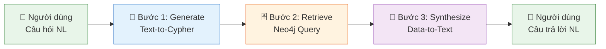
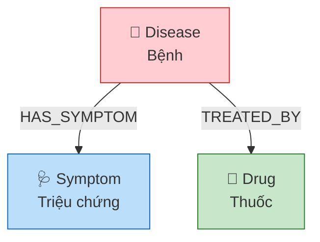

# 01. TỔNG QUAN DỰ ÁN — AegisHealth KBQA

> **Knowledge Base Question Answering cho Y tế — Hybrid GraphRAG**

---

## 1. Bối cảnh & Bài toán

### 1.1. Sự bùng nổ của AI trong Y tế

Ứng dụng Mô hình Ngôn ngữ Lớn (LLM) vào lĩnh vực Y tế đang thu hút sự quan tâm mạnh mẽ từ cộng đồng nghiên cứu. Tuy nhiên, việc triển khai LLM trong thực tế lâm sàng và cung cấp thông tin y tế cho người dùng phổ thông đang đối mặt với một thách thức nghiêm trọng: **hiện tượng ảo giác (hallucination)**. LLM có khuynh hướng sinh ra các câu trả lời nghe có vẻ hợp lý nhưng không đúng sự thật, điều này hoàn toàn không thể chấp nhận khi kết quả đầu ra liên quan trực tiếp đến sức khỏe con người.

### 1.2. Hạn chế của kiến trúc RAG truyền thống (Vector-based RAG)

Kiến trúc **Retrieval-Augmented Generation (RAG)** truyền thống dựa trên Vector Database đã được đề xuất như một giải pháp cho bài toán ảo giác, bằng cách bổ sung ngữ cảnh từ nguồn dữ liệu ngoài vào prompt cho LLM. Tuy nhiên, trong domain Y tế, cách tiếp cận này vẫn tồn tại các điểm yếu cốt lõi:

| Hạn chế | Mô tả |
|---|---|
| **Sai lệch ngữ nghĩa (Semantic Drift)** | Phép tìm kiếm tương đồng vector (cosine similarity) trên các đoạn văn bản (chunks) có thể trả về ngữ cảnh *gần đúng* nhưng *không chính xác* về mặt y khoa. Ví dụ: triệu chứng của hai bệnh khác nhau có thể có mô tả ngôn ngữ rất giống nhau. |
| **Khó suy luận nhiều bước (Multi-hop Reasoning)** | Các câu hỏi y tế phức tạp thường yêu cầu suy luận chuỗi, ví dụ: *"Bệnh nào vừa có triệu chứng đau đầu vừa có triệu chứng buồn nôn, và có thể điều trị bằng thuốc Paracetamol?"*. RAG truyền thống gặp khó khăn trong việc tổng hợp thông tin rải rác trên nhiều tài liệu để trả lời kiểu câu hỏi này. |
| **Thiếu cấu trúc quan hệ (Lack of Relational Structure)** | Dữ liệu y tế bản chất là một mạng lưới quan hệ phức tạp giữa Bệnh – Triệu chứng – Thuốc – Tác dụng phụ. Biểu diễn phẳng (flat representation) của vector store không thể mô hình hóa hiệu quả các mối quan hệ này. |
| **Khó truy vấn chính xác (Imprecise Retrieval)** | Với câu hỏi yêu cầu tập kết quả xác định (ví dụ: *"Liệt kê tất cả triệu chứng của bệnh tiểu đường"*), RAG truyền thống không đảm bảo tính đầy đủ và chính xác tuyệt đối của kết quả. |

### 1.3. Yêu cầu một cách tiếp cận mới

Thực tế trên đặt ra nhu cầu về một kiến trúc mới, có khả năng:
1.  Đảm bảo **tính chính xác tuyệt đối** của dữ liệu đầu ra (nguồn sự thật có thể kiểm chứng).
2.  Hỗ trợ **suy luận quan hệ nhiều bước** một cách tự nhiên.
3.  Duy trì **giao diện ngôn ngữ tự nhiên** thân thiện cho người dùng cuối.

---

## 2. Đề xuất Giải pháp: Hybrid GraphRAG

### 2.1. Nền tảng lý thuyết: ChatKBQA

Dự án AegisHealth KBQA lấy cảm hứng kiến trúc từ bài báo nghiên cứu **ChatKBQA** (Luo et al., 2023), trong đó đề xuất phương pháp sử dụng LLM để sinh truy vấn logic (SPARQL/Cypher) trực tiếp lên Knowledge Graph, thay vì tìm kiếm tương đồng trên văn bản phi cấu trúc. Cách tiếp cận này được gọi là **"Generate then Retrieve"** (Sinh lệnh rồi Truy xuất), đối lập với **"Retrieve then Generate"** của RAG truyền thống.

### 2.2. Kiến trúc Generate → Retrieve → Synthesize

AegisHealth áp dụng kiến trúc 3 bước cốt lõi:

| Bước | Vai trò | So sánh với RAG truyền thống |
|---|---|---|
| **Generate** (Text-to-Cypher) | LLM dịch câu hỏi tiếng Việt/Anh thành câu lệnh Cypher. | RAG: embed câu hỏi thành vector → tìm kiếm tương đồng. |
| **Retrieve** (Graph Query) | Neo4j AuraDB thực thi Cypher và trả về kết quả **cấu trúc, xác định**. | RAG: trả về top-k đoạn văn bản *có thể* liên quan. |
| **Synthesize** (Data-to-Text) | LLM nhận dữ liệu cấu trúc từ DB và tổng hợp thành câu trả lời NL. | RAG: LLM nhận text chunks và *cố gắng tóm tắt*. |

### 2.3. Ưu điểm cốt lõi so với Vector-based RAG

- **Triệt tiêu ảo giác ở tầng dữ liệu**: Dữ liệu trả về cho LLM ở bước Synthesize là kết quả truy vấn chính xác từ cơ sở dữ liệu, không phải đoạn văn bản mơ hồ. LLM chỉ đóng vai trò *diễn đạt lại dữ liệu*, không phải *sáng tạo nội dung*.
- **Suy luận quan hệ tự nhiên**: Graph Database được thiết kế chuyên biệt cho truy vấn quan hệ đa bước (graph traversal). Câu hỏi phức tạp được giải quyết bằng một truy vấn Cypher duy nhất thay vì phải ghép nối nhiều chunks.
- **Tính minh bạch (Explainability)**: Mọi câu trả lời đều có thể truy vết lại câu lệnh Cypher tương ứng, cho phép kiểm chứng và gỡ lỗi (debuggability).
- **Kiểm soát đầu ra**: Kiến trúc cho phép phân loại ý định (intent classification) và gán nhãn `response_type` cho phía client render tương ứng (bảng, văn bản, cảnh báo).

---

## 3. Phạm vi Dự án (Project Scope)

### 3.1. Domain: Healthcare cơ bản

Phiên bản đầu tiên của AegisHealth tập trung vào **ba thực thể chính** và mối quan hệ giữa chúng:

### 3.2. Tính năng chính (In-scope)

| Tính năng | Mô tả |
|---|---|
| **Hỏi đáp Y tế bằng ngôn ngữ tự nhiên** | Người dùng đặt câu hỏi bằng tiếng Việt hoặc tiếng Anh về bệnh, triệu chứng, thuốc. |
| **Trả kết quả cấu trúc** | Kết quả có thể là bảng dữ liệu, giải thích văn bản, hoặc cảnh báo y tế, tùy theo ngữ cảnh câu hỏi. |
| **Đa nền tảng** | Web (ReactJS) và Mobile (Flutter) cùng tiêu thụ một API Backend duy nhất. |
| **Triển khai AI nội bộ** | Sử dụng Open-source SLM qua Ollama/vLLM, không phụ thuộc API bên thứ ba. |

### 3.3. Ngoài phạm vi (Out-of-scope)

- Chẩn đoán lâm sàng thực tế (hệ thống chỉ mang tính chất tham khảo).
- Tích hợp dữ liệu bệnh án điện tử (EMR/EHR).
- Mô hình đa ngôn ngữ phức tạp (chỉ hỗ trợ tiếng Việt và tiếng Anh ở mức cơ bản).
- Xác thực & phân quyền người dùng (authentication/authorization) ở phiên bản đầu.

---

## 4. Đối tượng sử dụng

| Nhóm đối tượng | Vai trò |
|---|---|
| **Người dùng phổ thông** | Tra cứu thông tin y tế cơ bản (triệu chứng, bệnh, thuốc) thông qua giao diện chat. |
| **Sinh viên Y khoa / Nghiên cứu sinh** | Tra cứu nhanh các mối quan hệ trong đồ thị tri thức y tế phục vụ học tập. |
| **Nhóm phát triển / Giáo sư hướng dẫn** | Đánh giá tính khả thi của kiến trúc GraphRAG và tiềm năng mở rộng. |

---

## 5. Tài liệu tham khảo

1. Luo, J., et al. (2023). *ChatKBQA: A Generate-then-Retrieve Framework for Knowledge Base Question Answering with Fine-tuned Large Language Models*. arXiv preprint.
2. Lewis, P., et al. (2020). *Retrieval-Augmented Generation for Knowledge-Intensive NLP Tasks*. NeurIPS.
3. Neo4j Documentation. *The Neo4j Graph Database*. https://neo4j.com/docs/
4. Neo4j AuraDB. *Fully Managed Cloud Graph Database*. https://neo4j.com/cloud/platform/aura-graph-database/
