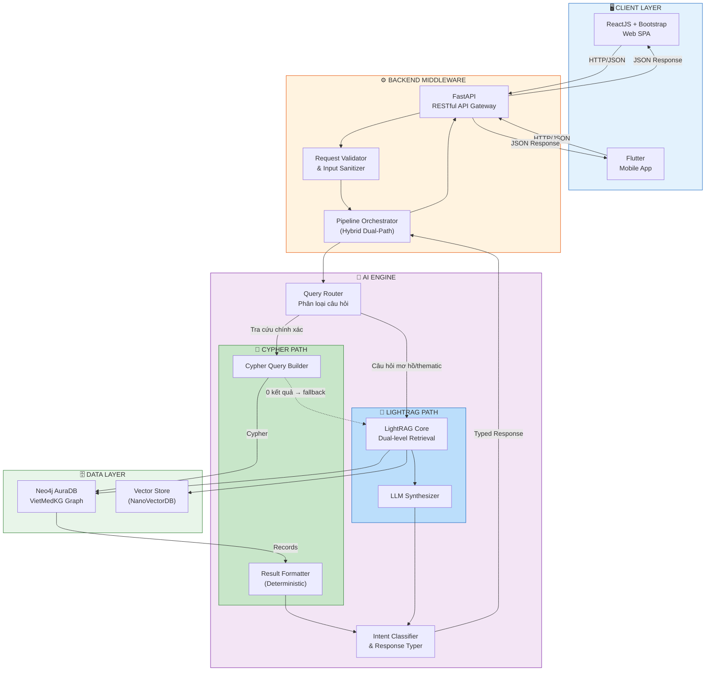
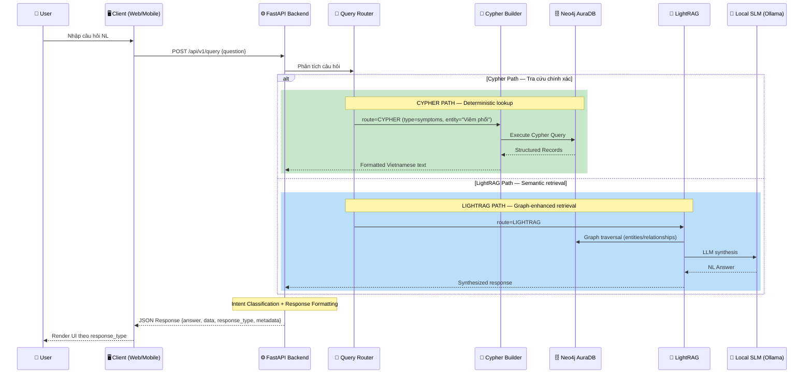
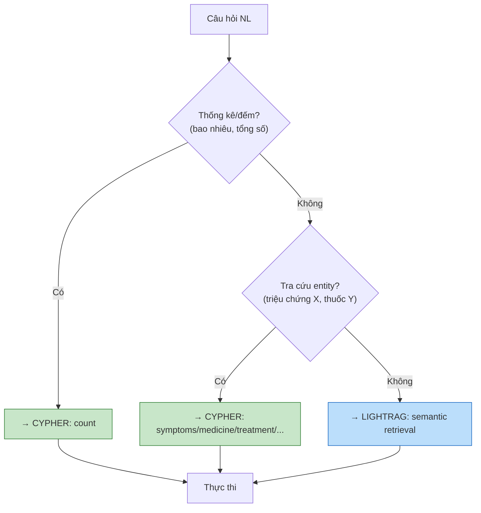
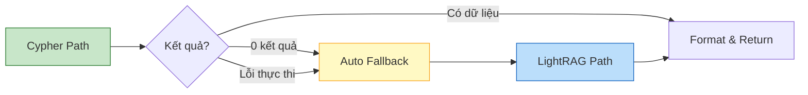
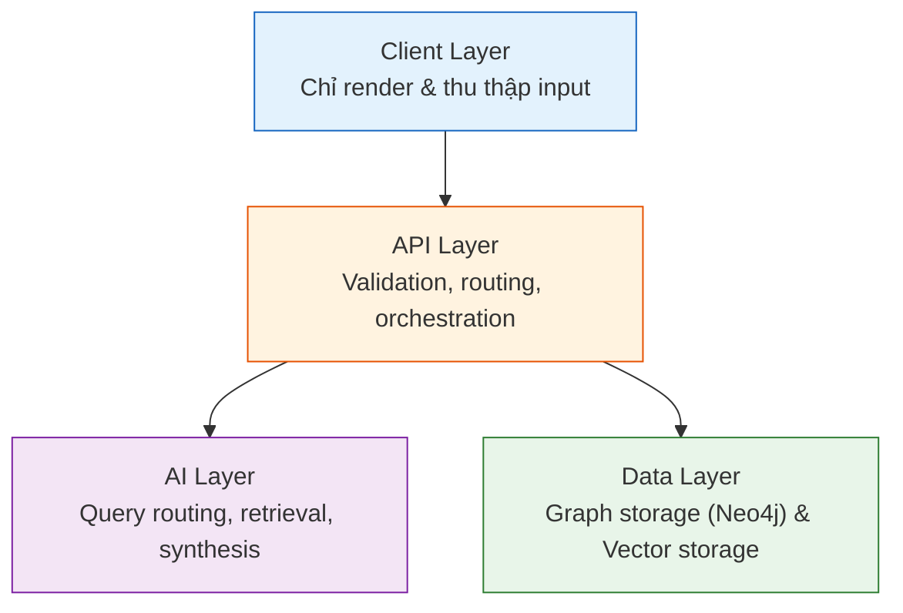

# 02. KIẾN TRÚC HỆ THỐNG — AegisHealth KBQA

> **System Architecture: Hybrid GraphRAG — Query Router → Dual-Path (Cypher + LightRAG)**

---

## 1. Sơ đồ Kiến trúc Tổng thể

---

## 2. Diễn giải Chi tiết Luồng Xử lý — Hybrid Dual-Path

### 2.1. Luồng Tổng quan (Sequence Diagram)

### 2.2. Query Router — Trái tim của Kiến trúc Hybrid

**Mục tiêu**: Phân tích câu hỏi đầu vào và quyết định đường đi xử lý tối ưu.

**Logic phân loại**:

| Loại câu hỏi | Path | Ví dụ |
|---|---|---|
| Triệu chứng bệnh cụ thể | **Cypher** | "Viêm phổi có triệu chứng gì?" |
| Thuốc điều trị bệnh | **Cypher** | "Bệnh tiểu đường dùng thuốc gì?" |
| Thống kê/đếm | **Cypher** | "Có bao nhiêu bệnh trong cơ sở dữ liệu?" |
| Profile bệnh | **Cypher** | "Cho tôi toàn bộ thông tin về bệnh gout" |
| Dinh dưỡng/phòng tránh | **Cypher** | "Bị gout nên ăn gì?" |
| Câu hỏi mơ hồ | **LightRAG** | "Bệnh nào liên quan đến hô hấp?" |
| Suy luận nhiều bước | **LightRAG** | "Mối liên hệ giữa tiểu đường và tim mạch?" |
| So sánh/tổng hợp | **LightRAG** | "So sánh viêm phổi và viêm phế quản" |
| Tư vấn tổng quát | **LightRAG** | "Làm gì để phòng bệnh mùa đông?" |

---

### 2.3. Cypher Path — Truy vấn trực tiếp VietMedKG

**Khi nào**: Câu hỏi tra cứu entity cụ thể hoặc thống kê trên graph VietMedKG.

**Quy trình**:
1. **Query Router** phân tích câu hỏi, extract disease name và query type
2. **Cypher Builder** sinh Cypher query cố định theo schema VietMedKG (không cần LLM sinh Cypher)
3. **Neo4j** thực thi Cypher, trả về records
4. **Result Formatter** chuyển records thành text tiếng Việt (deterministic, không cần LLM)
5. Nếu 0 kết quả → **Auto Fallback** sang LightRAG Path

**Ví dụ:**

| Input | Cypher sinh ra | Output |
|---|---|---|
| "Viêm phổi có triệu chứng gì?" | `MATCH (d:Disease {disease_name: "Viêm Phổi"})-[:HAS_SYMPTOM]->(s:Symptom) RETURN s` | "Bệnh Viêm Phổi có triệu chứng: Ho, Sốt, Khó thở..." |
| "Có bao nhiêu bệnh?" | `MATCH (d:Disease) RETURN count(d) AS disease_count` | "📊 Số bệnh: 8800" |

**Đặc điểm**: Nhanh (~50-100ms), deterministic, explainable (có Cypher trace trong metadata).

---

### 2.4. LightRAG Path — Graph-Enhanced Semantic Retrieval

**Khi nào**: Câu hỏi mơ hồ, thematic, suy luận nhiều bước, hoặc Cypher path trả 0 kết quả.

**Quy trình**:
1. **LightRAG Core** nhận câu hỏi
2. **Dual-level Retrieval**:
   - **Low-level**: Tìm entities cụ thể và quan hệ trực tiếp từ Knowledge Graph
   - **High-level**: Tìm chủ đề và khái niệm liên quan từ graph cấp cao
3. **LLM Synthesis**: Tổng hợp context từ cả hai level thành câu trả lời tự nhiên
4. **Response Formatting**: Phân loại response_type và thêm disclaimer

**Các chế độ query** (configurable qua API hoặc `.env`):

| Mode | Mô tả | Use case |
|---|---|---|
| `naive` | Vector search thuần | Câu hỏi đơn giản |
| `local` | Entity-focused retrieval | Câu hỏi về entity cụ thể |
| `global` | Theme-focused retrieval | Câu hỏi tổng quát |
| `hybrid` | Local + Global | Cân bằng (mặc định) |
| `mix` | Local + Global + Reranker | Chất lượng cao nhất (cần reranker model) |

---

### 2.5. Auto Fallback Mechanism

Cơ chế đảm bảo người dùng **luôn nhận được câu trả lời** — nếu Cypher trả kết quả rỗng hoặc lỗi, hệ thống tự động thử LightRAG trước khi trả fallback message.

---

## 3. Vai trò Chi tiết của Từng Thành phần Công nghệ

### 3.1. Neo4j AuraDB — Managed Graph Database (Tầng Dữ liệu)

| Khía cạnh | Chi tiết |
|---|---|
| **Vai trò** | Lưu trữ đồ thị tri thức y tế VietMedKG (cho Cypher Path) + đồ thị LightRAG (cho LightRAG Path). Là **Single Source of Truth**. |
| **Dịch vụ** | **Neo4j AuraDB** — dịch vụ Graph Database được quản lý hoàn toàn (fully-managed) trên cloud bởi Neo4j, Inc. |
| **Mô hình dữ liệu** | Property Graph Model — Node (thực thể) và Relationship (quan hệ) đều có thể mang properties. |
| **Ngôn ngữ truy vấn** | Cypher — ngôn ngữ truy vấn đồ thị khai báo (declarative). |
| **Kết nối** | Backend kết nối qua giao thức `neo4j+s://` (Bolt over TLS), đảm bảo mã hóa end-to-end. |
| **Dual-use** | **(1)** Cypher Path truy vấn trực tiếp schema VietMedKG. **(2)** LightRAG dùng Neo4JStorage để lưu entities/relationships đã extract. |

### 3.2. LightRAG — Graph-Enhanced RAG Framework (Tầng AI)

| Khía cạnh | Chi tiết |
|---|---|
| **Vai trò** | Graph-based indexing + dual-level retrieval cho câu hỏi semantic/thematic. |
| **Nguồn gốc** | HKUDS (HKU), EMNLP 2025. arXiv:2410.05779. MIT License. |
| **Indexing** | Extract entities/relationships từ documents bằng LLM → xây dựng Knowledge Graph tự động. |
| **Retrieval** | Dual-level: Low-level (entity-focused) + High-level (theme-focused). |
| **Storage** | Graph → `Neo4JStorage` (cùng instance AuraDB). Vector → `NanoVectorDB` (local). |
| **Embedding** | `BAAI/bge-m3` — đa ngôn ngữ, hỗ trợ tiếng Việt. |

### 3.3. FastAPI — Backend Middleware (Tầng Điều phối)

| Khía cạnh | Chi tiết |
|---|---|
| **Vai trò** | API Gateway trung tâm — tiếp nhận request từ client, điều phối Hybrid pipeline, trả kết quả. |
| **Kiến trúc** | Async-first (dựa trên `asyncio`), hỗ trợ xử lý đồng thời cao. |
| **Validation** | Tích hợp Pydantic cho request/response validation, tự động sinh OpenAPI documentation. |
| **Lý do lựa chọn** | Hiệu suất cao, native async support, Python ecosystem tương thích với LightRAG + AI/ML libraries. |

### 3.4. Open-source SLM via Ollama/vLLM (Tầng AI)

| Khía cạnh | Chi tiết |
|---|---|
| **Vai trò** | **(1)** LightRAG indexing: entity/relationship extraction. **(2)** LightRAG querying: synthesis answer. **(3)** Embedding generation. |
| **Mô hình** | LLM: Qwen-2.5 series (14B khuyến nghị, 7B tối thiểu). Embedding: BAAI/bge-m3. |
| **Serving** | Ollama (dev/demo) hoặc vLLM (production). OpenAI-compatible API. |
| **Lý do lựa chọn** | Kiểm soát toàn bộ dữ liệu (no-data-out policy), không chi phí API, có thể fine-tune. |

### 3.5. ReactJS + Bootstrap — Web Client (Tầng Giao diện Web)

| Khía cạnh | Chi tiết |
|---|---|
| **Vai trò** | Single-Page Application cho người dùng web, giao tiếp với Backend qua RESTful API. |
| **Rendering** | Dynamic Rendering dựa trên `response_type` từ Backend — Client là lớp hiển thị thuần túy (thin client). |
| **UI Framework** | Bootstrap Grid cho responsive layout; component-based architecture của React cho tái sử dụng giao diện. |

### 3.6. Flutter — Mobile Client (Tầng Giao diện Mobile)

| Khía cạnh | Chi tiết |
|---|---|
| **Vai trò** | Cross-platform mobile application (Android/iOS) chia sẻ cùng Backend API với Web Client. |
| **Rendering** | Tương tự Web — Dynamic Rendering dựa trên `response_type`. |

---

## 4. Nguyên tắc Kiến trúc

### 4.1. Separation of Concerns

Kiến trúc được phân tầng rõ ràng, mỗi tầng có trách nhiệm duy nhất:

### 4.2. Backend-Driven UI

Triết lý cốt lõi: **Backend quyết định cách hiển thị, Client chỉ thực thi**. Trường `response_type` trong JSON response đóng vai trò như một lệnh điều khiển (directive) gửi từ Backend xuống Client. Trường `metadata.engine` cho biết câu trả lời đến từ path nào (`cypher_direct` hoặc `lightrag`).

### 4.3. Stateless API

Mỗi request từ client là độc lập, Backend không lưu trạng thái phiên (session state). Điều này đảm bảo khả năng mở rộng ngang (horizontal scaling) trong tương lai.

### 4.4. Fail-safe Design — Hybrid Fallback

Tại mỗi bước trong pipeline, hệ thống có cơ chế xử lý lỗi rõ ràng:

| Tình huống | Xử lý |
|---|---|
| Cypher Path trả 0 kết quả | Auto fallback → LightRAG Path |
| Cypher Path lỗi thực thi | Auto fallback → LightRAG Path |
| LightRAG query thất bại | Trả thông báo lỗi thân thiện |
| LLM server không phản hồi | HTTP 503 + user-friendly message |
| Neo4j AuraDB timeout | HTTP 500 + retry suggestion |
| Câu hỏi ngoài domain | LightRAG trả "Tôi chỉ hỗ trợ câu hỏi y tế" |
