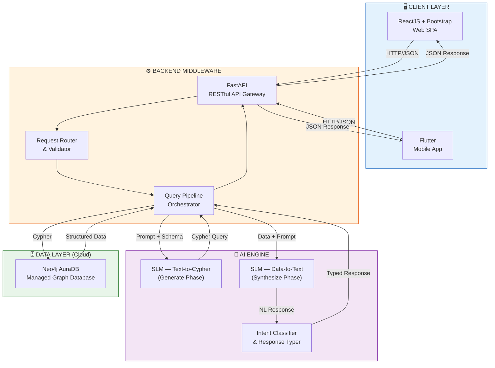
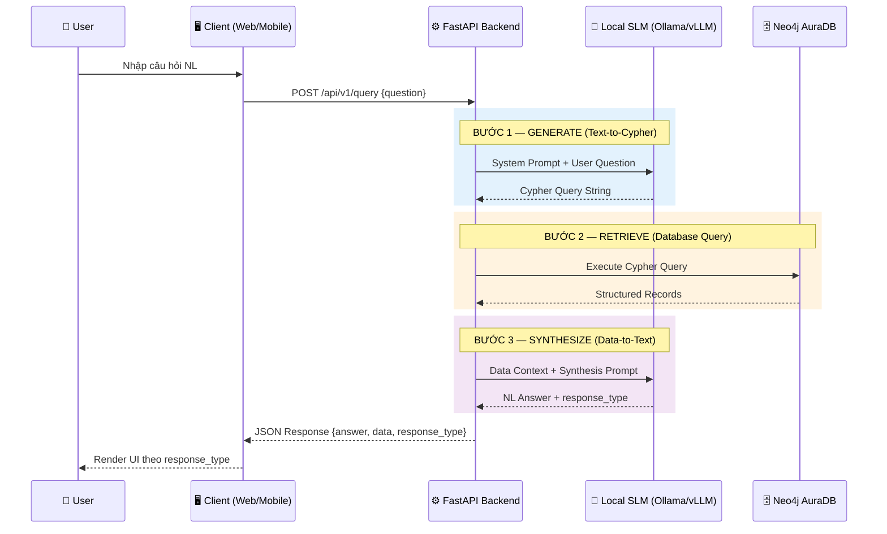
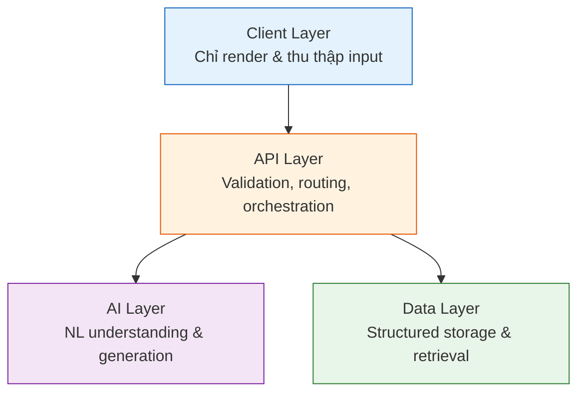

# 02. KIẾN TRÚC HỆ THỐNG — AegisHealth KBQA

> **System Architecture: Generate → Retrieve → Synthesize**

---

## 1. Sơ đồ Kiến trúc Tổng thể

---

## 2. Diễn giải Chi tiết Luồng Xử lý 3 Bước

### 2.1. Luồng Tổng quan (Sequence Diagram)

### 2.2. Bước 1 — Generate: Text-to-Cypher

**Mục tiêu**: Dịch câu hỏi ngôn ngữ tự nhiên (NL) thành câu lệnh truy vấn Cypher hợp lệ.

**Quy trình chi tiết**:

1. **Tiền xử lý (Preprocessing)**:
   - Chuẩn hóa câu hỏi đầu vào (loại bỏ ký tự đặc biệt, chuẩn hóa Unicode).
   - Gắn schema context vào prompt để LLM hiểu cấu trúc đồ thị hiện có.

2. **Prompt Construction**:
   - System prompt chứa: (a) Graph Schema đầy đủ (node labels, relationship types, property keys), (b) Các ví dụ few-shot Cypher, (c) Ràng buộc định dạng đầu ra.
   - User prompt chứa câu hỏi gốc của người dùng.

3. **LLM Inference**:
   - SLM nhận prompt và sinh ra câu lệnh Cypher.
   - Output được parse và validate theo cú pháp Cypher.

**Ví dụ minh họa**:

| Input (NL) | Output (Cypher) |
|---|---|
| *"Bệnh tiểu đường có những triệu chứng gì?"* | `MATCH (d:Disease {name: "Diabetes"})-[:HAS_SYMPTOM]->(s:Symptom) RETURN s.name` |
| *"Thuốc nào dùng để điều trị cảm cúm?"* | `MATCH (d:Disease {name: "Influenza"})-[:TREATED_BY]->(dr:Drug) RETURN dr.name` |

**Xử lý lỗi**: Nếu Cypher sinh ra không hợp lệ (syntax error), pipeline sẽ thực hiện retry hoặc trả về thông báo lỗi thân thiện cho người dùng.

---

### 2.3. Bước 2 — Retrieve: Database Query Execution

**Mục tiêu**: Thực thi câu lệnh Cypher trên Neo4j AuraDB (cloud) và nhận kết quả dữ liệu cấu trúc.

**Quy trình chi tiết**:

1. **Query Execution**:
   - Backend sử dụng Neo4j Python Driver để kết nối đến Neo4j AuraDB instance qua giao thức `neo4j+s://` (TLS encrypted) và gửi Cypher query.
   - Truy vấn được thực thi trong read transaction để đảm bảo tính consistency.

2. **Result Processing**:
   - Kết quả trả về dưới dạng danh sách record (key-value pairs).
   - Backend chuyển đổi Neo4j Record objects thành Python dictionaries.

3. **Empty Result Handling**:
   - Nếu kết quả rỗng, hệ thống ghi nhận để bước Synthesize có thể phản hồi phù hợp (ví dụ: *"Không tìm thấy thông tin về bệnh X trong cơ sở dữ liệu."*).

**Đặc điểm quan trọng**: Kết quả ở bước này là **deterministic** (xác định) — cùng một câu Cypher luôn cho ra cùng một kết quả, đảm bảo tính nhất quán và khả năng kiểm chứng.

---

### 2.4. Bước 3 — Synthesize: Data-to-Text & Intent Classification

**Mục tiêu**: Tổng hợp dữ liệu cấu trúc từ Neo4j AuraDB thành câu trả lời ngôn ngữ tự nhiên, đồng thời phân loại loại phản hồi phù hợp.

**Quy trình chi tiết**:

1. **Data-to-Text Generation**:
   - LLM nhận dữ liệu cấu trúc từ DB (dưới dạng JSON) kèm prompt hướng dẫn diễn đạt.
   - LLM tổng hợp thành câu trả lời tự nhiên, dễ hiểu cho người dùng.

2. **Intent Classification & Response Typing**:
   - Song song hoặc ngay sau bước sinh text, LLM phân loại câu trả lời vào một trong các `response_type`:

   | `response_type` | Mô tả | Ví dụ câu hỏi |
   |---|---|---|
   | `table` | Kết quả dạng danh sách/bảng dữ liệu | *"Liệt kê triệu chứng bệnh tiểu đường"* |
   | `text` | Giải thích hoặc mô tả bằng văn bản | *"Bệnh tiểu đường là gì?"* |
   | `warning` | Cảnh báo y tế quan trọng | *"Tôi bị đau ngực dữ dội"* |

3. **Response Assembly**:
   - Backend đóng gói `answer` (text), `data` (structured data), và `response_type` thành JSON response chuẩn.
   - Response được gửi về client.

---

## 3. Vai trò Chi tiết của Từng Thành phần Công nghệ

### 3.1. Neo4j AuraDB — Managed Graph Database (Tầng Dữ liệu)

| Khía cạnh | Chi tiết |
|---|---|
| **Vai trò** | Lưu trữ đồ thị tri thức y tế; là **Single Source of Truth** cho toàn bộ hệ thống. |
| **Dịch vụ** | **Neo4j AuraDB** — dịch vụ Graph Database được quản lý hoàn toàn (fully-managed) trên cloud bởi Neo4j, Inc. Loại bỏ gánh nặng vận hành hạ tầng (provisioning, backup, scaling, patching). |
| **Mô hình dữ liệu** | Property Graph Model — Node (thực thể) và Relationship (quan hệ) đều có thể mang properties. |
| **Ngôn ngữ truy vấn** | Cypher — ngôn ngữ truy vấn đồ thị khai báo (declarative), trực quan cho pattern matching. |
| **Kết nối** | Backend kết nối qua giao thức `neo4j+s://` (Bolt over TLS), đảm bảo mã hóa end-to-end. Xác thực bằng username/password do AuraDB cung cấp. |
| **Lý do lựa chọn AuraDB** | (1) **Không cần quản trị DB**: Team tập trung vào phát triển tính năng thay vì vận hành infrastructure. (2) **Free tier khả dụng**: AuraDB Free cung cấp 200K nodes, đủ cho phạm vi dự án. (3) **Bảo mật mặc định**: TLS encryption, IP allowlisting, auto-backup. (4) Phù hợp tự nhiên với dữ liệu y tế (quan hệ Bệnh-Triệu chứng-Thuốc); hiệu suất truy vấn quan hệ vượt trội so với SQL JOIN truyền thống. |

### 3.2. FastAPI — Backend Middleware (Tầng Điều phối)

| Khía cạnh | Chi tiết |
|---|---|
| **Vai trò** | API Gateway trung tâm — tiếp nhận request từ client, điều phối luồng 3 bước, trả kết quả. |
| **Kiến trúc** | Async-first (dựa trên `asyncio`), hỗ trợ xử lý đồng thời cao mà không cần multi-threading phức tạp. |
| **Validation** | Tích hợp Pydantic cho request/response validation, tự động sinh OpenAPI documentation. |
| **Lý do lựa chọn** | Hiệu suất cao (ngang Golang/NodeJS), native async support, Python ecosystem tương thích với AI/ML libraries. |

### 3.3. Open-source SLM via Ollama/vLLM (Tầng AI)

| Khía cạnh | Chi tiết |
|---|---|
| **Vai trò** | Thực hiện hai nhiệm vụ cốt lõi: (1) Text-to-Cypher generation, (2) Data-to-Text synthesis & intent classification. |
| **Mô hình** | Small Language Models (SLM) như Llama-3-8B, Qwen-2.5 series, hoặc tương đương. |
| **Serving** | Ollama (đơn giản, phù hợp dev/demo) hoặc vLLM (tối ưu throughput, phù hợp production). |
| **Lý do lựa chọn** | Kiểm soát toàn bộ dữ liệu (không gửi dữ liệu y tế ra bên ngoài), không chi phí API, có thể fine-tune cho domain cụ thể. |

### 3.4. ReactJS + Bootstrap — Web Client (Tầng Giao diện Web)

| Khía cạnh | Chi tiết |
|---|---|
| **Vai trò** | Single-Page Application cho người dùng web, giao tiếp với Backend qua RESTful API. |
| **Rendering** | Dynamic Rendering dựa trên `response_type` từ Backend — Client là lớp hiển thị thuần túy (thin client). |
| **UI Framework** | Bootstrap Grid cho responsive layout; component-based architecture của React cho tái sử dụng giao diện. |
| **Lý do lựa chọn** | Hệ sinh thái lớn, dễ tiếp cận cho team phát triển, responsive out-of-the-box với Bootstrap. |

### 3.5. Flutter — Mobile Client (Tầng Giao diện Mobile)

| Khía cạnh | Chi tiết |
|---|---|
| **Vai trò** | Cross-platform mobile application (Android/iOS) chia sẻ cùng Backend API với Web Client. |
| **Rendering** | Tương tự Web — Dynamic Rendering dựa trên `response_type`, sử dụng Widget system của Flutter. |
| **Lý do lựa chọn** | Single codebase cho cả Android và iOS; hiệu năng native-like; rich widget library cho UI y tế chuyên nghiệp. |

---

## 4. Nguyên tắc Kiến trúc

### 4.1. Separation of Concerns

Kiến trúc được phân tầng rõ ràng, mỗi tầng có trách nhiệm duy nhất:

### 4.2. Backend-Driven UI

Triết lý cốt lõi: **Backend quyết định cách hiển thị, Client chỉ thực thi**. Trường `response_type` trong JSON response đóng vai trò như một lệnh điều khiển (directive) gửi từ Backend xuống Client, cho phép thay đổi logic hiển thị mà không cần cập nhật ứng dụng client.

### 4.3. Stateless API

Mỗi request từ client là độc lập, Backend không lưu trạng thái phiên (session state). Điều này đảm bảo khả năng mở rộng ngang (horizontal scaling) trong tương lai.

### 4.4. Fail-safe Design

Tại mỗi bước trong pipeline, hệ thống có cơ chế xử lý lỗi rõ ràng:
- **Bước 1 thất bại** (Cypher không hợp lệ): Trả về thông báo yêu cầu làm rõ câu hỏi.
- **Bước 2 thất bại** (DB timeout/error): Trả về lỗi hệ thống với mã lỗi chuẩn.
- **Bước 3 thất bại** (LLM timeout): Trả về dữ liệu thô (raw data) từ DB mà không qua bước tổng hợp.
