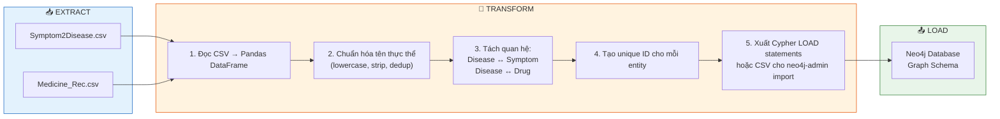
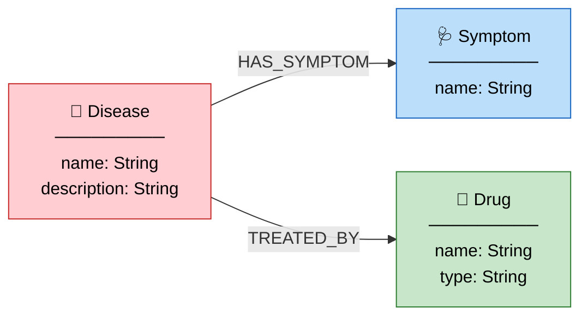

# 03. LUỒNG DỮ LIỆU & CẤU TRÚC ĐỒ THỊ — AegisHealth KBQA

> **Data Pipeline (ETL) & Graph Schema Design**

---

## 1. Nguồn Dữ liệu

### 1.1. Tổng quan

AegisHealth sử dụng các bộ dữ liệu y tế mở (open datasets) từ Kaggle làm nguồn dữ liệu chính cho việc xây dựng đồ thị tri thức. Lựa chọn này đảm bảo tính minh bạch, khả năng tái tạo (reproducibility), và không vi phạm quy định về dữ liệu bệnh nhân.

### 1.2. Các bộ dữ liệu sử dụng

| Dataset | Nguồn | Nội dung chính | Vai trò trong hệ thống |
|---|---|---|---|
| **Symptom2Disease** | Kaggle | Mapping giữa tập hợp triệu chứng và bệnh tương ứng | Xây dựng quan hệ `Disease → HAS_SYMPTOM → Symptom` |
| **Medicine Recommendation** | Kaggle | Thông tin thuốc điều trị cho từng bệnh, bao gồm tên thuốc, liều dùng cơ bản | Xây dựng quan hệ `Disease → TREATED_BY → Drug` |

### 1.3. Đặc điểm dữ liệu gốc

Dữ liệu gốc ở dạng **CSV (tabular)**, bao gồm:
- Các cột chứa tên bệnh, danh sách triệu chứng (thường dưới dạng nhiều cột binary hoặc text liệt kê).
- Các cột chứa tên thuốc, mô tả, và bệnh liên quan.
- Dữ liệu bằng **tiếng Anh**, cần xử lý chuẩn hóa trước khi nhập vào graph.

---

## 2. Quy trình ETL (Extract – Transform – Load)

### 2.1. Tổng quan Pipeline



### 2.2. Chi tiết từng bước

#### Bước 1: Extract — Đọc dữ liệu thô

- Sử dụng `pandas.read_csv()` để đọc các file CSV vào DataFrame.
- Kiểm tra và ghi nhận thống kê cơ bản: số dòng, số cột, tỷ lệ missing values.

#### Bước 2: Transform — Chuẩn hóa & Làm sạch

| Thao tác | Mô tả | Ví dụ |
|---|---|---|
| **Lowercase normalization** | Chuyển tất cả tên thực thể về chữ thường | `"Diabetes Mellitus"` → `"diabetes mellitus"` |
| **Whitespace stripping** | Loại bỏ khoảng trắng thừa đầu/cuối | `" headache "` → `"headache"` |
| **Deduplication** | Loại bỏ các thực thể trùng lặp | Gộp `"fever"` xuất hiện nhiều lần thành một node duy nhất |
| **Name standardization** | Chuẩn hóa các biến thể tên gọi | `"heart attack"` ↔ `"myocardial infarction"` (nếu có mapping) |
| **Encoding handling** | Xử lý ký tự đặc biệt và encoding UTF-8 | Đảm bảo tương thích Unicode |

#### Bước 3: Transform — Tách quan hệ

Từ dữ liệu dạng bảng, pipeline trích xuất ra ba tập thực thể riêng biệt và hai tập quan hệ:

```
Entities:
  ├── diseases.csv    → Danh sách bệnh (name, description)
  ├── symptoms.csv    → Danh sách triệu chứng (name)
  └── drugs.csv       → Danh sách thuốc (name, type)

Relationships:
  ├── disease_symptom.csv  → (disease_id, symptom_id)
  └── disease_drug.csv     → (disease_id, drug_id)
```

#### Bước 4: Transform — Tạo định danh duy nhất

Mỗi entity được gán một `entity_id` duy nhất (có thể ở dạng incremental integer hoặc UUID) để đảm bảo tính nhất quán khi load vào Neo4j.

#### Bước 5: Load — Nhập dữ liệu vào Neo4j

Hai phương pháp load được hỗ trợ:

| Phương pháp | Mô tả | Phù hợp khi |
|---|---|---|
| **Cypher LOAD CSV** | Sử dụng lệnh `LOAD CSV` tích hợp của Neo4j để import từ file CSV | Dữ liệu vừa phải (<100K nodes), cần linh hoạt |
| **neo4j-admin import** | Sử dụng công cụ dòng lệnh cho bulk import | Dữ liệu lớn (>100K nodes), cần tốc độ cao |

---

## 3. Đặc tả Graph Schema

### 3.1. Sơ đồ Schema tổng thể



### 3.2. Đặc tả Node Labels

#### `Disease` (Bệnh)

| Property | Kiểu dữ liệu | Ràng buộc | Mô tả |
|---|---|---|---|
| `name` | `String` | **UNIQUE, NOT NULL** | Tên bệnh (tiếng Anh, chuẩn hóa lowercase) |
| `description` | `String` | Nullable | Mô tả ngắn gọn về bệnh |

#### `Symptom` (Triệu chứng)

| Property | Kiểu dữ liệu | Ràng buộc | Mô tả |
|---|---|---|---|
| `name` | `String` | **UNIQUE, NOT NULL** | Tên triệu chứng (tiếng Anh, chuẩn hóa lowercase) |

#### `Drug` (Thuốc)

| Property | Kiểu dữ liệu | Ràng buộc | Mô tả |
|---|---|---|---|
| `name` | `String` | **UNIQUE, NOT NULL** | Tên thuốc (tiếng Anh) |
| `type` | `String` | Nullable | Phân loại thuốc (ví dụ: Antibiotic, Analgesic, v.v.) |

### 3.3. Đặc tả Relationship Types

#### `HAS_SYMPTOM` — Bệnh có Triệu chứng

| Thuộc tính | Chi tiết |
|---|---|
| **Hướng** | `(Disease) -[:HAS_SYMPTOM]-> (Symptom)` |
| **Cardinality** | Many-to-Many (một bệnh có nhiều triệu chứng; một triệu chứng có thể liên quan đến nhiều bệnh) |
| **Properties** | Không có (phiên bản hiện tại) |

#### `TREATED_BY` — Bệnh được điều trị bởi Thuốc

| Thuộc tính | Chi tiết |
|---|---|
| **Hướng** | `(Disease) -[:TREATED_BY]-> (Drug)` |
| **Cardinality** | Many-to-Many (một bệnh có thể dùng nhiều thuốc; một thuốc có thể trị nhiều bệnh) |
| **Properties** | Không có (phiên bản hiện tại) |

### 3.4. Thống kê dự kiến (ước lượng)

| Thực thể | Số lượng dự kiến |
|---|---|
| `Disease` nodes | ~200–500 |
| `Symptom` nodes | ~100–400 |
| `Drug` nodes | ~300–800 |
| `HAS_SYMPTOM` relationships | ~2,000–5,000 |
| `TREATED_BY` relationships | ~1,500–4,000 |

---

## 4. Ràng buộc & Chỉ mục (Constraints & Indexes)

### 4.1. Uniqueness Constraints

Đảm bảo không có thực thể trùng lặp trong graph:

```cypher
CREATE CONSTRAINT disease_name_unique IF NOT EXISTS
FOR (d:Disease) REQUIRE d.name IS UNIQUE;

CREATE CONSTRAINT symptom_name_unique IF NOT EXISTS
FOR (s:Symptom) REQUIRE s.name IS UNIQUE;

CREATE CONSTRAINT drug_name_unique IF NOT EXISTS
FOR (dr:Drug) REQUIRE dr.name IS UNIQUE;
```

### 4.2. Indexes cho truy vấn hiệu quả

```cypher
CREATE INDEX disease_name_index IF NOT EXISTS
FOR (d:Disease) ON (d.name);

CREATE INDEX symptom_name_index IF NOT EXISTS
FOR (s:Symptom) ON (s.name);

CREATE INDEX drug_name_index IF NOT EXISTS
FOR (dr:Drug) ON (dr.name);
```

---

## 5. Mẫu Câu lệnh Cypher Minh họa

### 5.1. Truy vấn cơ bản

**Tìm tất cả triệu chứng của một bệnh cụ thể:**

```cypher
MATCH (d:Disease {name: "diabetes"})-[:HAS_SYMPTOM]->(s:Symptom)
RETURN s.name AS symptom
ORDER BY s.name;
```

**Tìm thuốc điều trị một bệnh cụ thể:**

```cypher
MATCH (d:Disease {name: "influenza"})-[:TREATED_BY]->(dr:Drug)
RETURN dr.name AS drug, dr.type AS drug_type;
```

### 5.2. Truy vấn quan hệ nhiều bước (Multi-hop)

**Tìm bệnh có cả triệu chứng "headache" VÀ "fever":**

```cypher
MATCH (d:Disease)-[:HAS_SYMPTOM]->(s1:Symptom {name: "headache"}),
      (d)-[:HAS_SYMPTOM]->(s2:Symptom {name: "fever"})
RETURN d.name AS disease;
```

**Tìm bệnh có triệu chứng X và có thể điều trị bằng thuốc Y:**

```cypher
MATCH (d:Disease)-[:HAS_SYMPTOM]->(s:Symptom {name: "chest pain"}),
      (d)-[:TREATED_BY]->(dr:Drug {name: "aspirin"})
RETURN d.name AS disease, s.name AS symptom, dr.name AS drug;
```

### 5.3. Truy vấn thống kê

**Đếm số triệu chứng trung bình trên mỗi bệnh:**

```cypher
MATCH (d:Disease)-[:HAS_SYMPTOM]->(s:Symptom)
WITH d.name AS disease, COUNT(s) AS symptom_count
RETURN AVG(symptom_count) AS avg_symptoms_per_disease;
```

**Top 10 triệu chứng phổ biến nhất (xuất hiện ở nhiều bệnh nhất):**

```cypher
MATCH (s:Symptom)<-[:HAS_SYMPTOM]-(d:Disease)
WITH s.name AS symptom, COUNT(d) AS disease_count
RETURN symptom, disease_count
ORDER BY disease_count DESC
LIMIT 10;
```

### 5.4. Truy vấn chẩn đoán phân biệt (Differential Diagnosis)

**Cho một tập triệu chứng, tìm các bệnh có thể, xếp theo độ trùng khớp:**

```cypher
WITH ["headache", "fever", "fatigue"] AS input_symptoms
MATCH (d:Disease)-[:HAS_SYMPTOM]->(s:Symptom)
WHERE s.name IN input_symptoms
WITH d.name AS disease, 
     COUNT(s) AS matched_symptoms, 
     SIZE(input_symptoms) AS total_input
RETURN disease, 
       matched_symptoms, 
       total_input,
       round(toFloat(matched_symptoms) / total_input * 100, 1) AS match_percentage
ORDER BY matched_symptoms DESC
LIMIT 5;
```

---

## 6. Chiến lược Mở rộng Dữ liệu (Tương lai)

| Mở rộng | Mô tả |
|---|---|
| **Thêm Node Labels** | `Doctor`, `Hospital`, `Treatment Protocol`, `Side Effect` |
| **Thêm Relationships** | `CAUSES`, `INTERACTS_WITH` (Drug-Drug Interaction), `SPECIALIZES_IN` |
| **Relationship Properties** | Thêm `severity`, `frequency`, `confidence_score` vào quan hệ `HAS_SYMPTOM` |
| **Đa ngôn ngữ** | Thêm property `name_vi` cho các node để hỗ trợ truy vấn tiếng Việt trực tiếp |
