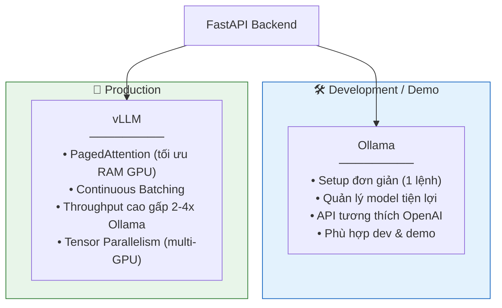
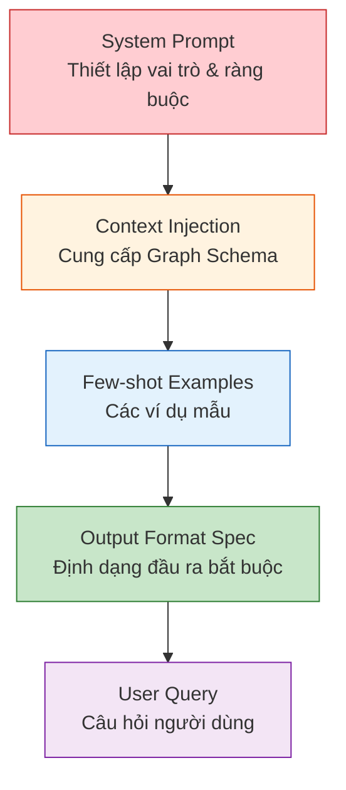

# 04. CHIẾN LƯỢC TRIỂN KHAI AI — AegisHealth KBQA

> **AI Models Strategy: Local Open-source SLM + Prompt Engineering**

---

## 1. Quyết định Chiến lược: Local SLM vs. Cloud API

### 1.1. Phân tích So sánh

| Tiêu chí | Cloud API (OpenAI, Anthropic, ...) | Local Open-source SLM |
|---|---|---|
| **Chi phí vận hành** | Tính theo token — tăng tuyến tính với lượng request, khó dự đoán ngân sách | Chi phí cố định (phần cứng GPU), không tốn thêm sau khi đầu tư ban đầu |
| **Bảo mật dữ liệu** | Dữ liệu y tế được gửi đến server bên thứ ba — rủi ro tuân thủ quy định (HIPAA, GDPR tương đương) | Dữ liệu hoàn toàn nằm trên máy chủ nội bộ (on-premise) — kiểm soát toàn diện |
| **Độ trễ (Latency)** | Phụ thuộc mạng internet, có thể biến động | Ổn định, phụ thuộc cấu hình phần cứng nội bộ |
| **Tùy biến** | Hạn chế ở prompt engineering, một số provider cho phép fine-tuning nhưng tốn kém | Toàn quyền fine-tune, lượng tử hóa (quantization), tối ưu cho domain cụ thể |
| **Khả dụng (Availability)** | Phụ thuộc uptime của provider, có rate limit | Chủ động quản lý, không bị giới hạn bởi bên thứ ba |
| **Quy mô mô hình** | Truy cập được model lớn (GPT-4, Claude 3.5) | Giới hạn ở SLM (7B–13B) do hạn chế phần cứng, nhưng đủ cho tác vụ cụ thể |

### 1.2. Lập luận Lựa chọn

AegisHealth lựa chọn **Local Open-source SLM** dựa trên ba lý do chính:

1. **Bảo mật dữ liệu y tế là ưu tiên số 1**: Trong lĩnh vực y tế, việc đảm bảo dữ liệu không rời khỏi hạ tầng kiểm soát được là yêu cầu bắt buộc. Dù AegisHealth chưa xử lý dữ liệu bệnh nhân thực, việc thiết kế kiến trúc tuân thủ nguyên tắc này từ đầu là cần thiết cho khả năng mở rộng.

2. **Tác vụ chuyên biệt, không cần model khổng lồ**: Hai tác vụ chính của hệ thống (Text-to-Cypher và Data-to-Text) là các tác vụ có đầu ra cấu trúc (structured output), có thể giải quyết hiệu quả bằng SLM 7B–8B khi được hướng dẫn đúng bằng prompt engineering. Không cần khả năng suy luận tổng quát (general reasoning) của model hàng trăm tỷ tham số.

3. **Tối ưu chi phí cho dự án nghiên cứu/giáo dục**: Dự án hoạt động trong ngữ cảnh học thuật, việc loại bỏ chi phí API biến đổi giúp quản lý ngân sách hiệu quả và duy trì dự án dài hạn.

---

## 2. Lựa chọn Mô hình

### 2.1. Các ứng viên SLM phù hợp

| Mô hình | Kích thước | Đặc điểm nổi bật | Mức độ phù hợp |
|---|---|---|---|
| **Llama-3-8B-Instruct** | 8B params | Instruction-following mạnh, output format tuân thủ tốt, cộng đồng lớn | ⭐⭐⭐⭐⭐ |
| **Qwen-2.5-7B-Instruct** | 7B params | Hỗ trợ đa ngôn ngữ tốt (bao gồm tiếng Việt), khả năng code generation mạnh | ⭐⭐⭐⭐⭐ |
| **Mistral-7B-Instruct** | 7B params | Hiệu suất cao trong tầm kích thước, sliding window attention | ⭐⭐⭐⭐ |
| **Phi-3-Mini-4K** | 3.8B params | Nhỏ gọn nhưng hiệu quả, phù hợp tài nguyên rất hạn chế | ⭐⭐⭐ |

### 2.2. Tiêu chí Đánh giá lựa chọn cuối

Mô hình được chọn sẽ dựa trên đánh giá thực nghiệm (benchmark) với các tiêu chí:

1. **Cypher Generation Accuracy**: Tỷ lệ sinh Cypher hợp lệ và đúng ngữ nghĩa trên tập test.
2. **Response Naturalness**: Chất lượng văn phong của câu trả lời tổng hợp.
3. **Format Compliance**: Khả năng tuân thủ định dạng JSON output theo đúng specification.
4. **Inference Speed**: Thời gian xử lý trung bình trên phần cứng mục tiêu.

---

## 3. Công cụ Phục vụ Mô hình (Model Serving)

### 3.1. Hai phương án triển khai



### 3.2. So sánh Chi tiết

| Tiêu chí | Ollama | vLLM |
|---|---|---|
| **Tốc độ setup** | Cực nhanh (`ollama pull model_name`) | Cần cấu hình Python environment |
| **Throughput** | Tốt cho single-user | Tối ưu cho concurrent requests |
| **Tối ưu GPU memory** | Cơ bản | PagedAttention — sử dụng GPU memory hiệu quả hơn 60-80% |
| **API Interface** | OpenAI-compatible REST API | OpenAI-compatible REST API |
| **Quantization** | Hỗ trợ GGUF (4-bit, 8-bit) | Hỗ trợ AWQ, GPTQ, SqueezeLLM |
| **Use case** | Development, demo, prototyping | Production deployment |

### 3.3. Chiến lược Triển khai

- **Giai đoạn phát triển**: Sử dụng **Ollama** cho tốc độ iteration nhanh.
- **Giai đoạn triển khai**: Chuyển sang **vLLM** khi cần phục vụ nhiều request đồng thời.
- **Giao diện nhất quán**: Cả hai đều expose OpenAI-compatible API, Backend code không cần thay đổi khi chuyển đổi.

---

## 4. Chiến lược Prompt Engineering

### 4.1. Nguyên tắc Thiết kế Prompt



### 4.2. System Prompt cho Text-to-Cypher (Bước 1)

**Mục tiêu**: Ép LLM xuất ra câu lệnh Cypher hợp lệ, chỉ sử dụng các node/relationship/property có trong schema.

```
SYSTEM PROMPT — TEXT-TO-CYPHER
═══════════════════════════════

## Vai trò
Bạn là chuyên gia chuyển đổi câu hỏi ngôn ngữ tự nhiên thành
câu lệnh Cypher cho Neo4j Graph Database.

## Graph Schema
Hệ thống có các Node Labels và Relationship Types sau:

### Node Labels:
- Disease (properties: name, description)
- Symptom (properties: name)
- Drug (properties: name, type)

### Relationship Types:
- (Disease)-[:HAS_SYMPTOM]->(Symptom)
- (Disease)-[:TREATED_BY]->(Drug)

## Quy tắc BẮT BUỘC:
1. CHỈ sử dụng Node Labels, Relationship Types, và Properties
   được liệt kê ở trên.
2. CHỈ trả về câu lệnh Cypher, KHÔNG kèm giải thích.
3. Sử dụng MATCH-RETURN pattern.
4. Tên thực thể trong query phải viết thường (lowercase).
5. Đầu ra phải là Cypher hợp lệ, có thể thực thi trực tiếp.

## Ví dụ:
Q: "Triệu chứng của bệnh tiểu đường là gì?"
A: MATCH (d:Disease {name: "diabetes"})-[:HAS_SYMPTOM]->(s:Symptom)
   RETURN s.name AS symptom

Q: "Thuốc nào có thể trị cảm cúm?"
A: MATCH (d:Disease {name: "influenza"})-[:TREATED_BY]->(dr:Drug)
   RETURN dr.name AS drug

Q: "Bệnh nào có triệu chứng đau đầu và sốt?"
A: MATCH (d:Disease)-[:HAS_SYMPTOM]->(s1:Symptom {name: "headache"}),
         (d)-[:HAS_SYMPTOM]->(s2:Symptom {name: "fever"})
   RETURN d.name AS disease
```

### 4.3. System Prompt cho Data-to-Text & Intent Classification (Bước 3)

**Mục tiêu**: LLM nhận dữ liệu từ Neo4j, tổng hợp câu trả lời tự nhiên, và xác định `response_type`.

```
SYSTEM PROMPT — DATA-TO-TEXT SYNTHESIS
══════════════════════════════════════

## Vai trò
Bạn là trợ lý y tế, nhận dữ liệu cấu trúc từ cơ sở dữ liệu
y tế và chuyển thành câu trả lời ngôn ngữ tự nhiên.

## Quy tắc BẮT BUỘC:
1. CHỈ sử dụng thông tin từ phần [DATA] được cung cấp.
2. KHÔNG bịa thêm thông tin ngoài dữ liệu.
3. Phản hồi PHẢI ở định dạng JSON với cấu trúc sau:

{
  "response_type": "<table|text|warning>",
  "answer": "<câu trả lời ngôn ngữ tự nhiên>",
  "data": <mảng dữ liệu nếu response_type = table, null nếu không>
}

## Quy tắc phân loại response_type:
- "table": Khi kết quả là DANH SÁCH (≥2 items), ví dụ: 
  liệt kê triệu chứng, liệt kê thuốc.
- "text": Khi kết quả là GIẢI THÍCH hoặc MÔ TẢ, ví dụ: 
  mô tả bệnh, giải thích quan hệ.
- "warning": Khi câu hỏi liên quan đến TRIỆU CHỨNG NGUY HIỂM 
  hoặc cần tư vấn y tế khẩn cấp.

## Disclaimer bắt buộc:
Luôn kết thúc bằng: "Lưu ý: Thông tin chỉ mang tính chất tham 
khảo. Vui lòng tham khảo ý kiến bác sĩ chuyên khoa."

## Ví dụ Input/Output:

[DATA]: [{"symptom": "frequent urination"}, {"symptom": 
"increased thirst"}, {"symptom": "fatigue"}]
[QUESTION]: "Triệu chứng của bệnh tiểu đường?"

Output:
{
  "response_type": "table",
  "answer": "Bệnh tiểu đường (Diabetes) có các triệu chứng 
  chính sau đây. Lưu ý: Thông tin chỉ mang tính chất tham 
  khảo. Vui lòng tham khảo ý kiến bác sĩ chuyên khoa.",
  "data": [
    {"symptom": "Tiểu tiện thường xuyên (Frequent urination)"},
    {"symptom": "Khát nước nhiều (Increased thirst)"},
    {"symptom": "Mệt mỏi (Fatigue)"}
  ]
}
```

### 4.4. Chiến lược Xử lý Prompt Nâng cao

| Chiến lược | Mô tả | Áp dụng |
|---|---|---|
| **Schema Injection** | Gắn schema đồ thị vào mọi prompt để LLM luôn biết cấu trúc dữ liệu hiện tại | Text-to-Cypher |
| **Few-shot Learning** | Cung cấp 3–5 ví dụ mẫu Input/Output trong system prompt | Cả hai bước |
| **Output Constraining** | Ép định dạng đầu ra (chỉ Cypher ở bước 1, chỉ JSON ở bước 3) | Cả hai bước |
| **Chain-of-Thought (tùy chọn)** | Cho phép LLM "suy nghĩ" trước khi sinh output, tăng chất lượng cho câu hỏi phức tạp | Text-to-Cypher (câu hỏi khó) |
| **Retry with Error Feedback** | Nếu output không hợp lệ, gửi lại prompt kèm thông báo lỗi để LLM tự sửa | Text-to-Cypher |

---

## 5. Khả năng Mở rộng AI (Tương lai)

| Hướng mở rộng | Mô tả |
|---|---|
| **Fine-tuning trên domain** | Thu thập cặp dữ liệu (Question, Cypher) và fine-tune SLM cho tác vụ Text-to-Cypher cụ thể |
| **Entity Linking** | Thêm module ánh xạ tên thực thể trong NL sang tên chính xác trong graph (ví dụ: "đau bụng" → `"abdominal pain"`) |
| **Multi-turn Conversation** | Hỗ trợ hội thoại đa lượt, cho phép người dùng hỏi thêm dựa trên context trước đó |
| **Confidence Scoring** | Đánh giá độ tin cậy của Cypher sinh ra, nếu thấp thì yêu cầu làm rõ thay vì trả kết quả sai |
