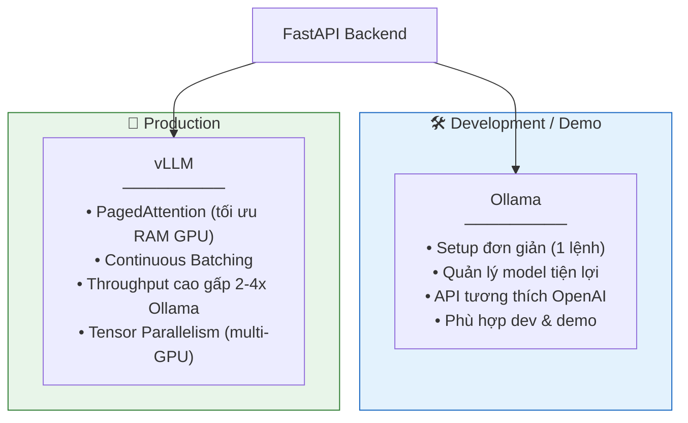

# 04. CHIẾN LƯỢC TRIỂN KHAI AI — AegisHealth KBQA

> **AI Models Strategy: Local Open-source SLM + LightRAG + Embedding**

---

## 1. Quyết định Chiến lược: Local SLM vs. Cloud API

### 1.1. Phân tích So sánh

| Tiêu chí | Cloud API (OpenAI, Anthropic, ...) | Local Open-source SLM |
|---|---|---|
| **Chi phí vận hành** | Tính theo token — tăng tuyến tính với lượng request, khó dự đoán ngân sách | Chi phí cố định (phần cứng GPU), không tốn thêm sau khi đầu tư ban đầu |
| **Bảo mật dữ liệu** | Dữ liệu y tế được gửi đến server bên thứ ba — rủi ro tuân thủ quy định (HIPAA, GDPR tương đương) | Dữ liệu hoàn toàn nằm trên máy chủ nội bộ (on-premise) — kiểm soát toàn diện |
| **Độ trễ (Latency)** | Phụ thuộc mạng internet, có thể biến động | Ổn định, phụ thuộc cấu hình phần cứng nội bộ |
| **Tùy biến** | Hạn chế ở prompt engineering, một số provider cho phép fine-tuning nhưng tốn kém | Toàn quyền fine-tune, lượng tử hóa (quantization), tối ưu cho domain cụ thể |
| **Khả dụng (Availability)** | Phụ thuộc uptime của provider, có rate limit | Chủ động quản lý, không bị giới hạn bởi bên thứ ba |
| **Quy mô mô hình** | Truy cập được model lớn (GPT-4, Claude 3.5) | Giới hạn ở SLM (7B–13B) do hạn chế phần cứng, nhưng đủ cho tác vụ cụ thể |

### 1.2. Lập luận Lựa chọn

AegisHealth lựa chọn **Local Open-source SLM** dựa trên ba lý do chính:

1. **Bảo mật dữ liệu y tế là ưu tiên số 1**: Trong lĩnh vực y tế, việc đảm bảo dữ liệu không rời khỏi hạ tầng kiểm soát được là yêu cầu bắt buộc. Dù AegisHealth chưa xử lý dữ liệu bệnh nhân thực, việc thiết kế kiến trúc tuân thủ nguyên tắc này từ đầu là cần thiết cho khả năng mở rộng.

2. **Tác vụ chuyên biệt, không cần model khổng lồ**: Hai tác vụ chính của hệ thống (Text-to-Cypher và Data-to-Text) là các tác vụ có đầu ra cấu trúc (structured output), có thể giải quyết hiệu quả bằng SLM 7B–8B khi được hướng dẫn đúng bằng prompt engineering. Không cần khả năng suy luận tổng quát (general reasoning) của model hàng trăm tỷ tham số.

3. **Tối ưu chi phí cho dự án nghiên cứu/giáo dục**: Dự án hoạt động trong ngữ cảnh học thuật, việc loại bỏ chi phí API biến đổi giúp quản lý ngân sách hiệu quả và duy trì dự án dài hạn.

---

## 2. Lựa chọn Mô hình

### 2.1. Các ứng viên SLM phù hợp

> **Lưu ý về mô hình cho LightRAG**: LightRAG yêu cầu LLM mạnh hơn so với Text-to-Cypher truyền thống, vì cần thực hiện entity/relationship extraction từ documents. Khuyến nghị LLM ≥ 14B cho indexing, ≥ 7B cho querying.

| Mô hình | Kích thước | Vai trò chính | Mức độ phù hợp |
|---|---|---|---|
| **Qwen-2.5-14B-Instruct** | 14B params | LightRAG indexing + querying. Context 32K+, đa ngôn ngữ tốt | ⭐⭐⭐⭐⭐ |
| **Qwen-2.5-7B-Instruct** | 7B params | Querying (fallback khi GPU hạn chế). Hỗ trợ tiếng Việt tốt | ⭐⭐⭐⭐ |
| **Llama-3-8B-Instruct** | 8B params | Querying. Output format tuân thủ tốt, cộng đồng lớn | ⭐⭐⭐⭐ |
| **Qwen-2.5-32B-Instruct** | 32B params | Indexing chất lượng cao nhất (cần GPU mạnh) | ⭐⭐⭐⭐⭐ |

### 2.2. Mô hình Embedding (Bắt buộc cho LightRAG)

| Mô hình | Chiều | Ngôn ngữ | Lý do lựa chọn |
|---|---|---|---|
| **BAAI/bge-m3** (đề xuất) | 1024 | Đa ngôn ngữ (bao gồm tiếng Việt) | Hiệu suất cao, hỗ trợ tiếng Việt tốt, khả năng dense+sparse retrieval |
| text-embedding-3-large | 3072 | Đa ngôn ngữ | Chất lượng cao nhưng cần API OpenAI |

> **Quan trọng**: Embedding model phải được chọn TRƯỚC khi indexing và KHOMU phải thay đổi sau đó. Nếu đổi embedding model, cần rebuild toàn bộ vector index.

### 2.3. Mô hình Reranker (Tùy chọn, khuyến nghị)

| Mô hình | Lý do |
|---|---|
| **BAAI/bge-reranker-v2-m3** | Cải thiện đáng kể retrieval quality, hỗ trợ `mix` query mode |

### 2.4. Tiêu chí Đánh giá

Mô hình được đánh giá trên:

1. **Entity Extraction Quality**: Tỷ lệ extract đúng entities/relationships từ VietMedKG documents.
2. **Answer Relevance**: Chất lượng câu trả lời tổng hợp từ LightRAG queries.
3. **Vietnamese Fluency**: Độ tự nhiên của câu trả lời tiếng Việt.
4. **Inference Speed**: Thời gian xử lý trên phần cứng mục tiêu.

---

## 3. Công cụ Phục vụ Mô hình (Model Serving)

### 3.1. Hai phương án triển khai



### 3.2. So sánh Chi tiết

| Tiêu chí | Ollama | vLLM |
|---|---|---|
| **Tốc độ setup** | Cực nhanh (`ollama pull model_name`) | Cần cấu hình Python environment |
| **Throughput** | Tốt cho single-user | Tối ưu cho concurrent requests |
| **Tối ưu GPU memory** | Cơ bản | PagedAttention — sử dụng GPU memory hiệu quả hơn 60-80% |
| **API Interface** | OpenAI-compatible REST API | OpenAI-compatible REST API |
| **Quantization** | Hỗ trợ GGUF (4-bit, 8-bit) | Hỗ trợ AWQ, GPTQ, SqueezeLLM |
| **Use case** | Development, demo, prototyping | Production deployment |

### 3.3. Chiến lược Triển khai

- **Giai đoạn phát triển**: Sử dụng **Ollama** cho tốc độ iteration nhanh.
- **Giai đoạn triển khai**: Chuyển sang **vLLM** khi cần phục vụ nhiều request đồng thời.
- **Giao diện nhất quán**: Cả hai đều expose OpenAI-compatible API, Backend code không cần thay đổi khi chuyển đổi.

---

## 4. Chiến lược Prompt Engineering

### 4.1. Thay đổi với LightRAG

Với kiến trúc Hybrid mới, prompt engineering thay đổi đáng kể:

| Thành phần | Kiến trúc cũ | Kiến trúc Hybrid mới |
|---|---|---|
| **Text-to-Cypher prompt** | Custom prompt + schema injection | **Không cần** — Cypher Builder sinh Cypher deterministic |
| **Data-to-Text prompt** | Custom prompt + data context | **Không cần cho Cypher Path** — Result Formatter là template. LightRAG Path dùng built-in synthesis. |
| **Entity extraction prompt** | Không có | **LightRAG tự quản lý** — built-in prompts cho entity/relationship extraction |
| **Query synthesis prompt** | Không có | **LightRAG tự quản lý** — built-in prompts cho answer synthesis |

### 4.2. Cypher Path — Không cần LLM

Cypher Path sinh Cypher bằng **rule-based query builder** (không cần LLM), dựa trên:
- Regex pattern matching (Query Router)
- Schema VietMedKG đã định nghĩa sẵn
- Template Cypher queries cho từng loại tra cứu

Điều này loại bỏ hoàn toàn bottleneck "LLM sinh Cypher sai" của kiến trúc cũ.

### 4.3. LightRAG Path — Prompts được quản lý bởi framework

LightRAG sử dụng các prompt nội bộ cho:
1. **Entity Extraction**: Extract entities và relationships từ documents
2. **KG Profiling**: Sinh mô tả cho nodes và edges
3. **Query Synthesis**: Tổng hợp câu trả lời từ retrieved context

Các prompt này có thể được tùy chỉnh thông qua LightRAG's configuration nếu cần.

### 4.4. Legacy Prompts (lưu giữ để tham khảo)

Các prompt cũ (Text-to-Cypher, Data-to-Text) vẫn được lưu trong `ai_engine/prompts/` để tham khảo nhưng **không được sử dụng runtime**.

### 4.3. System Prompt cho Data-to-Text & Intent Classification (Bước 3)

**Mục tiêu**: LLM nhận dữ liệu từ Neo4j, tổng hợp câu trả lời tự nhiên, và xác định `response_type`.

```
SYSTEM PROMPT — DATA-TO-TEXT SYNTHESIS
══════════════════════════════════════

## Vai trò
Bạn là trợ lý y tế, nhận dữ liệu cấu trúc từ cơ sở dữ liệu
y tế và chuyển thành câu trả lời ngôn ngữ tự nhiên.

## Quy tắc BẮT BUỘC:
1. CHỈ sử dụng thông tin từ phần [DATA] được cung cấp.
2. KHÔNG bịa thêm thông tin ngoài dữ liệu.
3. Phản hồi PHẢI ở định dạng JSON với cấu trúc sau:

{
  "response_type": "<table|text|warning>",
  "answer": "<câu trả lời ngôn ngữ tự nhiên>",
  "data": <mảng dữ liệu nếu response_type = table, null nếu không>
}

## Quy tắc phân loại response_type:
- "table": Khi kết quả là DANH SÁCH (≥2 items), ví dụ: 
  liệt kê triệu chứng, liệt kê thuốc.
- "text": Khi kết quả là GIẢI THÍCH hoặc MÔ TẢ, ví dụ: 
  mô tả bệnh, giải thích quan hệ.
- "warning": Khi câu hỏi liên quan đến TRIỆU CHỨNG NGUY HIỂM 
  hoặc cần tư vấn y tế khẩn cấp.

## Disclaimer bắt buộc:
Luôn kết thúc bằng: "Lưu ý: Thông tin chỉ mang tính chất tham 
khảo. Vui lòng tham khảo ý kiến bác sĩ chuyên khoa."

## Ví dụ Input/Output:

[DATA]: [{"symptom": "frequent urination"}, {"symptom": 
"increased thirst"}, {"symptom": "fatigue"}]
[QUESTION]: "Triệu chứng của bệnh tiểu đường?"

Output:
{
  "response_type": "table",
  "answer": "Bệnh tiểu đường (Diabetes) có các triệu chứng 
  chính sau đây. Lưu ý: Thông tin chỉ mang tính chất tham 
  khảo. Vui lòng tham khảo ý kiến bác sĩ chuyên khoa.",
  "data": [
    {"symptom": "Tiểu tiện thường xuyên (Frequent urination)"},
    {"symptom": "Khát nước nhiều (Increased thirst)"},
    {"symptom": "Mệt mỏi (Fatigue)"}
  ]
}
```

### 4.4. Chiến lược Xử lý Prompt Nâng cao

| Chiến lược | Mô tả | Áp dụng |
|---|---|---|
| **Schema Injection** | Gắn schema đồ thị vào mọi prompt để LLM luôn biết cấu trúc dữ liệu hiện tại | Text-to-Cypher |
| **Few-shot Learning** | Cung cấp 3–5 ví dụ mẫu Input/Output trong system prompt | Cả hai bước |
| **Output Constraining** | Ép định dạng đầu ra (chỉ Cypher ở bước 1, chỉ JSON ở bước 3) | Cả hai bước |
| **Chain-of-Thought (tùy chọn)** | Cho phép LLM "suy nghĩ" trước khi sinh output, tăng chất lượng cho câu hỏi phức tạp | Text-to-Cypher (câu hỏi khó) |
| **Retry with Error Feedback** | Nếu output không hợp lệ, gửi lại prompt kèm thông báo lỗi để LLM tự sửa | Text-to-Cypher |

---

## 5. So sánh với Baseline (Baseline Comparison)

### 5.1. Các phương pháp đối chứng

| # | Approach | Mô tả | Ưu điểm | Nhược điểm |
|---|---|---|---|---|
| B1 | **Keyword Search** | Tìm kiếm từ khóa trực tiếp trên database | Nhanh, đơn giản, deterministic | Không hiểu ngữ nghĩa; không xử lý đồng nghĩa; thất bại với câu hỏi NL |
| B2 | **Vector RAG** | Embed câu hỏi + tìm kiếm vector tương đồng trên text chunks | Hiểu ngữ nghĩa; linh hoạt | Sai lệch ngữ nghĩa; khó multi-hop; kết quả không deterministic |
| B3 | **Rule-based Cypher** | Ánh xạ từ khóa → template Cypher cố định (if-else) | Chính xác cho các case được define; không cần LLM | Không mở rộng; mỗi pattern mới = viết thêm rule; không hiểu NL |
| **Ours** | **GraphRAG (Text-to-Cypher)** | LLM sinh Cypher linh hoạt → truy vấn graph → tổng hợp NL | Chính xác + linh hoạt; multi-hop; deterministic data | Phụ thuộc LLM quality; cần schema design tốt |

### 5.2. Ma trận So sánh Định lượng (Dự kiến)

| Metric | Keyword Search | Vector RAG | Rule-based | **GraphRAG (Ours)** |
|---|---|---|---|---|
| **Accuracy** (est.) | ~40% | ~65% | ~90% (limited scope) | **~85%** |
| **Coverage** (để loại câu hỏi) | Thấp | Cao | Rất thấp | **Cao** |
| **Latency** (est.) | <100ms | ~1500ms | <100ms | **~2000ms** |
| **Multi-hop support** | ❌ | ❌ | ❌ | ✅ |
| **Explainability** | ✅ (exact match) | ❌ (embedding) | ✅ (rule trace) | ✅ (Cypher trace) |

> **Lưu ý**: Các con số trên là **ước lượng** dựa trên phân tích kiến trúc. Sẽ được xác nhận bằng thực nghiệm trong quá trình phát triển.

---

## 6. Phân tích Lỗi (Error Analysis)

### 6.1. Taxonomy lỗi Cypher Generation

| # | Loại lỗi | Mô tả | Ví dụ | Tỷ lệ dự kiến |
|---|---|---|---|---|
| E1 | **Wrong Entity** | LLM ánh xạ sai tên thực thể từ NL sang graph | "đau bụng" → `"stomach ache"` thay vì `"abdominal pain"` | ~25% |
| E2 | **Wrong Relationship** | Dùng sai loại quan hệ | Dùng `HAS_SYMPTOM` khi câu hỏi về thuốc (nên dùng `TREATED_BY`) | ~15% |
| E3 | **Syntax Error** | Cypher không đúng cú pháp | Thiếu dấu ngoặc, sai keyword | ~10% |
| E4 | **Out-of-Schema** | Sinh node label hoặc relationship type không tồn tại | `MATCH (d:Disease)-[:CAUSED_BY]->...` (CAUSED_BY không có trong schema) | ~20% |
| E5 | **Over-simplification** | LLM đơn giản hóa câu hỏi phức tạp, bỏ mất điều kiện | "Bệnh nào có triệu chứng X VÀ Y?" → chỉ query triệu chứng X | ~15% |
| E6 | **Language Mismatch** | Tên entity trong Cypher không match với dữ liệu trong graph (do khác ngôn ngữ/cách viết) | `{name: "tiểu đường"}` thay vì `{name: "diabetes"}` | ~15% |

### 6.2. Chiến lược Giảm Lỗi

| Lỗi | Chiến lược |
|---|---|
| **E1, E6** (Entity mismatch) | Entity linking module; bổ sung bảng mapping NL → graph entity |
| **E2, E4** (Schema violation) | Schema injection trong prompt; Cypher validator chặn output sai schema |
| **E3** (Syntax error) | Retry with error feedback (self-correction) |
| **E5** (Over-simplification) | Chain-of-Thought prompting; thêm few-shot cho câu hỏi multi-condition |

---

## 7. Phân tích Đánh đổi Accuracy vs. Speed

### 7.1. Ma trận Trade-off theo cấu hình Model

| Cấu hình | Accuracy (est.) | Latency (est.) | GPU RAM | Ghi chú |
|---|---|---|---|---|
| Llama-3-8B (FP16) | ~87% | ~2000ms | ~16GB | Chất lượng cao nhất, cần GPU mạnh |
| Llama-3-8B (INT8) | ~85% | ~1200ms | ~8GB | Cân bằng tốt |
| Llama-3-8B (INT4/GGUF) | ~82% | ~800ms | ~5GB | Chấp nhận được, chạy trên GPU vừa |
| Qwen-2.5-7B (INT4) | ~83% | ~750ms | ~5GB | Alternative tốt, hỗ trợ tiếng Việt |
| Phi-3-Mini (INT4) | ~72% | ~400ms | ~3GB | Nhanh nhất, accuracy thấp nhất |

### 7.2. Khuyến nghị

- **Ưu tiên chất lượng** (demo, đánh giá): Llama-3-8B (INT8) — cân bằng tốt nhất.
- **Ưu tiên tốc độ** (prototype nhanh): Qwen-2.5-7B (INT4) — nhanh và hỗ trợ tiếng Việt tốt.
- **Tài nguyên rất hạn chế**: Phi-3-Mini (INT4) — chấp nhận accuracy thấp hơn.

---

## 8. Khả năng Mở rộng AI (Tương lai)

| Hướng mở rộng | Mô tả |
|---|---|
| **Fine-tuning trên domain** | Thu thập cặp dữ liệu (Question, Cypher) và fine-tune SLM cho tác vụ Text-to-Cypher cụ thể |
| **Entity Linking** | Thêm module ánh xạ tên thực thể trong NL sang tên chính xác trong graph (ví dụ: "đau bụng" → `"abdominal pain"`) |
| **Multi-turn Conversation** | Hỗ trợ hội thoại đa lượt, cho phép người dùng hỏi thêm dựa trên context trước đó |
| **Confidence Scoring** | Đánh giá độ tin cậy của Cypher sinh ra, nếu thấp thì yêu cầu làm rõ thay vì trả kết quả sai |
