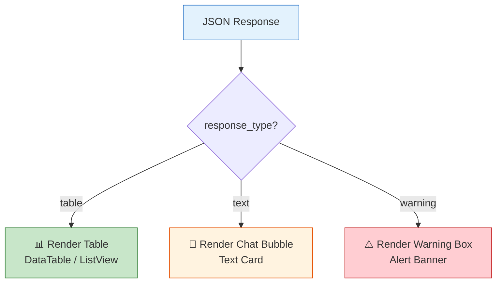
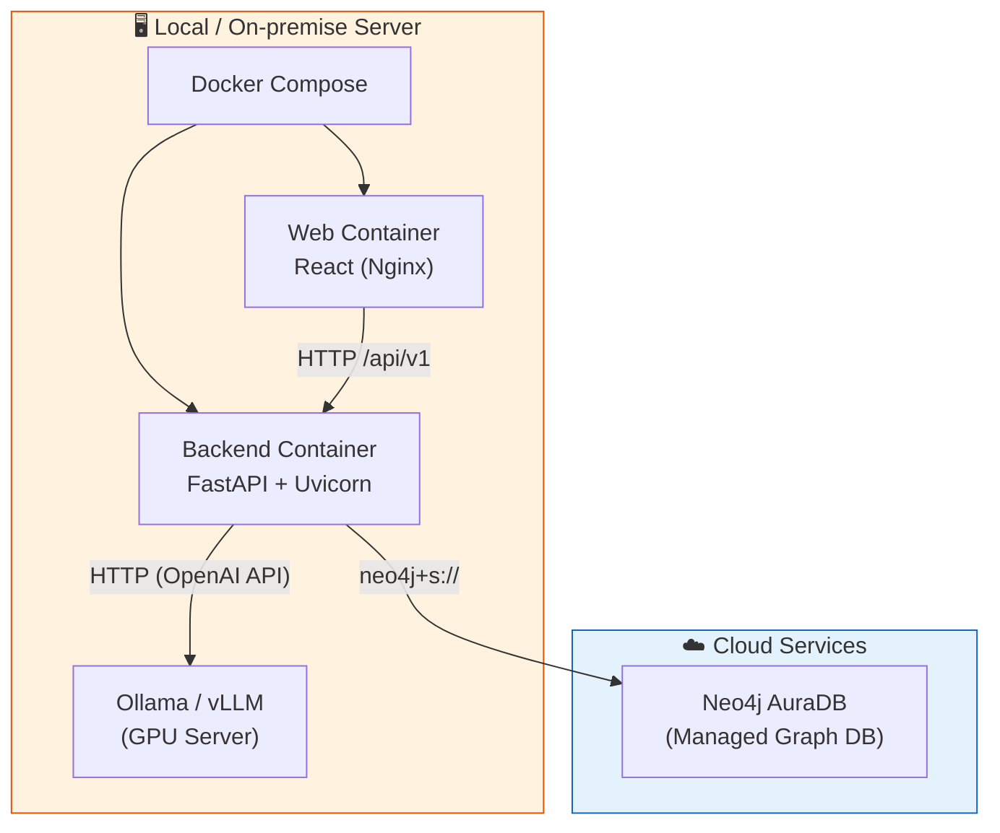

# 05. THIẾT KẾ GIAO TIẾP API — AegisHealth KBQA

> **API System Design: RESTful Contract between Backend & Clients**

---

## 1. Tổng quan Thiết kế API

### 1.1. Nguyên tắc Thiết kế

| Nguyên tắc | Mô tả |
|---|---|
| **RESTful** | API tuân thủ kiến trúc REST, sử dụng HTTP methods và status codes chuẩn |
| **JSON-first** | Tất cả request body và response body đều ở định dạng JSON (Content-Type: `application/json`) |
| **Stateless** | Mỗi request chứa đầy đủ thông tin cần thiết, server không lưu trạng thái phiên |
| **Versioned** | API có prefix version (`/api/v1/`) để hỗ trợ backward compatibility khi nâng cấp |
| **Backend-Driven UI** | Response chứa `response_type` để chỉ định cách client render, giảm logic phía client |

### 1.2. Base URL

```
http://<server-host>:<port>/api/v1
```

---

## 2. Đặc tả Endpoint Chính

### 2.1. Query Endpoint — Hỏi đáp Y tế

**Đây là endpoint cốt lõi của toàn hệ thống**, xử lý câu hỏi ngôn ngữ tự nhiên và trả về kết quả.

```
POST /api/v1/query
```

#### Request

| Trường | Kiểu | Bắt buộc | Mô tả |
|---|---|---|---|
| `question` | `string` | ✅ | Câu hỏi ngôn ngữ tự nhiên của người dùng |
| `language` | `string` | ❌ | Ngôn ngữ phản hồi mong muốn (`vi` hoặc `en`). Mặc định: `vi` |

**Ví dụ Request:**

```json
{
  "question": "Bệnh tiểu đường có những triệu chứng gì?",
  "language": "vi"
}
```

#### Response — Cấu trúc JSON chuẩn

| Trường | Kiểu | Mô tả |
|---|---|---|
| `status` | `string` | Trạng thái xử lý: `"success"` hoặc `"error"` |
| `response_type` | `string` | Loại phản hồi: `"table"`, `"text"`, hoặc `"warning"` — **quyết định cách client render** |
| `answer` | `string` | Câu trả lời ngôn ngữ tự nhiên đã tổng hợp |
| `data` | `array\|null` | Dữ liệu cấu trúc (nếu `response_type = "table"`), `null` nếu không áp dụng |
| `metadata` | `object` | Thông tin bổ sung (Cypher đã thực thi, thời gian xử lý, v.v.) |

---

## 3. Phân tích Chi tiết `response_type`

Trường `response_type` là **trái tim** của cơ chế Backend-Driven UI. Nó cho phép một API endpoint duy nhất phục vụ nhiều dạng câu hỏi khác nhau, và client chỉ cần kiểm tra giá trị này để quyết định component nào sẽ render.



### 3.1. Trường hợp 1: `response_type = "table"` — Dữ liệu dạng bảng

**Khi nào**: Câu hỏi yêu cầu **liệt kê** (list) hoặc trả về **tập dữ liệu có cấu trúc** với ≥2 items.

**Ví dụ câu hỏi**: *"Liệt kê tất cả triệu chứng của bệnh tiểu đường"*

```json
{
  "status": "success",
  "response_type": "table",
  "answer": "Bệnh tiểu đường (Diabetes) có 6 triệu chứng chính được ghi nhận trong hệ thống. Lưu ý: Thông tin chỉ mang tính chất tham khảo. Vui lòng tham khảo ý kiến bác sĩ chuyên khoa.",
  "data": [
    { "symptom": "Tiểu tiện thường xuyên", "symptom_en": "frequent urination" },
    { "symptom": "Khát nước nhiều", "symptom_en": "increased thirst" },
    { "symptom": "Mệt mỏi", "symptom_en": "fatigue" },
    { "symptom": "Giảm cân không giải thích", "symptom_en": "unexplained weight loss" },
    { "symptom": "Nhìn mờ", "symptom_en": "blurred vision" },
    { "symptom": "Vết thương chậm lành", "symptom_en": "slow healing wounds" }
  ],
  "metadata": {
    "cypher": "MATCH (d:Disease {name: 'diabetes'})-[:HAS_SYMPTOM]->(s:Symptom) RETURN s.name AS symptom",
    "execution_time_ms": 245,
    "source_count": 6
  }
}
```

**Cách Client render**: Hiển thị bảng dữ liệu (table) hoặc danh sách (list view).

---

### 3.2. Trường hợp 2: `response_type = "text"` — Giải thích văn bản

**Khi nào**: Câu hỏi yêu cầu **giải thích**, **mô tả**, hoặc kết quả chỉ có **1 item** đơn lẻ.

**Ví dụ câu hỏi**: *"Bệnh tiểu đường là gì?"*

```json
{
  "status": "success",
  "response_type": "text",
  "answer": "Bệnh tiểu đường (Diabetes) là một nhóm bệnh chuyển hóa đặc trưng bởi lượng đường trong máu cao kéo dài. Theo dữ liệu trong hệ thống, bệnh này có liên quan đến 6 triệu chứng chính bao gồm tiểu tiện thường xuyên, khát nước nhiều, và mệt mỏi. Hiện có 3 loại thuốc được ghi nhận trong cơ sở dữ liệu để hỗ trợ điều trị.\n\nLưu ý: Thông tin chỉ mang tính chất tham khảo. Vui lòng tham khảo ý kiến bác sĩ chuyên khoa.",
  "data": null,
  "metadata": {
    "cypher": "MATCH (d:Disease {name: 'diabetes'}) RETURN d.name, d.description",
    "execution_time_ms": 132,
    "source_count": 1
  }
}
```

**Cách Client render**: Hiển thị như một bong bóng chat (chat bubble) hoặc text card.

---

### 3.3. Trường hợp 3: `response_type = "warning"` — Cảnh báo Y tế

**Khi nào**: Câu hỏi liên quan đến **triệu chứng nguy hiểm**, **tình huống khẩn cấp**, hoặc cần **tư vấn y tế gấp**.

**Ví dụ câu hỏi**: *"Tôi bị đau ngực dữ dội và khó thở"*

```json
{
  "status": "success",
  "response_type": "warning",
  "answer": "⚠️ CẢNH BÁO: Đau ngực dữ dội kết hợp khó thở là triệu chứng nghiêm trọng có thể liên quan đến các bệnh tim mạch nguy hiểm. Dựa trên dữ liệu hệ thống, các triệu chứng này có thể liên quan đến nhồi máu cơ tim (Myocardial Infarction) hoặc thuyên tắc phổi (Pulmonary Embolism).\n\n🏥 VUI LÒNG LIÊN HỆ BÁC SĨ HOẶC GỌI CẤP CỨU NGAY LẬP TỨC.\n\nHệ thống này KHÔNG thay thế chẩn đoán y tế chuyên nghiệp.",
  "data": null,
  "metadata": {
    "cypher": "MATCH (d:Disease)-[:HAS_SYMPTOM]->(s:Symptom) WHERE s.name IN ['chest pain', 'shortness of breath'] RETURN d.name, collect(s.name)",
    "execution_time_ms": 189,
    "source_count": 2
  }
}
```

**Cách Client render**: Hiển thị hộp cảnh báo nổi bật (alert box) với màu đỏ/vàng, icon cảnh báo.

---

## 4. Xử lý Lỗi (Error Handling)

### 4.1. Cấu trúc Error Response

```json
{
  "status": "error",
  "response_type": "text",
  "answer": "<thông báo lỗi thân thiện cho người dùng>",
  "data": null,
  "metadata": {
    "error_code": "<mã lỗi nội bộ>",
    "error_detail": "<chi tiết kỹ thuật (chỉ hiện ở dev mode)>"
  }
}
```

### 4.2. Bảng mã lỗi

| HTTP Status | Error Code | Mô tả | Thông báo cho người dùng |
|---|---|---|---|
| `400` | `INVALID_QUESTION` | Câu hỏi trống hoặc không hợp lệ | *"Vui lòng nhập câu hỏi hợp lệ."* |
| `422` | `CYPHER_GENERATION_FAILED` | LLM không thể sinh Cypher hợp lệ | *"Xin lỗi, tôi chưa hiểu câu hỏi. Bạn có thể diễn đạt lại được không?"* |
| `404` | `NO_DATA_FOUND` | Cypher hợp lệ nhưng không có kết quả | *"Không tìm thấy thông tin về chủ đề này trong cơ sở dữ liệu."* |
| `500` | `DATABASE_ERROR` | Lỗi kết nối hoặc thực thi Neo4j AuraDB | *"Hệ thống đang gặp sự cố. Vui lòng thử lại sau."* |
| `503` | `MODEL_UNAVAILABLE` | LLM server không phản hồi | *"Dịch vụ AI tạm thời không khả dụng. Vui lòng thử lại sau."* |
| `504` | `TIMEOUT` | Vượt quá thời gian cho phép | *"Xử lý mất quá lâu. Vui lòng thử câu hỏi ngắn hơn."* |

---

## 5. Endpoint bổ sung (Phụ trợ)

### 5.1. Health Check

```
GET /api/v1/health
```

```json
{
  "status": "healthy",
  "services": {
    "database": "connected",
    "llm_server": "available",
    "api": "running"
  },
  "version": "1.0.0"
}
```

### 5.2. Schema Info (dành cho debug/admin)

```
GET /api/v1/schema
```

```json
{
  "nodes": [
    { "label": "Disease", "count": 350, "properties": ["name", "description"] },
    { "label": "Symptom", "count": 250, "properties": ["name"] },
    { "label": "Drug", "count": 500, "properties": ["name", "type"] }
  ],
  "relationships": [
    { "type": "HAS_SYMPTOM", "count": 3200, "from": "Disease", "to": "Symptom" },
    { "type": "TREATED_BY", "count": 2800, "from": "Disease", "to": "Drug" }
  ]
}
```

---

## 6. Bảo mật & Hiệu suất

### 6.1. Bảo mật cơ bản

| Biện pháp | Mô tả |
|---|---|
| **Input Validation** | Pydantic model validation cho mọi request body, ngăn chặn injection |
| **Rate Limiting** | Giới hạn số request/phút từ mỗi IP (configurable) |
| **CORS Configuration** | Chỉ cho phép các origin hợp lệ (web client domain) |
| **Cypher Sanitization** | Validate Cypher output từ LLM trước khi gửi đến Neo4j AuraDB, ngăn chặn destructive queries (DELETE, DROP, v.v.) |

### 6.2. Cân nhắc Hiệu suất

| Khía cạnh | Chiến lược |
|---|---|
| **Async Processing** | FastAPI xử lý request async, không block event loop khi chờ LLM/DB response |
| **Connection Pooling** | Neo4j Python Driver connection pool cho phép tái sử dụng kết nối TLS (`neo4j+s://`) đến AuraDB, giảm overhead handshake |
| **Response Caching** | Cache kết quả cho các câu hỏi phổ biến (tùy chọn, configurable TTL) |
| **Timeout Configuration** | Timeout riêng cho mỗi bước: LLM generation (30s), DB query (10s), tổng pipeline (60s) |

---

## 7. Quản lý Phiên bản Model (Model Versioning)

### 7.1. Chiến lược Versioning

| Thành phần | Đánh số phiên bản | Ví dụ | Trigger thay đổi version |
|---|---|---|---|
| **Base Model** | Major version | `model-v1` (Llama-3-8B), `model-v2` (Qwen-2.5-7B) | Thay đổi base model hoàn toàn |
| **Prompt Version** | Minor version | `prompt-v1.0`, `prompt-v1.3` | Cập nhật system prompt (few-shot, schema) |
| **API Version** | URL prefix | `/api/v1/`, `/api/v2/` | Breaking changes trong request/response format |

### 7.2. Rollback Procedure

```
1. Phát hiện chất lượng giảm (drift detection / user feedback)
2. Kiểm tra version hiện tại (model + prompt)
3. Rollback prompt → version trước (fast rollback, < 1 phút)
4. Nếu vấn đề từ model: rollback model version (slow, cần restart serving)
5. Chạy lại Golden Test Set → xác nhận accuracy phục hồi
```

### 7.3. A/B Testing

Khi deploy model hoặc prompt mới, sử dụng A/B testing:
- **10% traffic** → model/prompt mới (Canary).
- **90% traffic** → model/prompt cũ (Stable).
- So sánh Cypher Success Rate và CSAT giữa 2 nhóm trong 3–7 ngày.
- Nếu Canary tốt hơn → rollout 100%.

---

## 8. Triển khai Hệ thống (Deployment Environment)

### 8.1. Kiến trúc Triển khai



### 8.2. Yêu cầu Phần cứng Tối thiểu

| Thành phần | Yêu cầu tối thiểu | Khuyến nghị |
|---|---|---|
| **Backend (FastAPI)** | 2 CPU, 2GB RAM | 4 CPU, 4GB RAM |
| **LLM Serving (Ollama)** | GPU 6GB VRAM (INT4) | GPU 12GB+ VRAM (INT8) |
| **Web Client** | Không cần server mạnh (static files) | Nginx container |
| **Neo4j AuraDB** | Free Tier (200K nodes) | Professional (nếu mở rộng) |

### 8.3. Scalability Plan

| Giai đoạn | Mô tả | Chiến lược |
|---|---|---|
| **MVP (1–50 users)** | Single server, Ollama | Đủ cho demo và đánh giá |
| **Scale-up (50–200 users)** | GPU mạnh hơn, vLLM | Vertical scaling — nâng cấp phần cứng |
| **Scale-out (200+ users)** | Load balancer + multi-instance | Horizontal scaling — nhiều backend instances đằng sau Nginx/HAProxy |

---

## 9. Bảo vệ Dữ liệu Cá nhân (Data Privacy & PII Handling)

### 9.1. Rủi ro PII trong câu hỏi

Mặc dù hệ thống không yêu cầu thông tin cá nhân, người dùng có thể **vô tình** nhập PII trong câu hỏi, ví dụ:
- *"Mẹ tôi tên Nguyễn Thị A, năm nay 65 tuổi, bị tiểu đường..."*
- *"Số BHYT 123456789, bệnh viện Chợ Rẫy..."*

### 9.2. Chiến lược Xử lý

| Biện pháp | Mô tả |
|---|---|
| **PII Detection** | Thêm regex filter cơ bản trước khi xử lý: phát hiện số CMND, số điện thoại, email, tên riêng (nếu khả thi) |
| **Log Sanitization** | Logs hệ thống chỉ lưu câu hỏi đã được ẩn danh hóa (mask PII) |
| **No Persistent Storage** | Không lưu câu hỏi gốc của user lên database (chỉ lưu aggregated analytics) |
| **Local LLM** | Dữ liệu không rời khỏi infrastructure kiểm soát được (xem lý do lựa chọn Local SLM tại `04_AI_MODELS_STRATEGY.md`) |
| **Disclaimer** | Thông báo cho user: "Vui lòng không nhập thông tin cá nhân nhạy cảm" |

### 9.3. Xử lý Out-of-Domain & Adversarial Input

| Tình huống | Mô tả | Xử lý |
|---|---|---|
| **Out-of-domain** | Câu hỏi ngoài phạm vi y tế ("Thời tiết hôm nay?") | LLM + prompt hướng dẫn → trả lời: "Tôi chỉ hỗ trợ câu hỏi y tế" |
| **Prompt Injection** | User cố gắng override system prompt | Input sanitization + system prompt hardening (role reinforcement) |
| **Cypher Injection** | User nhập Cypher trực tiếp nhằm phá hoại DB | Cypher sanitization layer chặn mọi lệnh WRITE/DELETE/DROP |

