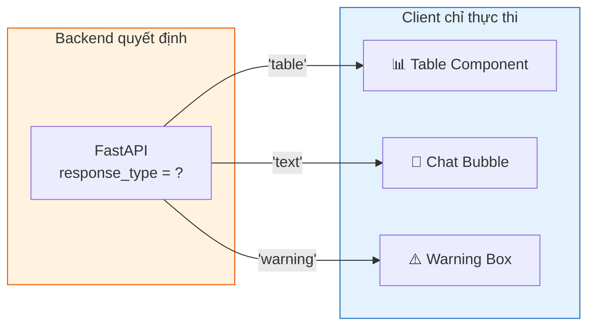
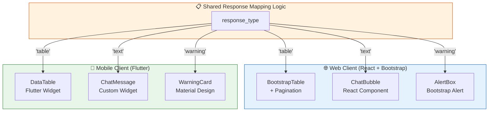
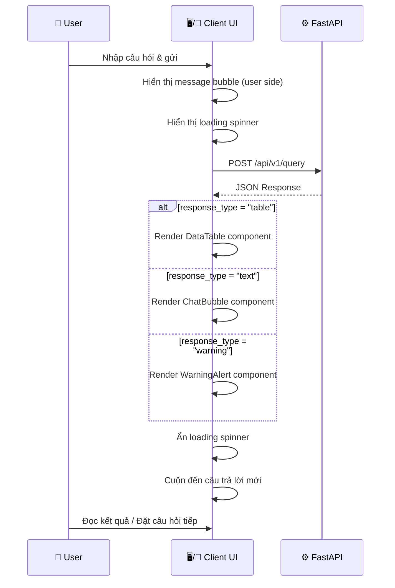

# 06. KIẾN TRÚC GIAO DIỆN ĐA NỀN TẢNG — AegisHealth KBQA

> **Client UI/UX Architecture: Dynamic Rendering with Backend-Driven UI**

---

## 1. Triết lý Dynamic Rendering

### 1.1. Nguyên tắc cốt lõi

Toàn bộ kiến trúc giao diện của AegisHealth tuân theo triết lý **Backend-Driven UI** (Giao diện điều khiển bởi Backend):

> **Client = Lớp hiển thị thuần túy (Presentation Layer)**. Client **KHÔNG** chứa business logic quyết định hiển thị dạng nào. Mọi quyết định render đều được Backend đưa ra thông qua trường `response_type` trong JSON Response.



### 1.2. Lợi ích của phương pháp này

| Lợi ích | Giải thích |
|---|---|
| **Nhất quán đa nền tảng** | Web (React) và Mobile (Flutter) nhận cùng một JSON, cùng logic mapping → đảm bảo trải nghiệm đồng nhất |
| **Dễ mở rộng** | Thêm `response_type` mới (ví dụ: `"chart"`, `"image"`) chỉ cần thêm component ở client, không thay đổi kiến trúc |
| **Giảm logic client** | Client không cần phân tích nội dung để quyết định render dạng gì — đã được Backend xử lý |
| **Cập nhật không cần release** | Thay đổi logic phân loại response chỉ cần cập nhật Backend, client tự thích ứng |

---

## 2. Kiến trúc Component chia sẻ giữa Web & Mobile

### 2.1. Mapping `response_type` → UI Component



| `response_type` | Web Component (React + Bootstrap) | Mobile Component (Flutter) | Mô tả |
|---|---|---|---|
| `"table"` | `<BootstrapDataTable>` — bảng dữ liệu responsive | `DataTable` widget — danh sách cuộn | Hiển thị danh sách triệu chứng, thuốc, v.v. |
| `"text"` | `<ChatBubble>` — bong bóng chat | `ChatMessage` widget — tin nhắn | Hiển thị giải thích, mô tả bệnh |
| `"warning"` | `<BootstrapAlert variant="danger">` — hộp cảnh báo đỏ | `WarningCard` widget — thẻ cảnh báo | Hiển thị cảnh báo y tế khẩn cấp |

---

## 3. Web Client — React + Bootstrap

### 3.1. Kiến trúc Component

```
src/
├── components/
│   ├── ChatInterface/
│   │   ├── ChatInterface.jsx       # Container chính
│   │   ├── MessageList.jsx          # Danh sách tin nhắn
│   │   ├── InputBar.jsx             # Thanh nhập liệu
│   │   └── ResponseRenderer.jsx     # ★ Dynamic Renderer
│   ├── renderers/
│   │   ├── TableRenderer.jsx        # Render response_type = "table"
│   │   ├── TextRenderer.jsx         # Render response_type = "text"
│   │   └── WarningRenderer.jsx      # Render response_type = "warning"
│   └── common/
│       ├── Header.jsx
│       ├── Footer.jsx
│       └── LoadingSpinner.jsx
├── services/
│   └── apiService.js                # AJAX calls to Backend
├── App.jsx
└── index.js
```

### 3.2. Logic Dynamic Rendering (ResponseRenderer)

`ResponseRenderer` là component trung tâm, nhận toàn bộ JSON response và phân phối (dispatch) render sang component con tương ứng:

```jsx
// ResponseRenderer.jsx — Pseudocode minh họa
function ResponseRenderer({ response }) {
  switch (response.response_type) {
    case "table":
      return <TableRenderer data={response.data} answer={response.answer} />;
    case "text":
      return <TextRenderer answer={response.answer} />;
    case "warning":
      return <WarningRenderer answer={response.answer} />;
    default:
      return <TextRenderer answer={response.answer} />;
  }
}
```

### 3.3. Chi tiết từng Renderer (Web)

#### `TableRenderer` — Bảng dữ liệu

- **Bootstrap component**: `<Table striped bordered hover responsive>`
- **Tính năng**: 
  - Tự động tạo header từ keys của object đầu tiên trong mảng `data`.
  - Responsive — tự cuộn ngang trên màn hình nhỏ.
  - Hiển thị `answer` phía trên bảng như mô tả tóm tắt.

```jsx
// TableRenderer.jsx — Pseudocode minh họa
function TableRenderer({ data, answer }) {
  const headers = Object.keys(data[0]);
  return (
    <div className="table-response">
      <p className="response-summary">{answer}</p>
      <Table striped bordered hover responsive>
        <thead>
          <tr>{headers.map(h => <th key={h}>{h}</th>)}</tr>
        </thead>
        <tbody>
          {data.map((row, i) => (
            <tr key={i}>
              {headers.map(h => <td key={h}>{row[h]}</td>)}
            </tr>
          ))}
        </tbody>
      </Table>
    </div>
  );
}
```

#### `TextRenderer` — Bong bóng chat

- **Bootstrap component**: `<Card>` hoặc custom chat bubble CSS.
- **Tính năng**:
  - Hiển thị `answer` trong khung chat với kiểu dáng bong bóng.
  - Phân biệt tin nhắn của user (bên phải) và hệ thống (bên trái).

```jsx
// TextRenderer.jsx — Pseudocode minh họa
function TextRenderer({ answer }) {
  return (
    <div className="chat-bubble bot-message">
      <div className="bubble-content">
        <p>{answer}</p>
      </div>
    </div>
  );
}
```

#### `WarningRenderer` — Hộp cảnh báo

- **Bootstrap component**: `<Alert variant="danger">`
- **Tính năng**:
  - Nền đỏ/vàng nổi bật với icon cảnh báo.
  - Hiển thị nút CTA "Gọi Cấp Cứu" hoặc "Tìm Bệnh Viện" (tùy chọn).

```jsx
// WarningRenderer.jsx — Pseudocode minh họa
function WarningRenderer({ answer }) {
  return (
    <Alert variant="danger" className="warning-response">
      <Alert.Heading>
        <ExclamationTriangleFill /> Cảnh báo Y tế
      </Alert.Heading>
      <p>{answer}</p>
      <hr />
      <div className="d-flex justify-content-end">
        <Button variant="outline-danger">🏥 Tìm Bệnh Viện Gần Nhất</Button>
      </div>
    </Alert>
  );
}
```

---

## 4. Mobile Client — Flutter

### 4.1. Kiến trúc Widget

```
lib/
├── screens/
│   └── chat_screen.dart              # Màn hình chính
├── widgets/
│   ├── response_renderer.dart        # ★ Dynamic Renderer
│   ├── renderers/
│   │   ├── table_renderer.dart       # Render "table"
│   │   ├── text_renderer.dart        # Render "text"
│   │   └── warning_renderer.dart     # Render "warning"
│   ├── chat_input_bar.dart
│   └── message_bubble.dart
├── models/
│   └── query_response.dart           # JSON → Dart model
├── services/
│   └── api_service.dart              # HTTP calls
└── main.dart
```

### 4.2. Logic Dynamic Rendering (Flutter)

```dart
// response_renderer.dart — Pseudocode minh họa
class ResponseRenderer extends StatelessWidget {
  final QueryResponse response;
  
  const ResponseRenderer({required this.response});

  @override
  Widget build(BuildContext context) {
    switch (response.responseType) {
      case 'table':
        return TableRenderer(
          data: response.data, 
          answer: response.answer,
        );
      case 'text':
        return TextRenderer(answer: response.answer);
      case 'warning':
        return WarningRenderer(answer: response.answer);
      default:
        return TextRenderer(answer: response.answer);
    }
  }
}
```

### 4.3. Chi tiết từng Renderer (Flutter)

#### `TableRenderer` — DataTable

```dart
// table_renderer.dart — Pseudocode minh họa
class TableRenderer extends StatelessWidget {
  final List<Map<String, dynamic>> data;
  final String answer;

  @override
  Widget build(BuildContext context) {
    final headers = data.first.keys.toList();
    return Column(
      crossAxisAlignment: CrossAxisAlignment.start,
      children: [
        // Tóm tắt câu trả lời
        Padding(
          padding: const EdgeInsets.all(12),
          child: Text(answer, style: Theme.of(context).textTheme.bodyMedium),
        ),
        // Bảng dữ liệu cuộn ngang
        SingleChildScrollView(
          scrollDirection: Axis.horizontal,
          child: DataTable(
            columns: headers.map((h) => DataColumn(label: Text(h))).toList(),
            rows: data.map((row) => DataRow(
              cells: headers.map((h) => DataCell(Text(row[h].toString()))).toList(),
            )).toList(),
          ),
        ),
      ],
    );
  }
}
```

#### `WarningRenderer` — Material Warning Card

```dart
// warning_renderer.dart — Pseudocode minh họa
class WarningRenderer extends StatelessWidget {
  final String answer;

  @override
  Widget build(BuildContext context) {
    return Card(
      color: Colors.red.shade50,
      elevation: 4,
      margin: const EdgeInsets.all(12),
      child: Padding(
        padding: const EdgeInsets.all(16),
        child: Column(
          children: [
            Row(
              children: [
                Icon(Icons.warning_amber, color: Colors.red, size: 28),
                const SizedBox(width: 8),
                Text('Cảnh báo Y tế',
                  style: TextStyle(
                    fontWeight: FontWeight.bold,
                    color: Colors.red.shade800,
                    fontSize: 18,
                  ),
                ),
              ],
            ),
            const Divider(),
            Text(answer),
            const SizedBox(height: 12),
            ElevatedButton.icon(
              onPressed: () { /* Open map / dial */ },
              icon: const Icon(Icons.local_hospital),
              label: const Text('Tìm Bệnh Viện Gần Nhất'),
              style: ElevatedButton.styleFrom(
                backgroundColor: Colors.red,
              ),
            ),
          ],
        ),
      ),
    );
  }
}
```

---

## 5. Luồng Tương tác Người dùng (User Flow)



---

## 6. Nguyên tắc UI/UX

### 6.1. Design Guidelines

| Nguyên tắc | Mô tả |
|---|---|
| **Chat-first Interface** | Giao diện chính là dạng chat, tự nhiên và quen thuộc với người dùng |
| **Progressive Disclosure** | Hiển thị thông tin từ tổng quan → chi tiết (answer trước, data table sau) |
| **Clear Visual Hierarchy** | Warning nổi bật nhất (đỏ) → Table cấu trúc rõ ràng → Text nhẹ nhàng |
| **Mobile-first Responsive** | Thiết kế cho mobile trước, scale lên desktop — đảm bảo trải nghiệm tốt trên mọi thiết bị |
| **Accessibility** | Đảm bảo contrast ratio đủ lớn, font size phù hợp cho nội dung y tế |

### 6.2. Trạng thái UI cần xử lý

| Trạng thái | Web (React) | Mobile (Flutter) |
|---|---|---|
| **Loading** | Spinner + skeleton placeholder | `CircularProgressIndicator` + shimmer effect |
| **Empty State** | Hướng dẫn ban đầu + câu hỏi gợi ý | Onboarding screen + suggestion chips |
| **Error** | Toast notification + retry button | `SnackBar` + retry action |
| **Success** | Render theo `response_type` | Render theo `response_type` |

---

## 7. Khả năng Mở rộng `response_type`

Kiến trúc Dynamic Rendering cho phép dễ dàng thêm các loại response mới trong tương lai:

| `response_type` (tương lai) | Mô tả | Component tương ứng |
|---|---|---|
| `"chart"` | Biểu đồ thống kê (ví dụ: phân bố triệu chứng) | Chart.js (Web) / fl_chart (Flutter) |
| `"graph"` | Hiển thị đồ thị con (sub-graph) trực quan | D3.js (Web) / CustomPainter (Flutter) |
| `"image"` | Hình ảnh minh họa y tế | `` (Web) / `Image.network` (Flutter) |
| `"multi"` | Kết hợp nhiều loại trong một response | Composite component |
