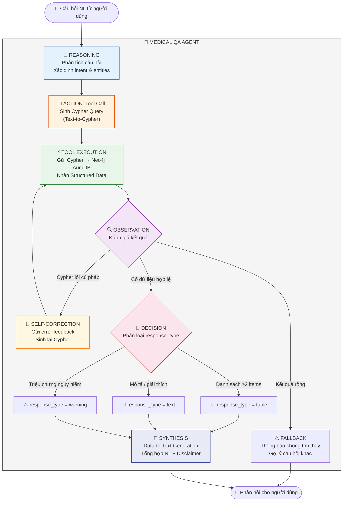
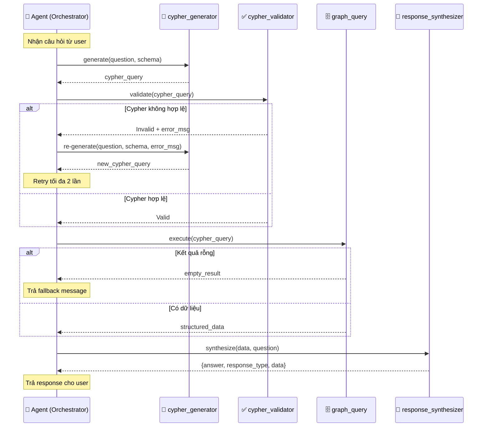
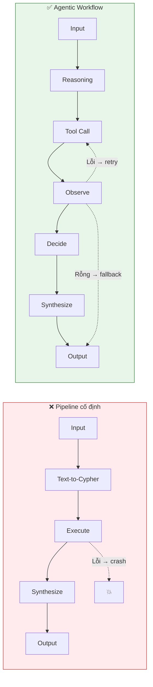

# 07. THIẾT KẾ THÀNH PHẦN AGENTIC AI — AegisHealth KBQA

> **Agentic AI Design: Tool-using Agent Workflow với Suy luận Nhiều bước**

---

## 1. Tổng quan: Từ Pipeline đến Agent

### 1.1. Định nghĩa Agentic AI

Trong ngữ cảnh hệ thống AI hiện đại, **Agentic AI** đề cập đến kiến trúc mà trong đó một "agent" (tác nhân) có khả năng:

1. **Phân tích yêu cầu** và lập kế hoạch hành động.
2. **Sử dụng công cụ (tools)** để thu thập thông tin hoặc thực hiện tác vụ.
3. **Ra quyết định ở các bước trung gian** dựa trên kết quả từ bước trước.
4. **Tự sửa lỗi** khi phát hiện output không hợp lệ (self-correction).

### 1.2. AegisHealth dưới góc nhìn Agentic

Pipeline 3 bước **Generate → Retrieve → Synthesize** của AegisHealth không đơn thuần là một chuỗi xử lý tuyến tính (linear pipeline). Khi phân tích kỹ, hệ thống thể hiện đầy đủ các đặc tính của một **Tool-using Agent** theo mô hình **ReAct** (Reasoning + Acting):

| Đặc tính Agentic | Biểu hiện trong AegisHealth |
|---|---|
| **Reasoning** (Suy luận) | LLM phân tích câu hỏi NL, suy luận về cấu trúc đồ thị cần truy vấn, xác định entities & relationships liên quan |
| **Acting** (Hành động) | LLM sinh Cypher query — đây chính là một **tool call** đến Neo4j AuraDB |
| **Observation** (Quan sát) | Agent nhận kết quả truy vấn từ Neo4j (tool response) và đánh giá tính hợp lệ |
| **Decision** (Quyết định) | Agent phân loại `response_type` (table/text/warning) dựa trên dữ liệu quan sát được |
| **Self-correction** | Nếu Cypher sinh ra lỗi, agent retry với error feedback |

---

## 2. Kiến trúc Agent Chi tiết

### 2.1. Agent Workflow Diagram



### 2.2. So sánh: Pipeline truyền thống vs. Agentic Workflow

| Khía cạnh | Pipeline tuyến tính | Agentic Workflow (AegisHealth) |
|---|---|---|
| **Luồng xử lý** | Cố định: A → B → C | Linh hoạt: có vòng lặp retry, nhánh fallback |
| **Xử lý lỗi** | Dừng & trả lỗi | Tự sửa (retry with feedback), fallback graceful |
| **Ra quyết định** | Không có | Agent phân loại response_type dựa trên dữ liệu trung gian |
| **Tool usage** | Gọi hàm cố định | Agent "quyết định" query nào phù hợp dựa trên câu hỏi |
| **Khả năng mở rộng** | Thêm bước = sửa code | Thêm tool mới cho agent (ví dụ: web search, drug interaction check) |

---

## 3. Đặc tả Tools của Agent

### 3.1. Bảng Đăng ký Tool (Tool Registry)

Agent của AegisHealth quản lý một tập hợp tools mà nó có thể sử dụng:

| Tool ID | Tên | Input | Output | Mô tả |
|---|---|---|---|---|
| `cypher_generator` | Text-to-Cypher | Câu hỏi NL + Graph Schema | Cypher query string | LLM sinh câu lệnh Cypher từ câu hỏi |
| `graph_query` | Neo4j Executor | Cypher query string | List of records (JSON) | Thực thi Cypher trên Neo4j AuraDB |
| `response_synthesizer` | Data-to-Text | Structured data + Original question | NL answer + response_type | Tổng hợp câu trả lời tự nhiên |
| `cypher_validator` | Syntax Checker | Cypher query string | Valid / Invalid + error message | Kiểm tra cú pháp Cypher trước khi thực thi |

### 3.2. Luồng Tool Invocation



---

## 4. Decision Logic Chi tiết

### 4.1. Intent Classification (Nút quyết định)

Agent thực hiện phân loại ý định tại **hai điểm quyết định** trong luồng:

**Điểm quyết định 1: Sau Observation (kết quả truy vấn)**

```
IF query_result is SYNTAX_ERROR:
    → RETRY (self-correction, tối đa 2 lần)
    → Nếu vẫn lỗi: trả "Xin lỗi, tôi chưa hiểu câu hỏi..."

ELSE IF query_result is EMPTY:
    → FALLBACK: "Không tìm thấy thông tin..."

ELSE IF query_result has DATA:
    → Chuyển sang Điểm quyết định 2
```

**Điểm quyết định 2: Phân loại Response Type**

```
IF data contains dangerous symptoms (chest pain, severe bleeding, ...):
    → response_type = "warning"

ELSE IF data is LIST with ≥ 2 items:
    → response_type = "table"

ELSE:
    → response_type = "text"
```

### 4.2. Self-Correction Mechanism

Khi Cypher sinh ra không hợp lệ, agent không dừng lại mà thực hiện **retry with error feedback**:

| Lần retry | Chiến lược | Input bổ sung cho LLM |
|---|---|---|
| **Retry 1** | Gửi lại prompt kèm error message | `"Cypher trước bị lỗi: {error}. Hãy sửa lại."` |
| **Retry 2** | Đơn giản hóa câu hỏi + narrow schema | Giảm schema context, tập trung vào entities rõ ràng nhất |
| **Từ chối** | Trả fallback gracefully | `"Xin lỗi, tôi chưa hiểu. Bạn có thể diễn đạt lại?"` |

---

## 5. So sánh với Non-Agentic Approaches

### 5.1. Tại sao không dùng Pipeline cố định?



### 5.2. Lợi ích của Agent-based Architecture

| Lợi ích | Mô tả |
|---|---|
| **Resilience** | Hệ thống không crash khi gặp lỗi — tự phục hồi qua retry |
| **Extensibility** | Dễ dàng thêm tool mới (ví dụ: Drug Interaction Checker, Web Search) vào tool registry mà không thay đổi kiến trúc |
| **Observability** | Mỗi bước agent đều có thể được log, giúp debug và audit trail |
| **Adaptability** | Agent có thể điều chỉnh chiến lược dựa trên kết quả trung gian |

---

## 6. Khả năng Mở rộng Agent (Tương lai)

| Mở rộng | Mô tả |
|---|---|
| **Multi-tool Agent** | Thêm tools: web search (khi graph không có data), drug interaction checker, clinical guideline lookup |
| **Planning Phase** | Agent lập kế hoạch truy vấn nhiều bước cho câu hỏi phức tạp (plan → execute → verify) |
| **Memory** | Agent nhớ context hội thoại trước đó cho multi-turn QA |
| **Evaluation Agent** | Agent thứ hai đánh giá chất lượng câu trả lời trước khi trả về user (self-evaluation) |
