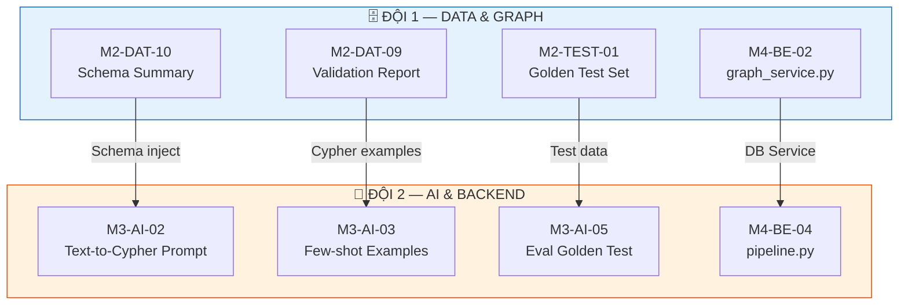

# 07. PHÂN CÔNG CÔNG VIỆC CHI TIẾT — AegisHealth KBQA

> **Task Assignments: Backlog Breakdown theo Milestone & Sprint**

---

## Quy ước Ký hiệu

| Ký hiệu | Ý nghĩa |
|---|---|
| **Đội 1 (Data & Graph)** | Chịu trách nhiệm chính về Data Pipeline, Graph Schema, Neo4j AuraDB |
| **Đội 2 (AI & Backend)** | Chịu trách nhiệm chính về LLM/Prompt, FastAPI Backend, Frontend Integration |
| **[Data Lead]** | Lead Đội 1 — thiết kế Schema, viết Cypher phức tạp, review pipeline |
| **[Data Dev]** | Dev Đội 1 — viết script Python/Pandas, clean data, import data |
| **[AI Lead]** | Lead Đội 2 — setup model Ollama/vLLM, thiết kế System Prompt, kiến trúc FastAPI |
| **[AI Dev]** | Dev Đội 2 — viết endpoint CRUD, parsing JSON, tích hợp Frontend |
| 🤝 | Điểm bắt tay Cross-team (cần phối hợp giữa 2 đội) |

---

## Bảng Tổng hợp Milestones

| # | Milestone | Mục tiêu chính | Sprint | Tuần |
|---|---|---|---|---|
| M1 | Design Approved | Bộ tài liệu thiết kế hoàn chỉnh, được phê duyệt | Sprint 0 | T1–T2 |
| M2 | Knowledge Graph Ready | AuraDB có ≥200 diseases, ≥100 symptoms, ≥200 drugs; Golden Test Set 50 câu | Sprint 0–1 | T1–T4 |
| M3 | AI Pipeline v1 | Cypher accuracy ≥ 70%; Data-to-Text prompt hoạt động | Sprint 0–1 | T1–T4 |
| M4 | Backend + Web MVP | Demo end-to-end: hỏi → nhận trả lời trên web browser | Sprint 2–3 | T5–T8 |
| M5 | Multi-platform + QA | Flutter app chạy; Cypher accuracy ≥ 85%; Docker ready | Sprint 4 | T9–T10 |
| M6 | Final Submission | Written Report, code repo, demo video nộp đúng hạn | Sprint 5 | T11–T12 |

---

## Milestone 1: Design Approved
*Mục tiêu:* Hoàn thiện và phê duyệt toàn bộ tài liệu thiết kế hệ thống (11 docs). Thiết lập hạ tầng ban đầu (repo, tools, môi trường phát triển).
*Thời gian dự kiến:* Sprint 0 (Tuần 1–2)

| Task ID | Tên Công việc (Actionable) | Đội phụ trách | Assignee | Tiêu chí hoàn thành (DoD) | Phụ thuộc (Dependencies) |
|---|---|---|---|---|---|
| M1-DAT-01 | Khởi tạo monorepo GitHub theo cấu trúc `11_DEVELOPMENT_INFRASTRUCTURE.md` | Đội 1 (Data) | [Data Lead] | Repo trên GitHub với folder structure đầy đủ (`docs/`, `data/`, `backend/`, `web-client/`, `mobile-client/`), `.gitignore`, `README.md`, branch `main` + `develop` | Không |
| M1-DAT-02 | Tạo tài khoản Neo4j AuraDB Free Tier & cấu hình kết nối | Đội 1 (Data) | [Data Dev] | AuraDB instance tạo thành công, ghi nhận URI `neo4j+s://...`, file `.env.example` có template credentials | Không |
| M1-DAT-03 | Tải và kiểm tra datasets gốc từ Kaggle (Symptom2Disease.csv, Medicine_Recommendation.csv) | Đội 1 (Data) | [Data Dev] | 2 file CSV nằm trong `data/raw/`, có báo cáo thống kê cơ bản (số dòng, cột, tỷ lệ missing) | Không |
| M1-AI-01 | Cài đặt Ollama trên máy phát triển & pull model SLM (Llama-3-8B hoặc Qwen-2.5-7B) | Đội 2 (AI) | [AI Lead] | Ollama chạy trên port 11434, model respond đúng qua `curl http://localhost:11434/v1/chat/completions` | Không |
| M1-AI-02 | Khởi tạo base project FastAPI với cấu trúc thư mục chuẩn | Đội 2 (AI) | [AI Dev] | Project Python có `main.py`, `config.py`, `requirements.txt` theo spec trong `11_DEVELOPMENT_INFRASTRUCTURE.md`; Swagger UI chạy tại `localhost:8000/docs` | Không |
| M1-AI-03 | Viết file `.env.example` template với tất cả biến môi trường cần thiết | Đội 2 (AI) | [AI Dev] | File `.env.example` chứa đầy đủ: `NEO4J_URI`, `NEO4J_USERNAME/PASSWORD`, `LLM_BASE_URL`, `LLM_MODEL_NAME`, `API_HOST/PORT`, `API_CORS_ORIGINS`, `LOG_LEVEL` | M1-DAT-02 |
| M1-ALL-01 | Review & finalize bộ tài liệu thiết kế (11 docs) | Cả 2 đội | Cả 4 người | Tất cả 11 tài liệu được review chéo, sửa lỗi nếu có, nộp cho GV/hướng dẫn phê duyệt | Không |
| M1-ALL-02 | Setup công cụ quản lý: GitHub Projects (Kanban board), Discord channels | Cả 2 đội | Cả 4 người | Kanban board có 5 cột (`Backlog → Sprint → In Progress → Review → Done`), Discord có các channels: `#daily-sync`, `#pair-alpha`, `#pair-beta` | Không |

### 🤝 Điểm bắt tay Cross-team (Milestone 1):
- **[Data Dev]** cung cấp URI AuraDB + credentials → **[AI Dev]** cập nhật `.env.example` (M1-DAT-02 → M1-AI-03).
- **Cuối Sprint 0**: Cả 4 người demo setup cho nhau, đảm bảo ai cũng chạy được Neo4j + Ollama + FastAPI trên máy local.

---

## Milestone 2: Knowledge Graph Ready
*Mục tiêu:* Hoàn thành pipeline ETL, load dữ liệu lên Neo4j AuraDB với ≥200 diseases, ≥100 symptoms, ≥200 drugs. Validate graph bằng Cypher queries mẫu. Tạo Golden Test Set (50 câu).
*Thời gian dự kiến:* Sprint 0–1 (Tuần 1–4)

| Task ID | Tên Công việc (Actionable) | Đội phụ trách | Assignee | Tiêu chí hoàn thành (DoD) | Phụ thuộc (Dependencies) |
|---|---|---|---|---|---|
| M2-DAT-01 | Thiết kế Graph Schema chính thức: định nghĩa Node Labels, Properties, Relationship Types | Đội 1 (Data) | [Data Lead] | File `schema.cypher` chứa 3 `CREATE CONSTRAINT` (Disease/Symptom/Drug name unique) + 3 `CREATE INDEX`; tài liệu bổ sung trên Markdown | Không |
| M2-DAT-02 | Viết EDA script phân tích Symptom2Disease.csv (thống kê, phân bố, anomalies) | Đội 1 (Data) | [Data Dev] | Script Python (`eda_symptom2disease.py`) chạy không lỗi, output báo cáo: số unique diseases, symptoms, missing values, duplicates | M1-DAT-03 |
| M2-DAT-03 | Viết EDA script phân tích Medicine_Recommendation.csv | Đội 1 (Data) | [Data Dev] | Script Python (`eda_medicine.py`) chạy không lỗi, output báo cáo: số unique drugs, disease-drug pairs, missing values | M1-DAT-03 |
| M2-DAT-04 | Viết script ETL: Transform Symptom2Disease.csv → tách entities & quan hệ | Đội 1 (Data) | [Data Dev] | Script `etl_pipeline.py` (phần Symptom2Disease): lowercase, strip whitespace, dedup, output 3 file CSV sạch (`diseases.csv`, `symptoms.csv`, `disease_symptom.csv`) | M2-DAT-02 |
| M2-DAT-05 | Viết script ETL: Transform Medicine_Recommendation.csv → tách entities & quan hệ | Đội 1 (Data) | [Data Dev] | Script `etl_pipeline.py` (phần Medicine): output `drugs.csv` + `disease_drug.csv`, entity_id duy nhất cho mỗi drug | M2-DAT-03 |
| M2-DAT-06 | Review kết quả ETL: kiểm tra data quality, cross-reference giữa 2 datasets | Đội 1 (Data) | [Data Lead] | Báo cáo data quality: 0 nulls ở trường `name`, 0 duplicates, mapping disease names giữa 2 datasets nhất quán | M2-DAT-04, M2-DAT-05 |
| M2-DAT-07 | Viết script `load_to_neo4j.py`: import entities vào AuraDB (Disease, Symptom, Drug nodes) | Đội 1 (Data) | [Data Dev] | Script kết nối AuraDB qua `neo4j+s://`, dùng `MERGE` statements, batch 1000 records/batch; ≥200 Disease nodes, ≥100 Symptom nodes, ≥200 Drug nodes trên AuraDB | M2-DAT-01, M2-DAT-06 |
| M2-DAT-08 | Viết script import relationships vào AuraDB (HAS_SYMPTOM, TREATED_BY) | Đội 1 (Data) | [Data Dev] | Relationships tạo thành công trên AuraDB; `MATCH` query trả kết quả đúng cho ít nhất 10 diseases mẫu | M2-DAT-07 |
| M2-DAT-09 | 🤝 Validate toàn bộ Knowledge Graph bằng bộ Cypher queries mẫu (từ `03_DATA_PIPELINE_AND_SCHEMA.md`) | Đội 1 (Data) | [Data Lead] | Chạy thành công tất cả 7 loại query mẫu (basic, multi-hop, statistical, differential diagnosis); ghi nhận kết quả vào file `validation_report.md` | M2-DAT-08 |
| M2-DAT-10 | 🤝 Tạo và export file Schema Summary (danh sách labels, properties, relationships) cho Đội 2 dùng viết prompt | Đội 1 (Data) | [Data Lead] | File `graph_schema_summary.md` chứa bảng tóm tắt toàn bộ schema + thống kê số lượng nodes/relationships thực tế trên AuraDB | M2-DAT-09 |
| M2-TEST-01 | Xây dựng Golden Test Set v1: viết 30 cặp (question, expected_cypher) | Đội 1 (Data) | [Data Lead] | File `golden_test_set.json` chứa 30 cặp, cover 3 loại: basic query (15), multi-hop (10), statistical (5) | M2-DAT-09 |
| M2-TEST-02 | Mở rộng Golden Test Set lên 50 câu: thêm edge cases & tiếng Việt | Đội 1 (Data) | [Data Dev] | File `golden_test_set.json` có 50 cặp, bao gồm: 10 câu hỏi tiếng Việt, 5 câu edge case (entity không tồn tại, câu hỏi mập mờ) | M2-TEST-01 |

### 🤝 Điểm bắt tay Cross-team (Milestone 2):
- **[Data Lead]** hoàn thành M2-DAT-10 (Schema Summary) → chuyển cho **[AI Lead]** để inject vào System Prompt (M3-AI-02).
- **[Data Lead]** hoàn thành M2-DAT-09 (Validation) → Cypher queries mẫu dùng làm few-shot examples cho **[AI Lead]** (M3-AI-03).
- **[Data Lead]** hoàn thành M2-TEST-01 (Golden Test Set) → **[AI Lead]** dùng để benchmark Cypher accuracy (M3-AI-05).

---

## Milestone 3: AI Pipeline v1
*Mục tiêu:* Cypher Generation accuracy ≥ 70% trên Golden Test Set. Data-to-Text prompt hoạt động ổn định. Intent classification (table/text/warning) chính xác.
*Thời gian dự kiến:* Sprint 0–1 (Tuần 1–4, chạy song song với Milestone 2)

| Task ID | Tên Công việc (Actionable) | Đội phụ trách | Assignee | Tiêu chí hoàn thành (DoD) | Phụ thuộc (Dependencies) |
|---|---|---|---|---|---|
| M3-AI-01 | Benchmark 2–3 model SLM trên tác vụ Text-to-Cypher (Llama-3-8B, Qwen-2.5-7B, Mistral-7B) | Đội 2 (AI) | [AI Lead] | Báo cáo so sánh: accuracy, latency, GPU RAM cho mỗi model trên 10 câu hỏi mẫu; chọn model chính thức | M1-AI-01 |
| M3-AI-02 | 🤝 Viết System Prompt v1 cho Text-to-Cypher (inject Graph Schema từ Đội 1) | Đội 2 (AI) | [AI Lead] | File `text_to_cypher.txt` hoàn chỉnh: có role definition, full schema injection, ràng buộc output, ≥ 3 few-shot examples | M2-DAT-10, M1-AI-01 |
| M3-AI-03 | 🤝 Bổ sung few-shot examples vào prompt từ Cypher queries mẫu (nhận từ Đội 1) | Đội 2 (AI) | [AI Lead] | Prompt có ≥ 8 few-shot examples cover: basic query, multi-hop, statistical, Vietnamese input | M3-AI-02, M2-DAT-09 |
| M3-AI-04 | Viết script Python test prompt thủ công qua Ollama API (20 câu hỏi) | Đội 2 (AI) | [AI Dev] | Script `test_prompt.py` chạy 20 câu hỏi qua Ollama, output ra file kết quả (question → generated_cypher → pass/fail) | M3-AI-02 |
| M3-AI-05 | 🤝 Chạy Golden Test Set lên prompt v1 → đo Cypher accuracy baseline | Đội 2 (AI) | [AI Dev] | Script `eval_golden_test.py` tự động chạy 50 câu, báo cáo: accuracy %, phân loại lỗi theo taxonomy (E1–E6 từ `04_AI_MODELS_STRATEGY.md`) | M3-AI-03, M2-TEST-01 |
| M3-AI-06 | Tinh chỉnh prompt v1 → v1.x dựa trên error analysis (bổ sung few-shot, sửa schema) | Đội 2 (AI) | [AI Lead] | Cypher accuracy trên Golden Test Set ≥ 70% (tăng so với baseline); ghi nhận changelog prompt versions | M3-AI-05 |
| M3-AI-07 | Viết System Prompt v1 cho Data-to-Text & Intent Classification (Bước 3) | Đội 2 (AI) | [AI Lead] | File `data_to_text.txt` hoàn chỉnh: role, output JSON format spec (`response_type`, `answer`, `data`), ≥ 3 examples cho table/text/warning, disclaimer bắt buộc | M1-AI-01 |
| M3-AI-08 | Test Data-to-Text prompt trên 15 bộ data mẫu (5 table, 5 text, 5 warning) | Đội 2 (AI) | [AI Dev] | Mỗi response có JSON format đúng spec; `response_type` phân loại chính xác ≥ 80%; disclaimer luôn có mặt | M3-AI-07 |
| M3-AI-09 | Viết module `cypher_validator.py`: kiểm tra syntax Cypher trước khi thực thi | Đội 2 (AI) | [AI Dev] | Module detect: syntax errors, out-of-schema labels/rels, destructive commands (DELETE/DROP); unit tests pass | Không |

### 🤝 Điểm bắt tay Cross-team (Milestone 3):
- **[AI Lead]** nhận `graph_schema_summary.md` từ **[Data Lead]** để inject vào System Prompt (M3-AI-02).
- **[AI Dev]** nhận `golden_test_set.json` từ **[Data Lead/Dev]** để chạy evaluation (M3-AI-05).
- **Cross-review cuối Phase 1**: Cả 4 người demo — Đội 1 demo Knowledge Graph, Đội 2 demo AI Prompt results. Mỗi đội review work của đội kia.

---

## Milestone 4: Backend + Web MVP
*Mục tiêu:* Demo end-to-end trên web browser: Người dùng nhập câu hỏi → nhận câu trả lời (table/text/warning). Backend production-ready với error handling, CORS, API docs.
*Thời gian dự kiến:* Sprint 2–3 (Tuần 5–8)

| Task ID | Tên Công việc (Actionable) | Đội phụ trách | Assignee | Tiêu chí hoàn thành (DoD) | Phụ thuộc (Dependencies) |
|---|---|---|---|---|---|
| **Sprint 2 — Backend MVP & Web MVP** | | | | | |
| M4-BE-01 | Implement Pydantic request/response models (`QueryRequest`, `QueryResponse`) theo spec `05_API_SYSTEM_DESIGN.md` | Đội 2 (AI) | [AI Dev] | File `models/request.py` + `models/response.py` với validation; match JSON schema trong docs (status, response_type, answer, data, metadata) | M1-AI-02 |
| M4-BE-02 | Implement `graph_service.py`: kết nối Neo4j AuraDB, thực thi Cypher, trả kết quả | Đội 1 (Data) | [Data Lead] | Service kết nối qua `neo4j+s://`, hàm `execute_cypher(query) → List[Dict]`, connection pooling, error handling cho timeout/connection failure | M2-DAT-09 |
| M4-BE-03 | Implement `llm_service.py`: gọi Ollama API (OpenAI-compatible), truyền prompt + nhận response | Đội 2 (AI) | [AI Lead] | Service gọi `/v1/chat/completions`, hỗ trợ configurable `base_url` + `model_name`, timeout 30s, parse JSON response từ LLM | M3-AI-02, M3-AI-07 |
| M4-BE-04 | Implement `pipeline.py` (Agent Orchestrator): luồng Generate → Retrieve → Synthesize | Đội 2 (AI) | [AI Lead] | Orchestrator gọi lần lượt: `llm_service` (Text-to-Cypher) → `cypher_validator` → `graph_service` → `llm_service` (Data-to-Text); retry logic (tối đa 2 lần); fallback message khi lỗi | M4-BE-02, M4-BE-03, M3-AI-09 |
| M4-BE-05 | Implement endpoint `POST /api/v1/query` tích hợp pipeline | Đội 2 (AI) | [AI Dev] | Endpoint nhận `QueryRequest`, gọi `pipeline.py`, trả `QueryResponse`; test bằng `curl` thành công end-to-end | M4-BE-01, M4-BE-04 |
| M4-BE-06 | Implement endpoint `GET /api/v1/health` (health check) | Đội 2 (AI) | [AI Dev] | Endpoint trả JSON: status database (connected/disconnected), llm_server (available/unavailable), api version | M4-BE-02, M4-BE-03 |
| M4-BE-07 | 🤝 Implement endpoint `GET /api/v1/schema` (schema info cho debug) | Đội 1 (Data) | [Data Lead] | Endpoint trả JSON: danh sách nodes (label, count, properties), relationships (type, count, from, to); query trực tiếp từ AuraDB | M4-BE-02 |
| M4-WEB-01 | Khởi tạo React project (Vite + Bootstrap 5) theo cấu trúc `06_CLIENT_UI_UX_ARCHITECTURE.md` | Đội 2 (AI) | [AI Dev] | React app chạy tại `localhost:5173`, folder structure match docs: `components/ChatInterface/`, `components/renderers/`, `services/` | Không |
| M4-WEB-02 | Build component `ChatInterface`: input bar + message list | Đội 2 (AI) | [AI Dev] | User nhập text → hiện message bubble bên phải; loading spinner show khi chờ; auto-scroll đến message mới nhất | M4-WEB-01 |
| M4-WEB-03 | Build `ResponseRenderer` + `TableRenderer` component | Đội 2 (AI) | [AI Dev] | `ResponseRenderer` switch theo `response_type`; `TableRenderer` hiển thị Bootstrap table responsive từ mảng `data` + `answer` summary | M4-WEB-01 |
| M4-WEB-04 | Build `TextRenderer` + `WarningRenderer` components | Đội 2 (AI) | [AI Dev] | `TextRenderer`: chat bubble style; `WarningRenderer`: Bootstrap Alert variant="danger" + icon cảnh báo + nút CTA tùy chọn | M4-WEB-01 |
| M4-WEB-05 | Build `apiService.js`: kết nối Frontend tới Backend API | Đội 2 (AI) | [AI Dev] | Axios client gọi `POST /api/v1/query`, xử lý response/error; configurable `API_BASE_URL` từ env variable | M4-BE-05, M4-WEB-01 |
| M4-WEB-06 | 🤝 Integration test: Web → Backend → LLM → AuraDB → Web (full round-trip) | Cả 2 đội | [AI Dev] + [Data Dev] | Demo 5 câu hỏi end-to-end trên browser: ≥1 table response, ≥1 text response, ≥1 warning response; tất cả hiển thị đúng | M4-BE-05, M4-WEB-05 |
| **Sprint 3 — Backend Hardening & Web Polish** | | | | | |
| M4-BE-08 | Implement error handling toàn diện theo bảng mã lỗi (`05_API_SYSTEM_DESIGN.md` section 4.2) | Đội 2 (AI) | [AI Dev] | Xử lý 6 loại lỗi (400/422/404/500/503/504); response luôn đúng format `ErrorResponse`; thông báo thân thiện tiếng Việt | M4-BE-05 |
| M4-BE-09 | Implement CORS configuration + Rate Limiting | Đội 2 (AI) | [AI Lead] | CORS chỉ cho phép origins trong `.env`; Rate limit configurable (mặc định 30 req/min/IP) | M4-BE-05 |
| M4-BE-10 | Implement Cypher Sanitization: chặn destructive queries (DELETE, DROP, MERGE write) | Đội 2 (AI) | [AI Lead] | Module `sanitizer.py` chặn mọi lệnh write/delete/drop trước khi gửi đến AuraDB; unit tests cover 10+ destructive patterns | M3-AI-09 |
| M4-BE-11 | Cấu hình API documentation tự động (OpenAPI spec) + clean Swagger UI | Đội 2 (AI) | [AI Dev] | Swagger UI tại `/docs` hiển thị tất cả endpoints, request/response schemas, descriptions rõ ràng | M4-BE-08 |
| M4-WEB-07 | Implement loading states (skeleton placeholder) & error handling trên UI | Đội 2 (AI) | [AI Dev] | Loading: skeleton khi chờ; Error: toast notification + retry button; Network error: friendly message | M4-WEB-06 |
| M4-WEB-08 | Implement Empty State: onboarding screen + 5 câu hỏi gợi ý (suggested questions) | Đội 2 (AI) | [AI Dev] | Khi chưa hỏi gì: hiển thị greeting + 5 chip câu hỏi mẫu; click chip → auto-fill input bar + gửi | M4-WEB-02 |
| M4-WEB-09 | Responsive design: đảm bảo web hoạt động tốt trên mobile viewport (375px+) | Đội 2 (AI) | [AI Dev] | Test trên Chrome DevTools ở breakpoints: 375px (mobile), 768px (tablet), 1024px (desktop); không bị vỡ layout | M4-WEB-06 |
| M4-WEB-10 | Implement Feedback widget: thumbs up/down sau mỗi câu trả lời | Đội 2 (AI) | [AI Dev] | 2 nút 👍👎 dưới mỗi response; click → gửi feedback event (log console ở MVP, API endpoint ở version sau) | M4-WEB-06 |
| M4-BE-12 | Viết unit tests cho backend: test_query.py, test_llm_service.py (≥ 10 test cases) | Đội 2 (AI) | [AI Dev] | `pytest tests/ -v` pass 100%; cover: valid query, empty result, cypher error, LLM timeout, DB connection error | M4-BE-08 |

### 🤝 Điểm bắt tay Cross-team (Milestone 4):
- **[Data Lead]** implement `graph_service.py` (M4-BE-02) vì hiểu sâu Neo4j — vì lý do A (Data Lead) pair với C trong Phase 2.
- **[Data Lead]** implement `/api/v1/schema` endpoint (M4-BE-07) vì gần gũi với data layer.
- **[AI Dev]** + **[Data Dev]** cùng integration test (M4-WEB-06): [AI Dev] test frontend flow, [Data Dev] verify DB queries đúng.
- **Integration demo cuối Sprint 3**: Cả 4 người demo MVP end-to-end.

---

## Milestone 5: Multi-platform + QA
*Mục tiêu:* Flutter mobile app chạy được. Cypher accuracy nâng lên ≥ 85%. Docker Compose ready. E2E test suite hoàn thành.
*Thời gian dự kiến:* Sprint 4 (Tuần 9–10)

| Task ID | Tên Công việc (Actionable) | Đội phụ trách | Assignee | Tiêu chí hoàn thành (DoD) | Phụ thuộc (Dependencies) |
|---|---|---|---|---|---|
| **Flutter Mobile App** | | | | | |
| M5-MOB-01 | Khởi tạo Flutter project theo cấu trúc `06_CLIENT_UI_UX_ARCHITECTURE.md` | Đội 2 (AI) | [AI Dev] | Flutter app chạy trên emulator/device, folder structure: `lib/screens/`, `lib/widgets/`, `lib/models/`, `lib/services/` | Không |
| M5-MOB-02 | Build Dart model `QueryResponse`: parse JSON response từ API | Đội 2 (AI) | [AI Dev] | Class `QueryResponse` with `fromJson()`, match JSON spec: status, response_type, answer, data, metadata | M5-MOB-01 |
| M5-MOB-03 | Build `api_service.dart`: HTTP client kết nối Backend API | Đội 2 (AI) | [AI Dev] | Hàm `postQuery(question, language)` gọi `POST /api/v1/query`, trả `QueryResponse`; error handling cho timeout/network error | M5-MOB-01, M4-BE-05 |
| M5-MOB-04 | Build `chat_screen.dart`: main screen với input bar + message list | Đội 2 (AI) | [AI Dev] | Chat UI hoạt động: nhập text → gửi → hiện user bubble + loading → hiện response; auto-scroll | M5-MOB-01 |
| M5-MOB-05 | Build `response_renderer.dart` + 3 renderer widgets (table/text/warning) | Đội 2 (AI) | [AI Dev] | `ResponseRenderer` switch theo `responseType`; `TableRenderer` = DataTable widget; `TextRenderer` = chat bubble; `WarningRenderer` = Material Card đỏ + icon warning | M5-MOB-02 |
| M5-MOB-06 | Implement suggestion chips + empty state trên Flutter | Đội 2 (AI) | [AI Dev] | Onboarding screen với ≥ 5 suggestion chips; tap chip → auto-query | M5-MOB-04 |
| **E2E Testing & Prompt Optimization** | | | | | |
| M5-QA-01 | Viết E2E test suite: 50 câu hỏi end-to-end (qua API, không qua UI) | Đội 2 (AI) | [AI Lead] | Script `e2e_test.py`: 50 câu hỏi → gọi API → validate: HTTP 200, response_type hợp lệ, answer không rỗng | M4-BE-05 |
| M5-QA-02 | 🤝 Chạy Golden Test Set v2 (50 câu) → đo accuracy sau tất cả cải tiến | Cả 2 đội | [AI Lead] + [Data Lead] | Báo cáo accuracy mới; phân tích: loại lỗi nào còn nhiều nhất; so sánh với baseline M3 | M3-AI-06, M2-TEST-02 |
| M5-QA-03 | Prompt tuning cuối: targeted fix cho top 3 loại lỗi phổ biến nhất | Đội 2 (AI) | [AI Lead] | Cypher accuracy trên Golden Test Set ≥ 85%; prompt changelog ghi rõ thay đổi | M5-QA-02 |
| M5-QA-04 | Performance testing: đo latency P50/P95 trên 50 requests | Đội 2 (AI) | [AI Dev] | Báo cáo: P50 < 2000ms, P95 < 5000ms; nếu vượt → ghi nhận bottleneck và giải pháp | M4-BE-05 |
| M5-QA-05 | Fix bugs phát hiện từ E2E testing (bug sprint) | Cả 2 đội | [AI Dev] + [Data Dev] | Tất cả bugs severity High đã fix; bugs Medium có workaround hoặc fix; danh sách bugs tracked trên GitHub Issues | M5-QA-01 |
| **Containerization & Deployment** | | | | | |
| M5-DEV-01 | Viết Dockerfile cho Backend (FastAPI + Uvicorn) | Đội 1 (Data) | [Data Dev] | Docker image build thành công; container chạy `localhost:8000/docs` | M4-BE-08 |
| M5-DEV-02 | Viết Dockerfile cho Web Client (React build + Nginx serve) | Đội 2 (AI) | [AI Dev] | Docker image build thành công; container serve static files tại `localhost:3000` | M4-WEB-09 |
| M5-DEV-03 | Viết `docker-compose.yml` orchestrate Backend + Web | Đội 1 (Data) | [Data Dev] | `docker-compose up` khởi động 2 services; web gọi API backend thành công; env variables từ `.env` file | M5-DEV-01, M5-DEV-02 |
| M5-DEV-04 | Viết CI pipeline (`.github/workflows/ci.yml`) cho lint + test tự động | Đội 1 (Data) | [Data Lead] | GitHub Actions chạy trên push/PR to `main`/`develop`: Ruff lint → pytest; status badge trên README | M4-BE-12 |

### 🤝 Điểm bắt tay Cross-team (Milestone 5):
- **[AI Lead]** + **[Data Lead]** cùng chạy Golden Test Set v2 (M5-QA-02): [AI Lead] phân tích prompt errors, [Data Lead] kiểm tra graph data correctness.
- **[AI Dev]** + **[Data Dev]** cùng fix bugs (M5-QA-05): bugs liên quan data → [Data Dev], bugs liên quan API/LLM → [AI Dev].
- **[Data Dev]** viết Dockerfiles (M5-DEV-01, M5-DEV-03) vì ở Phase 3 pair với Mobile — đóng gói deployment.

---

## Milestone 6: Final Submission
*Mục tiêu:* Hoàn thành Written Report (10–15 trang), demo video, code repo sạch, nộp đúng hạn.
*Thời gian dự kiến:* Sprint 5 (Tuần 11–12)

| Task ID | Tên Công việc (Actionable) | Đội phụ trách | Assignee | Tiêu chí hoàn thành (DoD) | Phụ thuộc (Dependencies) |
|---|---|---|---|---|---|
| **Written Report** | | | | | |
| M6-DOC-01 | Viết chương: System Architecture + Data Pipeline & Schema | Đội 1 (Data) | [Data Lead] | ≥ 2 trang, có diagrams, giải thích rõ quyết định thiết kế; cross-review bởi [AI Lead] | M2, M4-BE-02 |
| M6-DOC-02 | Viết chương: AI Strategy & Error Analysis + Agentic AI Workflow | Đội 2 (AI) | [AI Lead] | ≥ 2 trang, có bảng so sánh baseline, error taxonomy, kết quả accuracy thực tế; cross-review bởi [Data Lead] | M3, M5-QA-03 |
| M6-DOC-03 | Viết chương: API & Deployment + Dev Infrastructure | Cả 2 đội | [Data Lead] + [AI Dev] | ≥ 2 trang, API spec tóm tắt, deployment architecture, Docker setup; cross-review bởi [Data Dev] | M4, M5-DEV-03 |
| M6-DOC-04 | Viết chương: Client Architecture (Web + Mobile) | Đội 2 (AI) | [AI Dev] | ≥ 1.5 trang, component diagram, screenshots UI thực tế; cross-review bởi [Data Dev] | M4-WEB, M5-MOB |
| M6-DOC-05 | Viết chương: Project Management + Continual Learning + Ethics | Đội 1 (Data) | [Data Dev] | ≥ 2 trang, timeline thực tế (so sánh planned vs actual), lessons learned, risk register results; cross-review bởi [AI Dev] | M5 |
| M6-DOC-06 | Viết chương: Executive Summary + Business Metrics | Đội 2 (AI) | [AI Lead] | ≥ 1 trang, tóm tắt toàn dự án, business metrics thực tế (task completion rate, latency); cross-review bởi [AI Dev] | Tất cả milestones |
| M6-DOC-07 | Tổng hợp, format, review chéo toàn bộ Written Report | Cả 2 đội | Cả 4 người | Report 10–15 trang, format nhất quán, không lỗi chính tả/grammar nghiêm trọng, có mục lục + references | M6-DOC-01 → M6-DOC-06 |
| **Demo & Submission** | | | | | |
| M6-DEMO-01 | Chuẩn bị slide demo (10–15 slides): giới thiệu, kiến trúc, demo flows, kết quả | Đội 2 (AI) | [AI Lead] | Slide deck hoàn chỉnh, có screenshots/GIFs, talking points cho mỗi slide | M5 |
| M6-DEMO-02 | Quay demo video: recording màn hình 3–5 phút, demo 5 use cases trên web + mobile | Đội 1 (Data) | [Data Dev] | Video MP4, chất lượng HD, âm thanh rõ ràng (voice-over hoặc subtitle), cover: table/text/warning responses, cả web lẫn mobile | M5-MOB-05, M4-WEB-09 |
| M6-DEMO-03 | 🤝 Rehearsal demo cuối cùng (dry-run): cả 4 người chạy thử trình bày | Cả 2 đội | Cả 4 người | Demo chạy ≤ 15 phút, không crash, Q&A prep cho ≥ 10 câu hỏi dự kiến | M6-DEMO-01, M6-DEMO-02 |
| M6-SUB-01 | Clean up code repo: xóa dead code, kiểm tra `.env` không bị commit, README.md hoàn chỉnh | Đội 1 (Data) | [Data Lead] | `README.md` có: mô tả dự án, hướng dẫn setup (AuraDB, Ollama, Backend, Web, Mobile), screenshots; `.gitignore` cover .env, `__pycache__`, `node_modules`, `.dart_tool` | M5 |
| M6-SUB-02 | Tag release cuối cùng `v1.0-M6` và nộp bài | Cả 2 đội | [Data Lead] | Git tag `v1.0-M6` trên `main`, submission link/email gửi đúng hạn | M6-DOC-07, M6-SUB-01 |

### 🤝 Điểm bắt tay Cross-team (Milestone 6):
- **Cross-review Report**: Mỗi người viết ~3 chương, review ~3 chương — đảm bảo toàn bộ report nhất quán.
- **[AI Lead]** chuẩn bị slides, **[Data Dev]** quay video — 2 deliverables song song.
- **Rehearsal** (M6-DEMO-03): Bắt buộc cả 4 người tham gia, phân công ai trình bày phần nào.

---

## Bảng Tổng hợp Khối lượng Công việc theo Assignee

| Assignee | Tổng Tasks | Lead Tasks (phức tạp) | Dev Tasks (thực thi) | Cross-team Tasks |
|---|---|---|---|---|
| **[Data Lead]** | 14 | 9 (Schema, Validation, Golden Test, Graph Service, CI, Code Review, Report) | 3 | 4 |
| **[Data Dev]** | 14 | 0 | 12 (ETL scripts, EDA, Import, Docker, Video, Report) | 2 |
| **[AI Lead]** | 13 | 10 (Model benchmark, Prompt design, Pipeline architecture, E2E testing, Slides) | 0 | 3 |
| **[AI Dev]** | 20 | 0 | 18 (FastAPI endpoints, React/Flutter components, API integration, Tests, Report) | 2 |

> **Lưu ý về cân bằng tải**:
> - **[AI Dev]** có nhiều task nhất vì chịu trách nhiệm cả Web + Mobile + API endpoints — đây đều là tác vụ thực thi (boilerplate) chứ không phải thiết kế.
> - **Lead** tập trung vào kiến trúc, review, và quyết định kỹ thuật — task ít hơn nhưng phức tạp hơn.
> - Nếu **[AI Dev]** quá tải ở Sprint 2–3, **[Data Dev]** có thể hỗ trợ frontend (React components) sau khi ETL hoàn thành.

---

## Ma trận Phụ thuộc Chéo (Cross-team Dependency Map)

---

## Timeline Tóm tắt

| Sprint | Tuần | Đội 1 (Data & Graph) Focus | Đội 2 (AI & Backend) Focus | Milestone |
|---|---|---|---|---|
| **Sprint 0** | T1–T2 | Setup + EDA + ETL scripts | Ollama setup + Prompt v1 draft | M1 |
| **Sprint 1** | T3–T4 | Load AuraDB + Validate + Golden Test | Prompt tuning + Eval accuracy | M2, M3 |
| **Sprint 2** | T5–T6 | `graph_service.py` + `schema` endpoint | FastAPI pipeline + React MVP | M4 (part 1) |
| **Sprint 3** | T7–T8 | Hỗ trợ backend hardening | Backend hardening + Web polish | M4 (part 2) |
| **Sprint 4** | T9–T10 | Docker + CI/CD | Flutter + E2E testing + Prompt tune | M5 |
| **Sprint 5** | T11–T12 | Report + Video + Repo cleanup | Report + Slides + Rehearsal | M6 |
