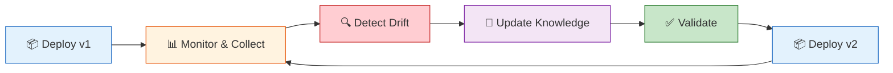
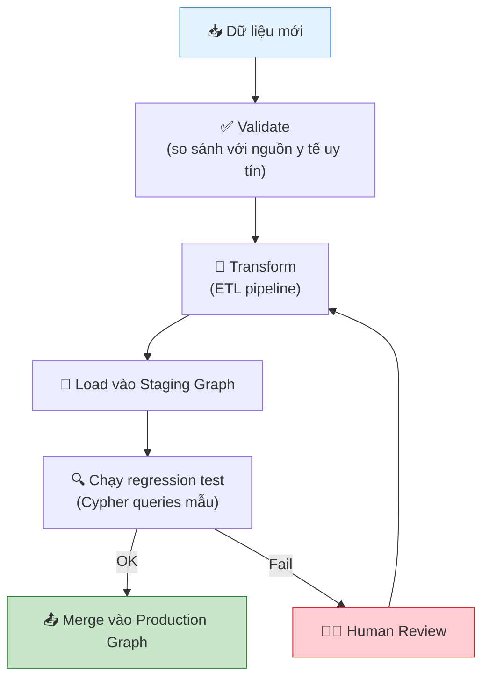
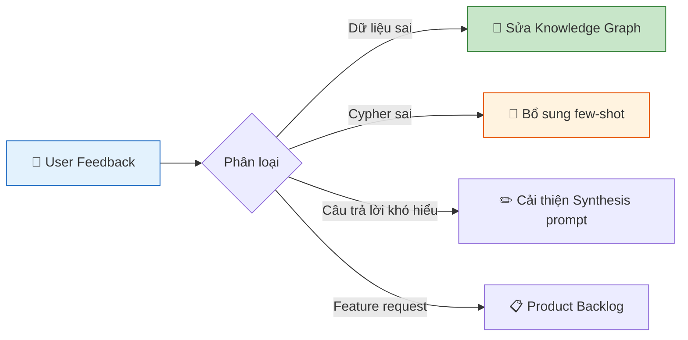

# 08. HỌC LIÊN TỤC & GIÁM SÁT HỆ THỐNG — AegisHealth KBQA

> **Continual Learning & Production Monitoring Strategy**

---

## 1. Tổng quan Chiến lược

### 1.1. Vòng đời Hệ thống AI Y tế

Một hệ thống AI y tế không thể "deploy xong là xong". Tri thức y tế liên tục cập nhật (thuốc mới, phác đồ mới, bệnh mới), đồng thời hành vi người dùng thay đổi theo thời gian. AegisHealth cần một chiến lược **Continual Learning** để duy trì chất lượng lâu dài.



### 1.2. Hai trục chính cần giám sát

| Trục | Đối tượng | Mô tả |
|---|---|---|
| **Knowledge Freshness** | Đồ thị tri thức (Neo4j) | Dữ liệu y tế có còn chính xác và đầy đủ không? |
| **Model Performance** | SLM (Text-to-Cypher, Data-to-Text) | Chất lượng output của LLM có suy giảm theo thời gian không? |

---

## 2. Cập nhật Đồ thị Tri thức (Knowledge Graph Update)

### 2.1. Nguồn dữ liệu bổ sung

| Nguồn | Tần suất | Phương pháp tích hợp |
|---|---|---|
| **Kaggle Datasets (bổ sung)** | Theo đợt (quarterly) | ETL pipeline hiện có, merge vào graph |
| **PubMed / ClinicalTrials.gov** | Theo đợt (monthly scraping) | NLP extraction → Entity/Relation → graph import |
| **Phản hồi chuyên gia y tế** | Liên tục | Manual review → curated additions |
| **User feedback** (flag incorrect answers) | Liên tục | Tạo issue → human review → graph correction |

### 2.2. Quy trình cập nhật Graph



### 2.3. Chiến lược Versioning cho Knowledge Graph

| Phiên bản | Mô tả | Rollback |
|---|---|---|
| `KG-v1.0` | Dataset gốc (Symptom2Disease + Medicine Rec) | Baseline — luôn giữ backup |
| `KG-v1.1` | + Bổ sung Drug side effects | Snapshot trước khi merge |
| `KG-v2.0` | + Mở rộng domain (thêm Hospital, Doctor) | Major version — full backup |

---

## 3. Giám sát Model Performance (Model Monitoring)

### 3.1. Metrics Giám sát Runtime

| Metric | Công thức / Mô tả | Ngưỡng cảnh báo | Tần suất đo |
|---|---|---|---|
| **Cypher Success Rate** | `(Cypher hợp lệ & thực thi thành công) / Tổng requests` | < 80% | Real-time |
| **Empty Result Rate** | `(Truy vấn trả kết quả rỗng) / Tổng requests` | > 30% | Hàng ngày |
| **End-to-End Latency P50** | Phân vị 50 của thời gian xử lý toàn pipeline | > 2000ms | Real-time |
| **End-to-End Latency P95** | Phân vị 95 của thời gian xử lý toàn pipeline | > 5000ms | Real-time |
| **Retry Rate** | `(Số lần agent retry) / Tổng requests` | > 20% | Hàng ngày |
| **Warning Trigger Rate** | `(Số response_type = "warning") / Tổng requests` | Theo dõi trend | Hàng tuần |
| **User Satisfaction (CSAT)** | Rating trung bình từ feedback widget | < 3.5/5.0 | Hàng tuần |

### 3.2. Phát hiện Model Drift

**Model Drift** xảy ra khi chất lượng output của LLM suy giảm theo thời gian, có thể do:
- Phân phối câu hỏi thay đổi (distribution shift).
- Knowledge Graph mở rộng nhưng prompt chưa cập nhật schema.
- Mô hình serving bị thay đổi cấu hình (quantization, version).

**Chiến lược phát hiện:**

| Phương pháp | Mô tả | Tần suất |
|---|---|---|
| **Golden Test Set** | Duy trì bộ 50–100 cặp (question, expected_cypher) làm benchmark. Chạy lại định kỳ để theo dõi accuracy. | Hàng tuần |
| **Statistical Process Control** | Theo dõi Cypher Success Rate theo moving average (7 ngày). Cảnh báo nếu vượt 2σ khỏi baseline. | Tự động, real-time |
| **User Feedback Analysis** | Phân tích tỷ lệ negative feedback (thumbs down). Trend tăng = dấu hiệu drift. | Hàng tuần |

### 3.3. Dashboard Monitoring (Thiết kế khái niệm)

```
┌─────────────────────────────────────────────────────┐
│              AEGISHEALTH MONITORING DASHBOARD        │
├──────────────┬──────────────┬───────────────────────┤
│ Cypher       │ Latency P95  │ Requests / hour       │
│ Success: 87% │ 1,850ms      │ ████████░░ 142        │
│ ▼ 2% (7d)   │ ▲ 200ms (7d) │                       │
├──────────────┴──────────────┴───────────────────────┤
│ [!] ALERT: Empty Result Rate vượt 30% (hiện: 33%)   │
│     → Kiểm tra: có entity mới chưa được thêm vào    │
│       Knowledge Graph?                               │
├─────────────────────────────────────────────────────┤
│ Weekly Trend:                                        │
│ Success Rate:  ██████████████████░░░░░  87%          │
│ Retry Rate:    ████░░░░░░░░░░░░░░░░░░  15%          │
│ User CSAT:     ████████████████░░░░░░  4.1/5.0      │
└─────────────────────────────────────────────────────┘
```

---

## 4. Chiến lược Retrain / Re-prompt

### 4.1. Khi nào cần cập nhật?

| Trigger | Hành động | Mức độ |
|---|---|---|
| **Knowledge Graph thay đổi** (thêm node/relationship type) | Cập nhật System Prompt (schema injection section) | 🟢 Nhẹ — chỉ sửa prompt |
| **Cypher Success Rate giảm dưới ngưỡng** | Review & bổ sung few-shot examples trong prompt | 🟡 Vừa — prompt tuning |
| **Mở rộng domain mới** (thêm entity types) | Fine-tune SLM trên training set mới | 🔴 Nặng — retraining |
| **Chuyển đổi base model** (ví dụ: Llama-3 → Llama-4) | Re-evaluate toàn bộ trên Golden Test Set | 🔴 Nặng — full re-evaluation |

### 4.2. Quy trình Cập nhật Prompt (Lightweight)

```
1. Thu thập câu hỏi thất bại → phân loại lỗi
2. Viết thêm few-shot examples cover các case thất bại
3. Chạy Golden Test Set → so sánh accuracy trước/sau
4. Nếu accuracy ≥ baseline → deploy prompt mới
5. Nếu accuracy < baseline → rollback, cần phân tích sâu hơn
```

### 4.3. Quy trình Fine-tuning (Heavyweight)

```
1. Thu thập ≥ 500 cặp (question, correct_cypher) 
   → từ user logs + manual curation
2. Chia train/val = 90/10
3. Fine-tune SLM với LoRA (Low-Rank Adaptation)
4. Đánh giá trên Golden Test Set + Validation set
5. A/B testing: model cũ vs. model mới trên 10% traffic
6. Nếu model mới tốt hơn → rollout toàn bộ
```

---

## 5. Chiến lược Thu thập Dữ liệu Phản hồi (Feedback Loop)

### 5.1. Các kênh thu thập

| Kênh | Dữ liệu thu được | Cách sử dụng |
|---|---|---|
| **Thumbs up/down** trên mỗi câu trả lời | Binary signal (tốt/xấu) | Tính CSAT, phát hiện drift |
| **"Report incorrect"** button | Câu hỏi + câu trả lời sai + lý do (optional) | Tạo negative examples cho prompt tuning |
| **Query logs** | Toàn bộ câu hỏi, Cypher sinh ra, kết quả, latency | Phân tích pattern, error analysis |
| **Session analytics** | Số câu hỏi/session, bounce rate, follow-up questions | Đánh giá UX, task completion rate |

### 5.2. Quy trình xử lý phản hồi


