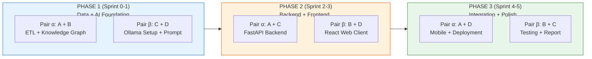

# 10. QUẢN LÝ DỰ ÁN — AegisHealth KBQA

> **Project Management: Hybrid Pair-based Organization, Timeline, và Risk Register**

---

## 1. Tổng quan Dự án

| Thuộc tính | Giá trị |
|---|---|
| **Tên dự án** | AegisHealth KBQA (Knowledge Base Question Answering) |
| **Loại dự án** | Đồ án học thuật — AI/NLP Application |
| **Thời lượng dự kiến** | 12 tuần (1 học kỳ) |
| **Quy mô nhóm** | 4 thành viên |
| **Phương pháp quản lý** | Agile (Sprint 2 tuần) |
| **Mô hình tổ chức** | **Hybrid Pair Rotation** — Chia pair theo phase, rotate để cross-knowledge |

---

## 2. Phương pháp Tổ chức Nhóm: Hybrid Pair Rotation

### 2.1. Triết lý

> **"Mỗi người có ownership 1 mảng chuyên sâu, nhưng luôn làm việc theo PAIR và rotate theo phase."**

Dự án AegisHealth có **4 tầng kỹ thuật khác nhau** (Data, AI, Backend, Frontend), nhưng chúng không chạy song song đều — có tầng nặng ở đầu dự án, có tầng nặng ở cuối. Do đó, thay vì chia role cố định (dễ gây bottleneck và workload mất cân bằng), nhóm áp dụng mô hình **Pair Rotation theo Phase**.

### 2.2. Phân tích Lý do Chọn Hybrid Pair

| Vấn đề của "chia role cố định" | Cách Hybrid Pair giải quyết |
|---|---|
| 🔴 **Bottleneck**: 1 người chậm → block cả team | ✅ Luôn có 2 người hiểu mỗi mảng → backup |
| 🔴 **Bus factor = 1**: nếu 1 người nghỉ → mất mảng đó | ✅ Pair programming → knowledge transfer tự nhiên |
| 🔴 **Workload mất cân bằng**: Frontend ngồi chờ khi chưa có API | ✅ Giai đoạn đầu cả 4 cùng làm Data/AI → ai cũng bận |
| 🔴 **Integration hell cuối sprint**: code riêng → ghép phát hiện lỗi | ✅ Pair rotate giữa các tầng → ai cũng hiểu interface |

| Vấn đề của "cả 4 cùng làm chung" | Cách Hybrid Pair giải quyết |
|---|---|
| 🔴 **Merge conflict liên tục** — 4 người cùng file | ✅ Chia pair rõ ràng → mỗi pair 1 scope riêng |
| 🔴 **Overhead giao tiếp quá cao** | ✅ Chỉ cần sync giữa 2 pair, không phải 4 người |
| 🔴 **Thiếu chuyên sâu** — jack of all trades | ✅ Mỗi người vẫn có 1 mảng chuyên sâu (ownership) |

### 2.3. Cơ cấu Nhóm

| Thành viên | Mảng chuyên sâu (Ownership) | Vai trò chính | Kỹ năng cần thiết |
|---|---|---|---|
| **A** | Data Engineering | Data Lead → Backend Lead | Python, Pandas, Cypher, Neo4j |
| **B** | AI / NLP | AI Lead → Pipeline Architect | Python, LLM, Prompt Engineering |
| **C** | Web Frontend | Web Lead → Integration Lead | JavaScript, React, Bootstrap |
| **D** | Mobile Frontend | Mobile Lead → QA & Testing | Dart, Flutter, API testing |

> **Nguyên tắc Ownership**: Mỗi người là người **chịu trách nhiệm cuối cùng** cho mảng của mình (review code, quyết định thiết kế, đảm bảo chất lượng), nhưng **không code một mình** — luôn có pair partner.

---

## 3. Ma trận Pair Rotation theo Phase

### 3.1. Tổng quan Rotation



### 3.2. Chi tiết Pair Assignment mỗi Sprint

#### 🔵 PHASE 1: Data + AI Foundation (Sprint 0–1, Tuần 1–4)

> **Mục tiêu**: Cả 4 người đều hiểu rõ dữ liệu và AI pipeline — đây là nền tảng cốt lõi.

| Sprint | Pair | Scope | Tasks chi tiết | Deliverables |
|---|---|---|---|---|
| **Sprint 0** (T1–2) | **Pair α: A + B** | Dữ liệu & Schema | ① Phân tích datasets Kaggle (EDA) ② Thiết kế Graph Schema (Node/Relationship) ③ Viết ETL scripts (Python/Pandas) ④ Tạo constraints & indexes | `etl_pipeline.py`, `schema.cypher`, dữ liệu trên AuraDB |
| | **Pair β: C + D** | AI Setup & Prompt | ① Setup Ollama + pull model ② Nghiên cứu System Prompt cho Text-to-Cypher ③ Viết 20+ ví dụ few-shot ④ Test prompt thủ công trên Ollama | `text_to_cypher.txt` (prompt v1), `golden_test_set.json` (draft 30 câu) |
| **Sprint 1** (T3–4) | **Pair α: A + B** | Load & Validate Graph | ① Load dữ liệu lên AuraDB ② Validate graph (chạy Cypher mẫu) ③ Fix data quality issues ④ Hoàn thiện Golden Test Set (50 câu) | KG trên AuraDB pass validation, `golden_test_set.json` (50 câu) |
| | **Pair β: C + D** | Prompt Tuning & Eval | ① Chạy Golden Test Set → đo accuracy ② Tinh chỉnh prompt (thêm few-shot, sửa schema injection) ③ Viết Data-to-Text prompt ④ Test intent classification (table/text/warning) | Cypher accuracy ≥ 70%, `data_to_text.txt` (prompt v1) |

**Cross-review cuối Phase 1**: Cả 4 người demo cho nhau → A+B review AI work, C+D review Data work.

---

#### 🟠 PHASE 2: Backend + Frontend (Sprint 2–3, Tuần 5–8)

> **Mục tiêu**: Pair rotation — người Data (A) pair với người Web (C) làm Backend; người AI (B) pair với người Mobile (D) làm Web UI. Đảm bảo cross-knowledge giữa backend ↔ frontend.

| Sprint | Pair | Scope | Tasks chi tiết | Deliverables |
|---|---|---|---|---|
| **Sprint 2** (T5–6) | **Pair α: A + C** | FastAPI Backend | ① Khởi tạo project FastAPI + `/api/v1/query` ② Tích hợp Neo4j Python Driver (kết nối AuraDB) ③ Tích hợp LLM service (gọi Ollama API) ④ Implement request/response models (Pydantic) | Backend MVP — gọi API bằng curl thành công |
| | **Pair β: B + D** | React Web Client | ① Khởi tạo React project (Vite + Bootstrap) ② Build Chat Interface (input bar + message list) ③ Build `ResponseRenderer` + 3 renderers (table/text/warning) ④ Kết nối với Backend API (Axios) | Web Client MVP — giao diện chat hoạt động |
| **Sprint 3** (T7–8) | **Pair α: A + C** | Backend Hardening | ① Error handling (Cypher validation, retry logic) ② Implement health check + schema endpoints ③ CORS, Rate Limiting, Cypher Sanitization ④ API documentation (auto OpenAPI) | Backend production-ready, API docs |
| | **Pair β: B + D** | Web Polish + UX | ① Loading states, error handling trên UI ② Empty state (onboarding, câu hỏi gợi ý) ③ Responsive design (mobile-friendly web) ④ Feedback widget (thumbs up/down) | Web Client feature-complete |

**Lý do chia pair như vậy**:
- **A (Data) + C (Web)**: A hiểu data pipeline nên viết graph_service dễ; C hiểu API contract vì C sẽ consume nó ở web → cả 2 thiết kế API hợp lý cho cả backend lẫn frontend.
- **B (AI) + D (Mobile)**: B hiểu AI pipeline nên hướng dẫn D cách render kết quả AI; D học React qua việc build web trước khi chuyển sang Flutter.

---

#### 🟢 PHASE 3: Integration, Mobile & Polish (Sprint 4–5, Tuần 9–12)

> **Mục tiêu**: Rotate pair lần cuối — A pair với D (mobile deployment), B pair với C (testing & report). Mỗi người đã hiểu ≥2 tầng kỹ thuật.

| Sprint | Pair | Scope | Tasks chi tiết | Deliverables |
|---|---|---|---|---|
| **Sprint 4** (T9–10) | **Pair α: A + D** | Flutter Mobile + Deploy | ① Migrate React UI patterns sang Flutter widgets ② Implement API service (Dart http) ③ Đóng gói Docker (Backend + Web) ④ Deploy demo environment | Flutter app chạy được, Docker Compose ready |
| | **Pair β: B + C** | E2E Testing + Optimize | ① Viết E2E test suite (50 câu hỏi end-to-end) ② Performance testing (latency benchmarks) ③ Prompt tuning cuối (nâng accuracy) ④ Fix bugs từ E2E testing | Test report, Cypher accuracy ≥ 85%, bugs fixed |
| **Sprint 5** (T11–12) | **Cả 4 người** | Report + Final Demo | ① Viết Written Report (mỗi người viết mảng mình own) ② Tổng hợp & review chéo ③ Chuẩn bị slide demo ④ Quay demo video | Written Report (10-15pp), Demo video, Final submission |

---

## 4. Ma trận Cross-Knowledge (Ai biết gì sau dự án)

Nhờ pair rotation, mỗi thành viên sẽ có kiến thức đa tầng:

| Thành viên | Phase 1 | Phase 2 | Phase 3 | Tổng kết |
|---|---|---|---|---|
| **A** | ETL + Neo4j ✅ | FastAPI Backend ✅ | Docker + Deploy ✅ | Data → Backend → DevOps |
| **B** | Prompt Engineering ✅ | React Web ✅ | E2E Testing ✅ | AI → Frontend → QA |
| **C** | Ollama + Prompt ✅ | FastAPI Backend ✅ | Testing + Report ✅ | AI → Backend → Documentation |
| **D** | Ollama + Prompt ✅ | React Web ✅ | Flutter Mobile ✅ | AI → Web → Mobile |

> **Kết quả**: Không có ai chỉ biết 1 mảng duy nhất. Mọi thành viên đều hiểu ≥ 2 tầng kỹ thuật → giảm bus factor, tăng khả năng phối hợp.

---

## 5. Timeline Dự án (12 tuần — Gantt Chart)

```mermaid
gantt
    title AegisHealth KBQA — Hybrid Pair Timeline (4 người)
    dateFormat  YYYY-MM-DD
    axisFormat  %d/%m

    section PHASE 1 — Data + AI
    Pair α — A+B: ETL + Graph Schema       :done, p1a, 2026-03-17, 2w
    Pair β — C+D: Ollama + Prompt v1        :done, p1b, 2026-03-17, 2w
    Pair α — A+B: Load AuraDB + Validate    :p1c, after p1a, 2w
    Pair β — C+D: Prompt Tuning + Eval      :p1d, after p1b, 2w
    Cross-review (CẢ 4)                     :milestone, p1m, after p1c, 0d

    section PHASE 2 — Backend + Frontend
    Pair α — A+C: FastAPI Backend MVP       :p2a, after p1c, 2w
    Pair β — B+D: React Web Client MVP      :p2b, after p1d, 2w
    Pair α — A+C: Backend Hardening + Docs  :p2c, after p2a, 2w
    Pair β — B+D: Web Polish + UX           :p2d, after p2b, 2w
    Integration demo (CẢ 4)                 :milestone, p2m, after p2c, 0d

    section PHASE 3 — Mobile + Polish
    Pair α — A+D: Flutter + Docker Deploy   :p3a, after p2c, 2w
    Pair β — B+C: E2E Testing + Optimize    :p3b, after p2c, 2w
    CẢ 4: Written Report + Final Demo       :p3c, after p3a, 2w
    Final Submission                         :milestone, p3m, after p3c, 0d
```

---

## 6. Milestones & Tiêu chí Hoàn thành

| # | Milestone | Tuần | Chịu trách nhiệm | Tiêu chí hoàn thành |
|---|---|---|---|---|
| M1 | **Design Approved** | 2 | Cả 4 | Bộ tài liệu thiết kế được GV phê duyệt |
| M2 | **Knowledge Graph Ready** | 4 | Pair α (A+B) | AuraDB có ≥200 diseases, ≥100 symptoms, ≥200 drugs; Golden Test Set 50 câu |
| M3 | **AI Pipeline v1** | 4 | Pair β (C+D) | Cypher accuracy ≥ 70%; Data-to-Text prompt hoạt động |
| M4 | **Backend + Web MVP** | 8 | Pair α (A+C) + Pair β (B+D) | Demo end-to-end: hỏi → nhận trả lời trên web browser |
| M5 | **Multi-platform + QA** | 10 | Pair α (A+D) + Pair β (B+C) | Flutter app chạy; Cypher accuracy ≥ 85%; Docker ready |
| M6 | **Final Submission** | 12 | Cả 4 | Written Report, code repo, demo video nộp đúng hạn |

---

## 7. Quy trình Làm việc trong mỗi Sprint (2 tuần)

### 7.1. Sprint Ceremony

| Hoạt động | Thời điểm | Thời lượng | Mô tả |
|---|---|---|---|
| **Sprint Planning** | Thứ 2, tuần đầu | 1 giờ | Cả 4 người: review backlog, chia task cho 2 pair, thống nhất mục tiêu |
| **Daily Sync** | Mỗi ngày | 15 phút (async Discord) | Mỗi người update: ① Hôm qua làm gì ② Hôm nay làm gì ③ Blocker |
| **Mid-sprint Check** | Thứ 6, tuần đầu | 30 phút | Cả 4: kiểm tra progress, điều chỉnh nếu chậm |
| **Sprint Review** | Thứ 6, tuần hai | 1 giờ | Demo kết quả; cross-review giữa 2 pair |
| **Sprint Retro** | Sau Review | 30 phút | Điều gì tốt? Điều gì cần cải thiện? |

### 7.2. Quy trình Pair Programming

```
1. Pair thống nhất task cần làm (từ Sprint Planning)
2. Một người làm "Driver" (code), một người làm "Navigator" (review real-time)
3. Swap role mỗi 30–60 phút (Pomodoro)
4. Commit thường xuyên với conventional commits
5. Cuối ngày: push code + update Discord daily sync
```

### 7.3. Quy trình Cross-review (cuối mỗi Phase)

```
1. Pair α demo work cho Pair β (live demo, không chỉ show code)
2. Pair β demo work cho Pair α
3. Mỗi pair viết 3 câu hỏi "Nếu tôi phải maintain phần này, tôi cần biết gì?"
4. Pair trả lời + bổ sung documentation nếu thiếu
5. Cả 4 thống nhất integration plan cho Phase tiếp theo
```

---

## 8. Phân công Viết Written Report

| Chương trong Report | Người viết chính | Reviewer | Lý do |
|---|---|---|---|
| Executive Summary | B | A | B hiểu toàn cảnh AI |
| Business Problem & Metrics | C | D | C hiểu user-facing metrics |
| System Architecture | A | B | A hiểu data → backend flow |
| Data Pipeline & Schema | A | C | A là Data Lead |
| AI Strategy & Error Analysis | B | A | B là AI Lead |
| Agentic AI Workflow | B | D | B thiết kế prompt/agent |
| API & Deployment | A + C | D | A+C pair build backend |
| Client Architecture | D | C | D là Mobile Lead, C là Web Lead |
| Continual Learning | B | A | B hiểu model monitoring |
| Ethics & Responsible AI | C | D | C hiểu UX & user impact |
| Project Management | D | C | D track QA & timeline |
| Dev Infrastructure | A | B | A setup project structure |

> Mỗi người viết **~3 chương**, review **~3 chương** → workload công bằng, ai cũng đọc toàn bộ report.

---

## 9. Đăng ký Rủi ro (Risk Register)

| # | Rủi ro | Xác suất | Ảnh hưởng | Biện pháp giảm thiểu |
|---|---|---|---|---|
| R1 | LLM sinh Cypher accuracy thấp (<70%) | Trung bình | 🔴 Cao | Bổ sung few-shot; thử model khác; fallback sang pre-defined queries |
| R2 | Neo4j AuraDB free tier hết quota | Thấp | 🟠 Trung bình | Monitor usage; optimize queries; Plan B: local Neo4j Community |
| R3 | Phần cứng GPU không đủ chạy SLM | Trung bình | 🔴 Cao | Model nhỏ (Phi-3); quantize 4-bit; cloud GPU (Colab) |
| R4 | Dataset Kaggle thiếu chất lượng | Thấp | 🟠 Trung bình | Data validation step; bổ sung nguồn thứ hai |
| R5 | **Pair conflict** — 2 người không hợp nhau | Thấp | 🟠 Trung bình | Rotate pair mỗi phase → ai cũng pair với ai; retro mỗi sprint để giải quyết sớm |
| R6 | 1 thành viên nghỉ dài (bệnh, bận thi) | Trung bình | 🟠 Trung bình | Pair programming → partner thay thế ngay; cross-knowledge từ rotation giúp bất kỳ ai cũng pickup được |
| R7 | Thời gian không đủ hoàn thành mobile | Trung bình | 🟡 Thấp | Mobile là ưu tiên P2; MVP = chỉ cần chat screen + 3 renderers |

---

## 10. Công cụ & Quy ước

### 10.1. Git Workflow

| Quy ước | Chi tiết |
|---|---|
| **Branching** | `main` ← `develop` ← `feature/<pair>/<task>` (ví dụ: `feature/pair-alpha/fastapi-setup`) |
| **Commit messages** | Conventional Commits: `feat:`, `fix:`, `docs:`, `refactor:`, `test:` |
| **Code Review** | Pair partner review trước; cross-pair review cho PR vào `develop` |
| **Merge** | Squash merge vào `develop`; merge commit vào `main` tại milestone |
| **Release tags** | `v0.1-M2`, `v0.2-M4`, `v0.3-M5`, `v1.0-M6` |

### 10.2. Công cụ Quản lý

| Công cụ | Mục đích |
|---|---|
| **GitHub Issues** | Task tracking — mỗi task gán cho 1 pair, label theo phase |
| **GitHub Projects** | Kanban board: `Backlog → Sprint → In Progress → Review → Done` |
| **Discord** | Daily sync (async), discussion, quick questions |
| **Google Docs** | Collaborative editing cho Written Report |
| **Notion / Trello** (tùy chọn) | Sprint planning board nếu team thích visual |
