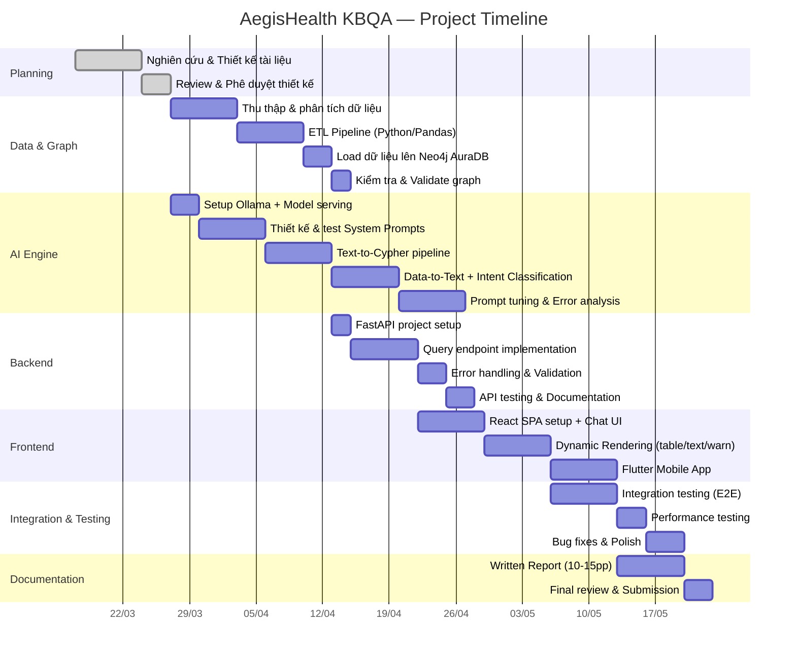

# 10. QUẢN LÝ DỰ ÁN — AegisHealth KBQA

> **Project Management: Timeline, Team Roles, và Risk Register**

---

## 1. Tổng quan Dự án

| Thuộc tính | Giá trị |
|---|---|
| **Tên dự án** | AegisHealth KBQA (Knowledge Base Question Answering) |
| **Loại dự án** | Đồ án học thuật — AI/NLP Application |
| **Thời lượng dự kiến** | 12 tuần (1 học kỳ) |
| **Quy mô nhóm** | 3–5 thành viên |
| **Phương pháp quản lý** | Agile (Sprint 2 tuần) |

---

## 2. Phân chia Vai trò Nhóm

| Vai trò | Trách nhiệm chính | Kỹ năng cần thiết |
|---|---|---|
| **AI/NLP Engineer** | Prompt Engineering, model evaluation, Text-to-Cypher pipeline | Python, LLM, NLP |
| **Backend Developer** | FastAPI, Neo4j integration, API design | Python, FastAPI, Neo4j |
| **Data Engineer** | ETL pipeline, Knowledge Graph construction, data quality | Python, Pandas, Cypher |
| **Frontend Developer (Web)** | ReactJS SPA, dynamic rendering, UX | JavaScript, React, Bootstrap |
| **Frontend Developer (Mobile)** | Flutter app, cross-platform UI | Dart, Flutter |

> **Lưu ý**: Với nhóm 3 người, một thành viên có thể kiêm nhiều vai trò (ví dụ: AI + Backend, Data + Backend, Web + Mobile).

---

## 3. Timeline Dự án (12 tuần)

### 3.1. Gantt Chart tổng quan

### 3.2. Chi tiết Sprint

| Sprint | Tuần | Mục tiêu chính | Deliverables |
|---|---|---|---|
| **Sprint 0** | 1–2 | Planning & Design | Bộ tài liệu thiết kế, approval từ GV |
| **Sprint 1** | 3–4 | Data + AI Foundation | ETL hoàn tất, KG trên AuraDB, Ollama serving hoạt động, System Prompts draft |
| **Sprint 2** | 5–6 | Core Pipeline | Text-to-Cypher hoạt động, Data-to-Text + intent classification, FastAPI endpoints |
| **Sprint 3** | 7–8 | Frontend + Integration | React chat UI, Dynamic Rendering, API integration |
| **Sprint 4** | 9–10 | Mobile + Testing | Flutter app, E2E testing, performance testing, bug fixes |
| **Sprint 5** | 11–12 | Polish + Report | Written Report, final demo, submission |

---

## 4. Milestones & Deliverables

| # | Milestone | Tuần | Tiêu chí hoàn thành |
|---|---|---|---|
| M1 | **Design Approved** | 2 | Bộ tài liệu thiết kế được GV phê duyệt |
| M2 | **Data Pipeline Complete** | 4 | KG trên AuraDB với ≥200 diseases, ≥100 symptoms, ≥200 drugs |
| M3 | **AI Pipeline Working** | 6 | Cypher generation accuracy ≥ 70% trên test set 50 câu |
| M4 | **API & Web Client MVP** | 8 | Demo end-to-end: hỏi câu hỏi → nhận câu trả lời trên web |
| M5 | **Multi-platform Release** | 10 | Web + Mobile cùng hoạt động, Cypher accuracy ≥ 85% |
| M6 | **Final Submission** | 12 | Written Report, code repository, demo video |

---

## 5. Đăng ký Rủi ro (Risk Register)

| # | Rủi ro | Xác suất | Ảnh hưởng | Biện pháp giảm thiểu |
|---|---|---|---|---|
| R1 | LLM sinh Cypher accuracy thấp (<70%) | Trung bình | 🔴 Cao | Bổ sung few-shot examples; thử model khác; fallback sang pre-defined queries |
| R2 | Neo4j AuraDB free tier hết quota | Thấp | 🟠 Trung bình | Monitor usage; optimize queries; có plan B: local Neo4j Community |
| R3 | Phần cứng GPU không đủ chạy SLM | Trung bình | 🔴 Cao | Dùng model nhỏ hơn (Phi-3); quantize 4-bit; sử dụng cloud GPU (Colab/Kaggle) |
| R4 | Dataset Kaggle thiếu chất lượng / nhiều lỗi | Thấp | 🟠 Trung bình | Thêm bước data validation; bổ sung nguồn thứ hai |
| R5 | Team member không đủ kỹ năng cần thiết | Trung bình | 🟠 Trung bình | Pair programming; tài liệu hướng dẫn nội bộ; chia task phù hợp skill |
| R6 | Thời gian không đủ để hoàn thành mobile app | Trung bình | 🟡 Thấp | Mobile là tính năng phụ; ưu tiên Web client; mobile có thể demo prototype |

---

## 6. Quy ước Làm việc Nhóm

### 6.1. Git Workflow

| Quy ước | Chi tiết |
|---|---|
| **Branching** | `main` (stable) ← `develop` (integration) ← `feature/*` (per-task) |
| **Commit messages** | Conventional Commits: `feat:`, `fix:`, `docs:`, `refactor:` |
| **Code Review** | Mọi PR phải có ≥1 reviewer trước khi merge |
| **Release** | Tag version khi đạt milestone (v0.1, v0.2...) |

### 6.2. Công cụ Quản lý

| Công cụ | Mục đích |
|---|---|
| **GitHub Issues** | Task tracking, bug reports |
| **GitHub Projects** | Kanban board (To Do → In Progress → Review → Done) |
| **Discord / Zalo** | Giao tiếp nhóm hàng ngày |
| **Google Docs** | Collaborative editing cho Written Report |
