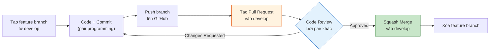

# 12. QUY TẮC QUẢN LÝ GIT & GITHUB — AegisHealth KBQA

> **Git Workflow, Branching Strategy, và Quy ước Cộng tác Nhóm**

---

## 1. Tổng quan

| Thuộc tính | Giá trị |
|---|---|
| **Platform** | GitHub (Private Repository) |
| **Repository** | `NgBaoAnn/kbqa` |
| **Branching Model** | **GitHub Flow mở rộng** (main ← develop ← feature branches) |
| **Merge Strategy** | Squash Merge cho feature → develop; Merge Commit cho develop → main |
| **Quy mô nhóm** | 4 người, chia 2 pair |

---

## 2. Cấu trúc Branch

### 2.1. Sơ đồ Branch

```mermaid
gitGraph
    commit id: "v0.0 — Init docs"
    branch develop
    checkout develop
    commit id: "setup project"
    branch feature/pair-alpha/etl-pipeline
    commit id: "feat: ETL scripts"
    commit id: "feat: load to AuraDB"
    checkout develop
    merge feature/pair-alpha/etl-pipeline id: "Squash merge"
    branch feature/pair-beta/prompt-v1
    commit id: "feat: text-to-cypher prompt"
    commit id: "fix: few-shot examples"
    checkout develop
    merge feature/pair-beta/prompt-v1 id: "Squash merge"
    checkout main
    merge develop id: "v0.1-M2 — Data + AI Foundation"
    checkout develop
    branch feature/pair-alpha/fastapi-backend
    commit id: "feat: query endpoint"
    checkout develop
    merge feature/pair-alpha/fastapi-backend id: "Squash merge"
    checkout main
    merge develop id: "v0.2-M4 — Backend + Web MVP"
```

### 2.2. Định nghĩa từng Branch

| Branch | Mục đích | Ai được push | Bảo vệ |
|---|---|---|---|
| `main` | **Production-ready code**. Chỉ chứa code đã test, ổn định. Mỗi commit tương ứng một Milestone. | Không ai push trực tiếp — chỉ qua PR từ `develop` | ✅ Protected: require PR + 1 review |
| `develop` | **Integration branch**. Tổng hợp tất cả feature đã hoàn thành trong sprint. Code phải build được. | Không push trực tiếp — chỉ qua PR từ `feature/*` | ✅ Protected: require PR + 1 review |
| `feature/<pair>/<tên-task>` | **Nhánh làm việc**. Mỗi task/user story một nhánh riêng. | Pair sở hữu nhánh đó | ❌ Không bảo vệ |
| `hotfix/<mô-tả>` | **Sửa lỗi khẩn cấp** trên `main`. Tạo từ `main`, merge ngược về cả `main` và `develop`. | Người phát hiện lỗi | ❌ Không bảo vệ |

### 2.3. Quy tắc Đặt tên Branch

```
feature/<pair>/<mô-tả-ngắn>

Ví dụ:
  feature/pair-alpha/etl-pipeline
  feature/pair-alpha/fastapi-query-endpoint
  feature/pair-beta/react-chat-ui
  feature/pair-beta/prompt-tuning-v2
  feature/pair-alpha/flutter-chat-screen
  hotfix/fix-cypher-sanitization
```

| Quy tắc | Ví dụ đúng | Ví dụ sai |
|---|---|---|
| Dùng **lowercase** + **kebab-case** | `feature/pair-alpha/etl-pipeline` | `Feature/PairAlpha/ETL_Pipeline` |
| Bắt đầu bằng `feature/` hoặc `hotfix/` | `feature/pair-beta/react-ui` | `new-feature-react` |
| Ghi rõ **pair name** | `feature/pair-alpha/...` | `feature/backend-setup` |
| Mô tả **ngắn gọn nhưng rõ nghĩa** | `fastapi-query-endpoint` | `update` hoặc `fix-stuff` |

---

## 3. Quy ước Commit Message (Conventional Commits)

### 3.1. Format

```
<type>(<scope>): <mô tả ngắn>

[body — tùy chọn, giải thích chi tiết]

[footer — tùy chọn, breaking changes hoặc issue ref]
```

### 3.2. Các loại `type`

| Type | Mô tả | Ví dụ |
|---|---|---|
| `feat` | Thêm tính năng mới | `feat(api): add /query endpoint` |
| `fix` | Sửa bug | `fix(prompt): wrong entity mapping for Vietnamese input` |
| `docs` | Chỉ thay đổi tài liệu | `docs: update API spec with new error codes` |
| `refactor` | Tái cấu trúc code, không thay đổi behavior | `refactor(backend): extract LLM service into separate module` |
| `test` | Thêm hoặc sửa test | `test(api): add golden test set for Cypher validation` |
| `chore` | Công việc maintenance (config, CI, deps) | `chore: update requirements.txt with neo4j driver` |
| `style` | Format code, không thay đổi logic | `style(backend): apply ruff formatting` |
| `perf` | Cải thiện hiệu suất | `perf(llm): reduce prompt token count by 30%` |

### 3.3. Các loại `scope` (tùy chọn)

| Scope | Áp dụng cho |
|---|---|
| `api` | Backend FastAPI |
| `graph` | Neo4j, Cypher, Knowledge Graph |
| `llm` hoặc `prompt` | AI Engine, Prompt Engineering |
| `web` | React Web Client |
| `mobile` | Flutter Mobile Client |
| `data` | ETL, data pipeline |
| `ci` | CI/CD, GitHub Actions |

### 3.4. Ví dụ Commit Messages

```
✅ Tốt:
feat(api): implement /api/v1/query endpoint with Pydantic models
fix(prompt): add retry logic when Cypher generation fails
docs: add 07_AGENTIC_AI_DESIGN with ReAct workflow
test(graph): add 50 golden test cases for Cypher accuracy
chore(ci): add GitHub Actions lint + test pipeline
refactor(api): split pipeline.py into separate service modules

❌ Xấu:
update code
fix bug
WIP
asdfgh
thêm tính năng mới
```

### 3.5. Quy tắc bổ sung

| Quy tắc | Lý do |
|---|---|
| Viết bằng **tiếng Anh** | Dễ đọc trong git log, GitHub UI, và CI tools |
| **Không quá 72 ký tự** ở dòng đầu | Hiển thị đẹp trên GitHub và terminal |
| Dùng **thì hiện tại** (imperative mood) | `add feature` ✅, không phải `added feature` ❌ |
| Mỗi commit = **1 thay đổi logic** | Không gộp 3 features vào 1 commit |

---

## 4. Quy trình Pull Request (PR)

### 4.1. Luồng tạo PR



### 4.2. Quy tắc PR

| Quy tắc | Chi tiết |
|---|---|
| **Tiêu đề PR** | Giống format commit: `feat(api): implement query endpoint` |
| **Mô tả PR** | Phải có: ① Tóm tắt thay đổi ② Cách test ③ Screenshots (nếu UI) |
| **Kích thước** | Tối đa **~300 dòng changed**. Nếu lớn hơn → tách thành nhiều PR |
| **Reviewer** | Pair **khác** review (không tự review PR của pair mình) |
| **Thời gian review** | Tối đa **24 giờ** sau khi tạo PR |
| **Resolve conflicts** | Người tạo PR chịu trách nhiệm resolve conflicts với `develop` |

### 4.3. Template PR (Copy vào GitHub)

```markdown
## Mô tả
<!-- Tóm tắt thay đổi trong 2-3 câu -->

## Loại thay đổi
- [ ] ✨ Feature mới
- [ ] 🐛 Bug fix
- [ ] 📝 Tài liệu
- [ ] ♻️ Refactor
- [ ] 🧪 Test

## Cách kiểm tra
<!-- Bước test để reviewer verify -->
1. ...
2. ...

## Screenshots (nếu có)
<!-- Dán ảnh UI nếu thay đổi giao diện -->

## Checklist
- [ ] Code đã chạy không lỗi trên máy local
- [ ] Commit messages đúng format Conventional Commits
- [ ] Không commit file nhạy cảm (.env, credentials)
- [ ] Đã chạy linter (ruff / eslint)
```

---

## 5. Quy tắc Merge

### 5.1. Feature → Develop (Squash Merge)

```bash
# Trên GitHub: chọn "Squash and merge" khi merge PR
# Kết quả: toàn bộ commits trong feature branch → 1 commit sạch trên develop
```

**Lý do dùng Squash**: Feature branch thường có nhiều commit nhỏ (WIP, fix typo, debug). Squash merge giữ `develop` sạch, mỗi commit = 1 feature hoàn chỉnh.

### 5.2. Develop → Main (Merge Commit)

```bash
# Trên GitHub: chọn "Create a merge commit" khi merge PR
# Kết quả: giữ nguyên lịch sử commits, đánh dấu rõ điểm merge
```

**Lý do dùng Merge Commit**: Giữ lịch sử đầy đủ trên `main`, mỗi merge commit = 1 Milestone release.

### 5.3. Tóm tắt

| Merge direction | Strategy | Commit message |
|---|---|---|
| `feature/*` → `develop` | **Squash Merge** | `feat(scope): tóm tắt feature` |
| `develop` → `main` | **Merge Commit** | `release: v0.X-MY — mô tả milestone` |
| `hotfix/*` → `main` | **Merge Commit** | `hotfix: mô tả fix` |
| `hotfix/*` → `develop` | **Cherry-pick** hoặc Merge | Giữ sync |

---

## 6. Quy tắc Bảo vệ Branch (Branch Protection Rules)

### 6.1. Cấu hình trên GitHub

**Cho `main`:**

| Rule | Giá trị |
|---|---|
| Require pull request before merging | ✅ |
| Required approvals | **1** |
| Dismiss stale reviews | ✅ |
| Require status checks (CI) | ✅ (lint + test phải pass) |
| Block force pushes | ✅ |
| Block deletions | ✅ |

**Cho `develop`:**

| Rule | Giá trị |
|---|---|
| Require pull request before merging | ✅ |
| Required approvals | **1** |
| Block force pushes | ✅ |

### 6.2. Ai review ai?

| PR từ | Review bởi | Lý do |
|---|---|---|
| Pair α (A+C) | Bất kỳ ai từ Pair β (B hoặc D) | Cross-pair review → phát hiện lỗi logic mà pair sở hữu bỏ qua |
| Pair β (B+D) | Bất kỳ ai từ Pair α (A hoặc C) | Tương tự |

---

## 7. Quản lý Phiên bản (Release Tagging)

### 7.1. Quy ước Tag

```
v<major>.<minor>-M<milestone_number>

Ví dụ:
  v0.1-M2    →  Data + AI Foundation hoàn tất
  v0.2-M4    →  Backend + Web MVP
  v0.3-M5    →  Multi-platform + QA
  v1.0-M6    →  Final Submission
```

### 7.2. Cách tạo Tag

```bash
# Sau khi merge develop → main tại milestone
git tag -a v0.1-M2 -m "release: Data + AI Foundation — KG on AuraDB, Cypher accuracy 70%"
git push origin v0.1-M2
```

### 7.3. GitHub Release

Mỗi tag nên có một **GitHub Release** kèm:
- Release notes (tóm tắt thay đổi)
- Link đến milestone board
- Known issues (nếu có)

---

## 8. Quy tắc .gitignore

### 8.1. Những gì KHÔNG BAO GIỜ commit

| Loại file | Ví dụ | Lý do |
|---|---|---|
| **Credentials & secrets** | `.env`, `*.pem`, API keys | Bảo mật |
| **Model weights** | `*.bin`, `*.gguf`, `*.safetensors` | Quá lớn (hàng GB), dùng Ollama pull |
| **Python cache** | `__pycache__/`, `*.pyc`, `.pytest_cache/` | Auto-generated |
| **Node modules** | `node_modules/` | Cài lại bằng `npm install` |
| **IDE config** | `.vscode/`, `.idea/` | Cá nhân mỗi người |
| **OS files** | `.DS_Store`, `Thumbs.db` | Không liên quan |
| **Build outputs** | `dist/`, `build/`, `*.egg-info/` | Tái tạo được |

### 8.2. Những gì NÊN commit

| Loại file | Ví dụ | Lý do |
|---|---|---|
| **Source code** | `*.py`, `*.jsx`, `*.dart` | Core deliverable |
| **Config templates** | `.env.example` | Hướng dẫn setup, không chứa secret |
| **Documentation** | `docs/*.md`, `README.md` | Tài liệu dự án |
| **Test data** | `golden_test_set.json` | Benchmark data |
| **Docker configs** | `Dockerfile`, `docker-compose.yml` | Reproducible deployment |
| **CI configs** | `.github/workflows/*.yml` | Automation |
| **Lock files** | `package-lock.json`, `pubspec.lock` | Reproducible builds |

---

## 9. Quy trình Xử lý Conflict

### 9.1. Nguyên tắc

| Quy tắc | Chi tiết |
|---|---|
| **Pull trước khi push** | Luôn `git pull origin develop` trước khi push feature branch |
| **Rebase thường xuyên** | `git rebase develop` trên feature branch mỗi 1-2 ngày để tránh conflict lớn |
| **Người tạo PR resolve** | Nếu PR có conflict → người tạo PR chịu trách nhiệm resolve |
| **Không force push shared branches** | KHÔNG `git push --force` trên `main` hoặc `develop` |

### 9.2. Xử lý khi gặp Conflict

```bash
# 1. Fetch latest develop
git fetch origin

# 2. Rebase feature branch lên develop mới nhất
git rebase origin/develop

# 3. Resolve conflicts (nếu có)
# → Mở file conflict → chọn code đúng → git add
git add <resolved-files>
git rebase --continue

# 4. Push (cần force-push cho feature branch — OK vì chỉ pair mình dùng)
git push --force-with-lease origin feature/pair-alpha/my-feature
```

---

## 10. Checklist hàng ngày cho Developer

```
☐ git pull origin develop (cập nhật latest)
☐ Tạo / switch sang đúng feature branch
☐ Code + commit thường xuyên (mỗi 1-2 giờ, không để cuối ngày)
☐ Commit message đúng format Conventional Commits
☐ Không commit file .env hoặc credentials
☐ Chạy linter trước khi commit (ruff check / eslint)
☐ Push lên GitHub cuối ngày (để pair partner / backup)
☐ Update Daily Sync trên Discord
```
