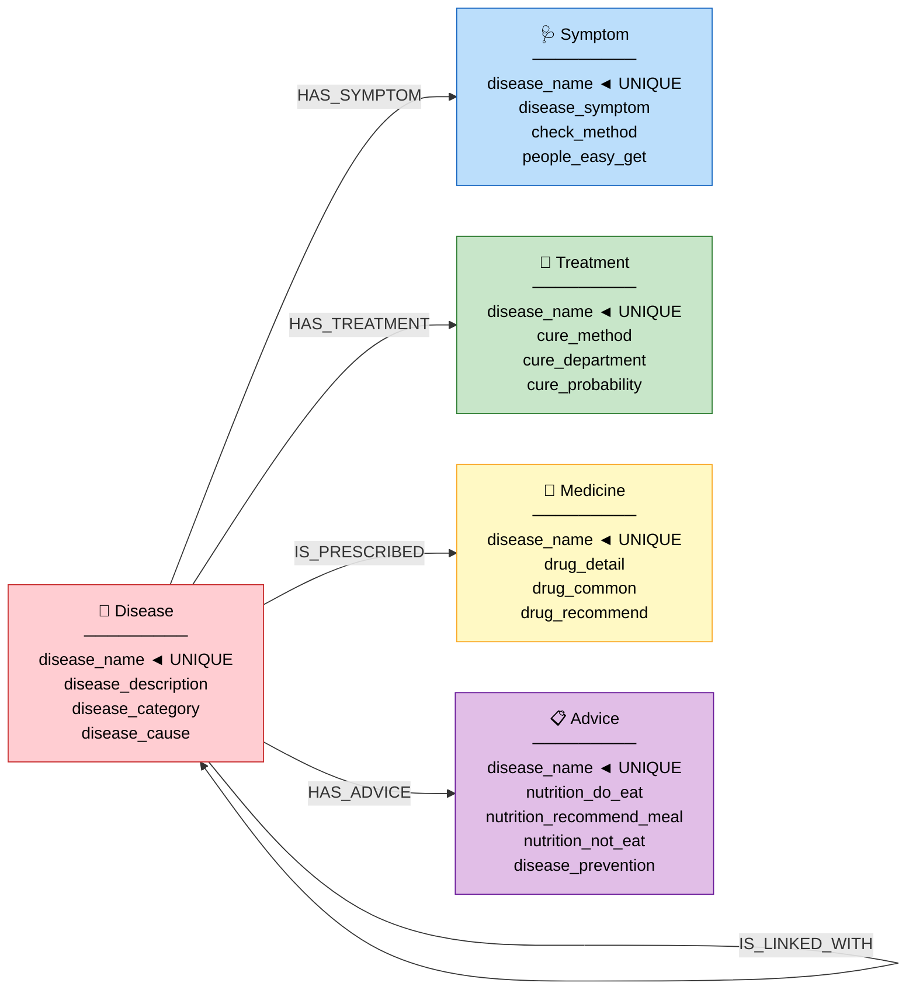

# 📐 THIẾT KẾ GRAPH SCHEMA — AegisHealth KBQA

> **Phiên bản:** 2.0 (VietMedKG-based)  
> **Tham chiếu:** [VietMedKG Paper — ACM TALLIP 2025](https://doi.org/10.1145/3744740)  
> **Source:** [github.com/HySonLab/VietMedKG](https://github.com/HySonLab/VietMedKG)  
> **Mục tiêu:** Schema chuẩn, tối ưu truy vấn, sẵn sàng mở rộng cho KBQA tiếng Việt

---

## 1. Nguyên Tắc Thiết Kế

| # | Nguyên tắc | Lý do |
|---|---|---|
| 1 | **Schema dựa trên VietMedKG paper** | Đã được kiểm chứng với 41K nodes, 42K rels, published tại ACM |
| 2 | **Node Labels = tiếng Anh, Properties = tiếng Anh** | Tránh Unicode issues trong Cypher, dễ làm việc với code |
| 3 | **Relationship Types dùng UPPER_CASE + dấu gạch dưới** | Chuẩn Neo4j convention, tránh lỗi khi không dùng backtick |
| 4 | **Mỗi Entity MERGE theo `disease_name`** | VietMedKG star schema: mỗi bệnh có 1 bộ nodes riêng |
| 5 | **Data tiếng Việt, tên bệnh Capitalize** | Nhất quán với data gốc, hỗ trợ KBQA tiếng Việt |
| 6 | **Dự phòng mở rộng** — enrich từ ViMedNer, Kaggle... | Chỉ cần THÊM nodes/rels, không SỬA cái cũ |

---

## 2. Nguồn Dữ Liệu

### 2.1. Nguồn chính: VietMedKG `data_translated.csv`

| Thuộc tính | Giá trị |
|---|---|
| **Nguồn** | [HySonLab/VietMedKG](https://github.com/HySonLab/VietMedKG) |
| **File** | `data/data_translated.csv` |
| **Số dòng** | ~8,800 bệnh |
| **Cột** | 18 cột thông tin y tế tiếng Việt |
| **Ngôn ngữ** | Tiếng Việt (dịch từ TCM Knowledge Graph) |

### 2.2. Mapping CSV → Graph

```
data_translated.csv
├── tên_bệnh ──────────────→ Disease.disease_name
├── mô_tả_bệnh ────────────→ Disease.disease_description
├── loại_bệnh ─────────────→ Disease.disease_category
├── nguyên_nhân ────────────→ Disease.disease_cause
├── triệu_chứng ───────────→ Symptom.disease_symptom
├── kiểm_tra ──────────────→ Symptom.check_method
├── đối_tượng_dễ_mắc_bệnh ─→ Symptom.people_easy_get
├── phương_pháp ────────────→ Treatment.cure_method
├── khoa_điều_trị ──────────→ Treatment.cure_department
├── tỉ_lệ_chữa_khỏi ──────→ Treatment.cure_probability
├── đề_xuất_thuốc ─────────→ Medicine.drug_recommend
├── thuốc_phổ_biến ────────→ Medicine.drug_common
├── thông_tin_thuốc ────────→ Medicine.drug_detail
├── nên_ăn_thực_phẩm_chứa ─→ Advice.nutrition_do_eat
├── đề_xuất_món_ăn ────────→ Advice.nutrition_recommend_meal
├── không_nên_ăn ───────────→ Advice.nutrition_not_eat
├── cách_phòng_tránh ──────→ Advice.disease_prevention
└── bệnh_đi_kèm ───────────→ IS_LINKED_WITH relationship
```

---

## 3. Đặc Tả Chi Tiết Graph Schema

### 3.1. Sơ Đồ Tổng Thể (theo Fig. 6 VietMedKG paper)



---

### 3.2. Node: `Disease` (Bệnh) — Node trung tâm

| Property | Kiểu | Ràng buộc | Nguồn CSV | Ví dụ |
|---|---|---|---|---|
| `disease_name` | `String` | **UNIQUE, NOT NULL** | `tên_bệnh` | `"Viêm phổi"` |
| `disease_description` | `String` | Nullable | `mô_tả_bệnh` | `"Viêm phổi là tình trạng..."` |
| `disease_category` | `String` | Nullable | `loại_bệnh` | `"[Nội khoa, Y học hô hấp]"` |
| `disease_cause` | `String` | Nullable | `nguyên_nhân` | `"Vi khuẩn, virus..."` |

**Thiết kế quan trọng:**
- Disease là **hub node** — mọi node khác đều kết nối qua Disease
- `disease_name` viết **Capitalize** (ví dụ: `"Viêm phổi"`, không phải `"viêm phổi"`)

---

### 3.3. Node: `Symptom` (Triệu chứng)

| Property | Kiểu | Ràng buộc | Nguồn CSV | Ví dụ |
|---|---|---|---|---|
| `disease_name` | `String` | **UNIQUE** | `tên_bệnh` | `"Viêm phổi"` |
| `disease_symptom` | `String` | Nullable | `triệu_chứng` | `"['Ho','Sốt','Khó thở']"` |
| `check_method` | `String` | Nullable | `kiểm_tra` | `"['X-quang phổi','Xét nghiệm máu']"` |
| `people_easy_get` | `String` | Nullable | `đối_tượng_dễ_mắc_bệnh` | `"Người già, trẻ em"` |

> [!NOTE]
> **Star schema:** Mỗi bệnh có **đúng 1 node Symptom riêng** (không chia sẻ). Triệu chứng lưu dạng text/list trong 1 property. Khác với schema truyền thống (mỗi triệu chứng = 1 node).

---

### 3.4. Node: `Treatment` (Điều trị)

| Property | Kiểu | Ràng buộc | Nguồn CSV | Ví dụ |
|---|---|---|---|---|
| `disease_name` | `String` | **UNIQUE** | `tên_bệnh` | `"Ho gà"` |
| `cure_method` | `String` | Nullable | `phương_pháp` | `"['Điều trị bằng thuốc','Hỗ trợ']"` |
| `cure_department` | `String` | Nullable | `khoa_điều_trị` | `"[Nhi khoa]"` |
| `cure_probability` | `String` | Nullable | `tỉ_lệ_chữa_khỏi` | `"98%"` |

---

### 3.5. Node: `Medicine` (Thuốc)

| Property | Kiểu | Ràng buộc | Nguồn CSV | Ví dụ |
|---|---|---|---|---|
| `disease_name` | `String` | **UNIQUE** | `tên_bệnh` | `"Ho gà"` |
| `drug_detail` | `String` | Nullable | `thông_tin_thuốc` | `"Liều lượng, cách dùng..."` |
| `drug_common` | `String` | Nullable | `thuốc_phổ_biến` | `"[Paracetamol]"` |
| `drug_recommend` | `String` | Nullable | `đề_xuất_thuốc` | `"['Erythromycin','Amoxicillin']"` |

---

### 3.6. Node: `Advice` (Lời khuyên)

| Property | Kiểu | Ràng buộc | Nguồn CSV | Ví dụ |
|---|---|---|---|---|
| `disease_name` | `String` | **UNIQUE** | `tên_bệnh` | `"Ho gà"` |
| `nutrition_do_eat` | `String` | Nullable | `nên_ăn_thực_phẩm_chứa` | `"[Hạt bí ngô, bắp cải]"` |
| `nutrition_recommend_meal` | `String` | Nullable | `đề_xuất_món_ăn` | `"['Súp trứng','Cháo gà']"` |
| `nutrition_not_eat` | `String` | Nullable | `không_nên_ăn_thực_phẩm_chứa` | `"[Cua, tôm]"` |
| `disease_prevention` | `String` | Nullable | `cách_phòng_tránh` | `"Tiêm vaccine, giữ vệ sinh..."` |

---

### 3.7. Relationships

| Relationship | Hướng | Ý nghĩa | Ví dụ |
|---|---|---|---|
| `HAS_SYMPTOM` | `(Disease)→(Symptom)` | Bệnh X có triệu chứng Y | `(Viêm phổi)-[:HAS_SYMPTOM]->(...)` |
| `HAS_TREATMENT` | `(Disease)→(Treatment)` | Bệnh X điều trị bằng Y | `(Ho gà)-[:HAS_TREATMENT]->(...)` |
| `IS_PRESCRIBED` | `(Disease)→(Medicine)` | Bệnh X dùng thuốc Y | `(Ho gà)-[:IS_PRESCRIBED]->(...)` |
| `HAS_ADVICE` | `(Disease)→(Advice)` | Bệnh X có lời khuyên Z | `(Tiểu đường)-[:HAS_ADVICE]->(...)` |
| `IS_LINKED_WITH` | `(Disease)→(Disease)` | Bệnh X đi kèm bệnh Y | `(Viêm phổi)-[:IS_LINKED_WITH]->(Viêm phế quản)` |

---

## 4. Thống Kê Dự Kiến

| Thực thể | Số lượng | Ghi chú |
|---|---|---|
| `Disease` nodes | ~8,800 | Mỗi dòng CSV = 1 bệnh |
| `Symptom` nodes | ~7,000–8,000 | 1:1 với bệnh (trừ rows thiếu data) |
| `Treatment` nodes | ~7,000–8,000 | Tương tự |
| `Medicine` nodes | ~6,000–7,000 | Một số bệnh không có thông tin thuốc |
| `Advice` nodes | ~6,000–7,000 | Tương tự |
| `HAS_SYMPTOM` rels | ~7,000–8,000 | |
| `HAS_TREATMENT` rels | ~7,000–8,000 | |
| `IS_PRESCRIBED` rels | ~6,000–7,000 | |
| `HAS_ADVICE` rels | ~6,000–7,000 | |
| `IS_LINKED_WITH` rels | ~3,000–5,000 | Bệnh liên quan |
| **Tổng nodes** | **~35,000–40,000** | Paper gốc: 41,549 |
| **Tổng relationships** | **~33,000–38,000** | Paper gốc: 42,112 |

---

## 5. Constraints & Indexes

### 5.1. Uniqueness Constraints (Chạy TRƯỚC KHI import)

```cypher
CREATE CONSTRAINT disease_name_unique IF NOT EXISTS
FOR (d:Disease) REQUIRE d.disease_name IS UNIQUE;

CREATE CONSTRAINT symptom_key_unique IF NOT EXISTS
FOR (s:Symptom) REQUIRE s.disease_name IS UNIQUE;

CREATE CONSTRAINT treatment_key_unique IF NOT EXISTS
FOR (t:Treatment) REQUIRE t.disease_name IS UNIQUE;

CREATE CONSTRAINT medicine_key_unique IF NOT EXISTS
FOR (m:Medicine) REQUIRE m.disease_name IS UNIQUE;

CREATE CONSTRAINT advice_key_unique IF NOT EXISTS
FOR (a:Advice) REQUIRE a.disease_name IS UNIQUE;
```

> [!NOTE]
> UNIQUE constraint **tự động tạo index**. Không cần tạo thêm index riêng.

---

## 6. Các Mẫu Cypher Query

### 6.1. Basic Queries

```cypher
-- Q: "Viêm phổi có triệu chứng gì?"
MATCH (d:Disease {disease_name: "Viêm phổi"})-[:HAS_SYMPTOM]->(s:Symptom)
RETURN s.disease_symptom AS symptoms, s.check_method AS check;

-- Q: "Ho gà điều trị bằng thuốc gì?"
MATCH (d:Disease {disease_name: "Ho gà"})-[:IS_PRESCRIBED]->(m:Medicine)
RETURN m.drug_common AS medicine, m.drug_recommend AS recommended;

-- Q: "Viêm phổi là bệnh gì?"
MATCH (d:Disease {disease_name: "Viêm phổi"})
RETURN d.disease_description AS description, d.disease_cause AS cause;

-- Q: "Bị tiểu đường nên ăn gì?"
MATCH (d:Disease)-[:HAS_ADVICE]->(a:Advice)
WHERE d.disease_name CONTAINS "tiểu đường"
RETURN a.nutrition_do_eat AS should_eat, a.nutrition_not_eat AS should_avoid;
```

### 6.2. Multi-hop Queries

```cypher
-- Q: "Viêm phổi đi kèm bệnh gì? Bệnh đó có triệu chứng gì?"
MATCH (d1:Disease {disease_name: "Viêm phổi"})-[:IS_LINKED_WITH]->(d2:Disease)
OPTIONAL MATCH (d2)-[:HAS_SYMPTOM]->(s:Symptom)
RETURN d2.disease_name AS linked_disease, s.disease_symptom AS symptoms;

-- Q: "Bệnh nào cùng khoa điều trị với viêm phổi?"
MATCH (d1:Disease {disease_name: "Viêm phổi"})-[:HAS_TREATMENT]->(t1:Treatment)
MATCH (d2:Disease)-[:HAS_TREATMENT]->(t2:Treatment)
WHERE t1.cure_department = t2.cure_department AND d1 <> d2
RETURN DISTINCT d2.disease_name, t2.cure_department;
```

### 6.3. Full Disease Profile

```cypher
-- Q: "Cho tôi toàn bộ thông tin về bệnh Ho gà"
MATCH (d:Disease {disease_name: "Ho gà"})
OPTIONAL MATCH (d)-[:HAS_SYMPTOM]->(s:Symptom)
OPTIONAL MATCH (d)-[:HAS_TREATMENT]->(t:Treatment)
OPTIONAL MATCH (d)-[:IS_PRESCRIBED]->(m:Medicine)
OPTIONAL MATCH (d)-[:HAS_ADVICE]->(a:Advice)
OPTIONAL MATCH (d)-[:IS_LINKED_WITH]->(linked:Disease)
RETURN d.disease_name AS name,
       d.disease_description AS description,
       d.disease_cause AS cause,
       s.disease_symptom AS symptoms,
       t.cure_method AS treatment,
       t.cure_probability AS cure_rate,
       m.drug_common AS common_drugs,
       a.nutrition_do_eat AS diet_recommend,
       a.disease_prevention AS prevention,
       COLLECT(DISTINCT linked.disease_name) AS linked_diseases;
```

### 6.4. Search Queries

```cypher
-- Q: "Tìm bệnh liên quan đến phổi"
MATCH (d:Disease)
WHERE d.disease_name CONTAINS "phổi"
RETURN d.disease_name, d.disease_description
ORDER BY d.disease_name;

-- Q: "Bệnh nào có tỷ lệ chữa khỏi cao?"
MATCH (d:Disease)-[:HAS_TREATMENT]->(t:Treatment)
WHERE t.cure_probability CONTAINS "90" OR t.cure_probability CONTAINS "95"
    OR t.cure_probability CONTAINS "98" OR t.cure_probability CONTAINS "99"
RETURN d.disease_name, t.cure_probability
ORDER BY t.cure_probability DESC;
```

---

## 7. So Sánh Với Schema Cũ (v1 Kaggle)

| Tiêu chí | v1 (Kaggle) | v2 (VietMedKG) |
|---|---|---|
| **Ngôn ngữ data** | Tiếng Anh | **Tiếng Việt** 🇻🇳 |
| **Số Node Labels** | 3 (Disease, Symptom, Drug) | **5** (Disease, Symptom, Treatment, Medicine, Advice) |
| **Số Relationship Types** | 2 (HAS_SYMPTOM, TREATED_BY) | **5** (HAS_SYMPTOM, HAS_TREATMENT, IS_PRESCRIBED, HAS_ADVICE, IS_LINKED_WITH) |
| **Quy mô** | ~573 nodes | **~40,000 nodes** |
| **Thông tin/bệnh** | Tên + description | **18 trường** (triệu chứng, điều trị, thuốc, dinh dưỡng...) |
| **Bệnh đi kèm** | ❌ Không có | ✅ IS_LINKED_WITH |
| **Phù hợp KBQA tiếng Việt** | ❌ Cần dịch | ✅ Sẵn sàng |

---

## 8. Schema cho System Prompt

```
## Graph Schema (VietMedKG-based)
Node Labels:
- Disease (properties: disease_name, disease_description, disease_category, disease_cause)
- Symptom (properties: disease_name, disease_symptom, check_method, people_easy_get)
- Treatment (properties: disease_name, cure_method, cure_department, cure_probability)
- Medicine (properties: disease_name, drug_detail, drug_common, drug_recommend)
- Advice (properties: disease_name, nutrition_do_eat, nutrition_recommend_meal, nutrition_not_eat, disease_prevention)

Relationship Types:
- (Disease)-[:HAS_SYMPTOM]->(Symptom)
- (Disease)-[:HAS_TREATMENT]->(Treatment)
- (Disease)-[:IS_PRESCRIBED]->(Medicine)
- (Disease)-[:HAS_ADVICE]->(Advice)
- (Disease)-[:IS_LINKED_WITH]->(Disease)

Constraints:
- All nodes have disease_name as UNIQUE key
- Disease.disease_name is Capitalized Vietnamese (e.g., "Viêm phổi")

Design Notes:
- Star schema: each Disease has its own Symptom/Treatment/Medicine/Advice nodes (1:1)
- Symptom, Treatment data stored as text/lists in single properties
- Use CONTAINS for fuzzy name matching
- Data is in Vietnamese
```

---

## 9. Kế Hoạch Mở Rộng (Tương Lai)

```
Hiện tại (v2 — VietMedKG):
  Disease ──HAS_SYMPTOM──→ Symptom
  Disease ──HAS_TREATMENT──→ Treatment
  Disease ──IS_PRESCRIBED──→ Medicine
  Disease ──HAS_ADVICE──→ Advice
  Disease ──IS_LINKED_WITH──→ Disease

Tương lai (v3) — THÊM từ ViMedNer + Kaggle:
  Disease ──HAS_NER_ENTITY──→ NEREntity          ← ViMedNer entities
  Disease ──TRANSLATED_AS──→ DiseaseEN           ← English mapping
  Medicine ──HAS_SIDE_EFFECT──→ SideEffect       ← Enrich data
```

---

## 10. Checklist Trước Khi Import

- [ ] Tạo AuraDB instance (hoặc local Neo4j)
- [ ] Tạo `.env` file (copy từ `.env.example`)
- [ ] Chạy 5 lệnh `CREATE CONSTRAINT` (section 5.1)
- [ ] Chạy `python ai-engine/scripts/import_vietmedkg.py --dry-run` (kiểm tra data)
- [ ] Chạy `python ai-engine/scripts/import_vietmedkg.py --clear` (import thật)
- [ ] Validate bằng query mẫu (section 6)
- [ ] Cập nhật System Prompt cho Đội AI (section 8)
