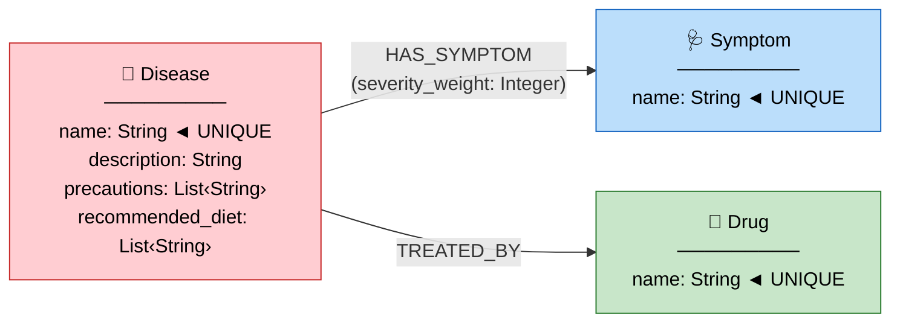

# 📐 THIẾT KẾ GRAPH SCHEMA — AegisHealth KBQA

> **Phiên bản:** 1.0  
> **Tác giả:** Đội Data & Graph  
> **Mục tiêu:** Schema chuẩn, tối ưu truy vấn, sẵn sàng mở rộng

---

## 1. Nguyên Tắc Thiết Kế

Trước khi đi vào chi tiết, đây là các nguyên tắc mà schema này tuân theo:

| # | Nguyên tắc | Lý do |
|---|---|---|
| 1 | **Tên Entity lưu lowercase, chuẩn hóa tiếng Anh** | Tránh trùng lặp do viết hoa/thường. LLM sinh Cypher sẽ nhất quán hơn |
| 2 | **Mỗi Entity có `name` là UNIQUE constraint** | Ngăn chặn duplicate nodes, cho phép dùng `MERGE` an toàn khi import |
| 3 | **Tên Relationship viết HOA, dùng dấu gạch dưới** | Chuẩn Neo4j convention: `HAS_SYMPTOM`, `TREATED_BY` |
| 4 | **Property càng ít càng tốt, nhưng đủ để trả lời câu hỏi** | Schema gọn → LLM dễ học → sinh Cypher chính xác hơn |
| 5 | **Relationship property cho metadata, không cho dữ liệu chính** | Dữ liệu chính nằm trên Node. Relationship property bổ sung ngữ cảnh |
| 6 | **Dự phòng mở rộng nhưng không over-engineer** | Chỉ implement cái cần cho v1, nhưng thiết kế sao cho thêm mới dễ dàng |

---

## 2. Nguồn Dữ Liệu & Mapping

### 2.1. Từ Kaggle về Graph

Project sử dụng bộ **Medicine Recommendation System Dataset** trên Kaggle, bao gồm nhiều file CSV:

| File CSV | Cột chính | Mapping vào Graph |
|---|---|---|
| `Training.csv` | `prognosis` + 132 cột symptom (binary 0/1) | `Disease` nodes, `Symptom` nodes, `HAS_SYMPTOM` relationships |
| `description.csv` | `Disease`, `Description` | Property `description` trên `Disease` node |
| `medications.csv` | `Disease`, `Medication` | `Drug` nodes, `TREATED_BY` relationships |
| `Symptom-severity.csv` | `Symptom`, `weight` | Property `severity_weight` trên `HAS_SYMPTOM` relationship |
| `precautions_df.csv` | `Disease`, `Precaution_1..4` | Property `precautions` trên `Disease` node |
| `diets.csv` | `Disease`, `Diet` | Property `recommended_diet` trên `Disease` node |

> [!IMPORTANT]
> Bộ dataset này **giàu hơn nhiều** so với chỉ 2 file. Tận dụng tối đa sẽ tạo Knowledge Graph chất lượng cao hơn.

### 2.2. Ánh Xạ Tổng Thể

```
Training.csv        ─── prognosis ──────────────→ Disease (name)
                    ─── 132 symptom columns ────→ Symptom (name) + HAS_SYMPTOM
description.csv     ─── Description ────────────→ Disease (description)
medications.csv     ─── Medication ─────────────→ Drug (name) + TREATED_BY
Symptom-severity.csv── weight ──────────────────→ HAS_SYMPTOM (severity_weight)
precautions_df.csv  ─── Precaution_1..4 ────────→ Disease (precautions)
diets.csv           ─── Diet ───────────────────→ Disease (recommended_diet)
```

---

## 3. Đặc Tả Chi Tiết Graph Schema

### 3.1. Sơ Đồ Tổng Thể



---

### 3.2. Node: `Disease` (Bệnh)

| Property | Kiểu | Ràng buộc | Nguồn dữ liệu | Ví dụ |
|---|---|---|---|---|
| `name` | `String` | **UNIQUE, NOT NULL** | `Training.csv` → cột `prognosis` | `"diabetes"` |
| `description` | `String` | Nullable | `description.csv` → cột `Description` | `"A chronic metabolic disease..."` |
| `precautions` | `List<String>` | Nullable | `precautions_df.csv` → cột `Precaution_1..4` | `["monitor blood sugar", "balanced diet", ...]` |
| `recommended_diet` | `List<String>` | Nullable | `diets.csv` → cột `Diet` | `["low sugar foods", "high fiber", ...]` |

**Quyết định thiết kế:**

- **`precautions` là List trên Node, không tách thành Node riêng.** Lý do: Precautions không có quan hệ chia sẻ giữa các bệnh (precaution A chỉ thuộc về bệnh X, không có bệnh Y cũng có precaution A). Nếu tách Node sẽ tạo thêm complexity không cần thiết.
- **`recommended_diet` tương tự.** Chỉ bổ sung thông tin, không cần truy vấn ngược ("diet nào thuộc bệnh nào?").
- **`description` là text dài** → lưu trên Node, không phải relationship.

**Câu hỏi mà Node này trả lời được:**
- "Bệnh tiểu đường là gì?" → `d.description`
- "Cần phòng ngừa gì cho bệnh X?" → `d.precautions`
- "Chế độ ăn cho bệnh X?" → `d.recommended_diet`

---

### 3.3. Node: `Symptom` (Triệu chứng)

| Property | Kiểu | Ràng buộc | Nguồn dữ liệu | Ví dụ |
|---|---|---|---|---|
| `name` | `String` | **UNIQUE, NOT NULL** | `Training.csv` → tên 132 cột symptom | `"headache"` |

**Quyết định thiết kế:**

- **Symptom cực kỳ đơn giản — chỉ có `name`.** Lý do: trong dataset, triệu chứng chỉ là tên (binary có/không). Không có mô tả hay metadata riêng cho từng triệu chứng.
- **Tên được chuẩn hóa:** `"skin_rash"` → `"skin rash"` (thay `_` bằng space, lowercase).
- **Symptom ĐƯỢC CHIA SẺ giữa các Disease** (many-to-many). Đây chính là sức mạnh của graph — headache vừa liên kết flu, vừa liên kết migraine.

**Câu hỏi mà Node này trả lời được:**
- "Headache là triệu chứng của bệnh gì?" → truy vấn ngược qua `HAS_SYMPTOM`

---

### 3.4. Node: `Drug` (Thuốc)

| Property | Kiểu | Ràng buộc | Nguồn dữ liệu | Ví dụ |
|---|---|---|---|---|
| `name` | `String` | **UNIQUE, NOT NULL** | `medications.csv` → cột `Medication` | `"metformin"` |

**Quyết định thiết kế:**

- **Giữ đơn giản ở v1.** Dataset `medications.csv` chỉ cung cấp tên thuốc, không có thông tin chi tiết (liều lượng, tác dụng phụ).
- **Sẵn sàng mở rộng:** Có thể thêm `type`, `dosage_info`, `side_effects` sau khi enrich data từ nguồn khác.
- **Drug ĐƯỢC CHIA SẺ giữa các Disease** (many-to-many). Paracetamol trị được cả flu lẫn headache.

**Câu hỏi mà Node này trả lời được:**
- "Paracetamol dùng để trị bệnh gì?" → truy vấn ngược qua `TREATED_BY`

---

### 3.5. Relationship: `HAS_SYMPTOM`

| Thuộc tính | Chi tiết |
|---|---|
| **Hướng** | `(Disease)-[:HAS_SYMPTOM]->(Symptom)` |
| **Cardinality** | Many-to-Many |
| **Ý nghĩa** | Bệnh X có triệu chứng Y |

| Property | Kiểu | Nguồn | Mô tả |
|---|---|---|---|
| `severity_weight` | `Integer` | `Symptom-severity.csv` → cột `weight` | Mức độ nghiêm trọng (1-7). Số càng cao → triệu chứng càng nặng |

**Quyết định thiết kế:**

- **`severity_weight` trên Relationship, không trên Node Symptom.** Lý do: severity của headache khi bị flu khác với khi bị brain tumor. Nhưng trong dataset hiện tại, severity là cố định cho mỗi symptom, nên giá trị sẽ giống nhau trên mọi relationship cho cùng symptom. Tuy nhiên, đặt trên relationship sẵn sàng cho tương lai khi severity thay đổi theo bệnh.
- **Trường hợp sử dụng:** Khi differential diagnosis, có thể ưu tiên các triệu chứng có severity cao hơn.

**Câu hỏi mà Relationship này trả lời được:**
- "Triệu chứng nào nghiêm trọng nhất của bệnh X?" → sort by `severity_weight DESC`
- "Bệnh nào có triệu chứng headache?" → match ngược

---

### 3.6. Relationship: `TREATED_BY`

| Thuộc tính | Chi tiết |
|---|---|
| **Hướng** | `(Disease)-[:TREATED_BY]->(Drug)` |
| **Cardinality** | Many-to-Many |
| **Ý nghĩa** | Bệnh X có thể được điều trị bằng thuốc Y |

| Property | Kiểu | Mô tả |
|---|---|---|
| *(Không có ở v1)* | — | Có thể thêm `confidence`, `source` ở phiên bản sau |

**Câu hỏi mà Relationship này trả lời được:**
- "Thuốc nào trị bệnh X?"
- "Thuốc Y trị được bệnh nào?"

---

## 4. Thống Kê Dự Kiến

| Thực thể | Số lượng dự kiến | Nguồn |
|---|---|---|
| `Disease` nodes | ~41 (từ 41 unique prognosis trong Training.csv) | `Training.csv` |
| `Symptom` nodes | ~132 (từ 132 cột symptom) | `Training.csv` |
| `Drug` nodes | ~200–400 (tùy dedup) | `medications.csv` |
| `HAS_SYMPTOM` relationships | ~500–1500 (mỗi bệnh trung bình 12–35 symptoms) | `Training.csv` |
| `TREATED_BY` relationships | ~200–600 | `medications.csv` |
| **Tổng nodes** | **~373–573** | Rất thoải mái với AuraDB Free (200K limit) |

---

## 5. Constraints & Indexes

### 5.1. Uniqueness Constraints (Bắt buộc — chạy TRƯỚC KHI import data)

```cypher
-- ═══════════════════════════════════════════
-- CONSTRAINTS: Đảm bảo không trùng lặp
-- Chạy file này trên Neo4j AuraDB TRƯỚC KHI import
-- ═══════════════════════════════════════════

-- Mỗi bệnh phải có tên duy nhất
CREATE CONSTRAINT disease_name_unique IF NOT EXISTS
FOR (d:Disease) REQUIRE d.name IS UNIQUE;

-- Mỗi triệu chứng phải có tên duy nhất
CREATE CONSTRAINT symptom_name_unique IF NOT EXISTS
FOR (s:Symptom) REQUIRE s.name IS UNIQUE;

-- Mỗi thuốc phải có tên duy nhất
CREATE CONSTRAINT drug_name_unique IF NOT EXISTS
FOR (dr:Drug) REQUIRE dr.name IS UNIQUE;
```

### 5.2. Indexes (Tối ưu tốc độ truy vấn)

```cypher
-- ═══════════════════════════════════════════
-- INDEXES: Tăng tốc tìm kiếm theo name
-- Neo4j tự tạo index cho UNIQUE constraint
-- nên các index dưới đây là TỰ ĐỘNG có
-- CHỈ cần thêm index nếu query theo property khác
-- ═══════════════════════════════════════════

-- Index cho severity_weight trên relationship (nếu cần sort)
-- Lưu ý: AuraDB Free có thể không hỗ trợ relationship index
-- Kiểm tra trước khi chạy. Nếu không hỗ trợ, bỏ qua.
-- CREATE INDEX has_symptom_weight IF NOT EXISTS
-- FOR ()-[r:HAS_SYMPTOM]-() ON (r.severity_weight);
```

> [!NOTE]
> **Khi tạo UNIQUE constraint, Neo4j tự động tạo index cho property đó.** Nên bạn KHÔNG cần tạo thêm index riêng cho `Disease.name`, `Symptom.name`, `Drug.name`. Chỉ cần 3 lệnh constraint ở trên là đủ.

---

## 6. Các Mẫu Cypher Query Quan Trọng

### 6.1. Basic Queries — AI sẽ sinh nhiều nhất

```cypher
-- Q: "Bệnh tiểu đường có triệu chứng gì?"
MATCH (d:Disease {name: "diabetes"})-[:HAS_SYMPTOM]->(s:Symptom)
RETURN s.name AS symptom
ORDER BY s.name;

-- Q: "Thuốc nào trị cảm cúm?"
MATCH (d:Disease {name: "common cold"})-[:TREATED_BY]->(dr:Drug)
RETURN dr.name AS drug;

-- Q: "Bệnh tiểu đường là gì?"
MATCH (d:Disease {name: "diabetes"})
RETURN d.name AS disease, d.description AS description;

-- Q: "Cần phòng ngừa gì cho bệnh X?"
MATCH (d:Disease {name: "diabetes"})
RETURN d.name AS disease, d.precautions AS precautions;
```

### 6.2. Multi-hop Queries — Sức mạnh của Graph

```cypher
-- Q: "Bệnh nào vừa có sốt vừa có đau đầu?"
MATCH (d:Disease)-[:HAS_SYMPTOM]->(s1:Symptom {name: "headache"}),
      (d)-[:HAS_SYMPTOM]->(s2:Symptom {name: "high fever"})
RETURN d.name AS disease;

-- Q: "Bệnh nào có triệu chứng đau đầu và trị được bằng paracetamol?"
MATCH (d:Disease)-[:HAS_SYMPTOM]->(s:Symptom {name: "headache"}),
      (d)-[:TREATED_BY]->(dr:Drug {name: "paracetamol"})
RETURN d.name AS disease;
```

### 6.3. Statistical Queries

```cypher
-- Q: "Triệu chứng phổ biến nhất?"
MATCH (s:Symptom)<-[:HAS_SYMPTOM]-(d:Disease)
RETURN s.name AS symptom, COUNT(d) AS disease_count
ORDER BY disease_count DESC
LIMIT 10;

-- Q: "Bệnh nào có nhiều triệu chứng nhất?"
MATCH (d:Disease)-[:HAS_SYMPTOM]->(s:Symptom)
RETURN d.name AS disease, COUNT(s) AS symptom_count
ORDER BY symptom_count DESC
LIMIT 10;
```

### 6.4. Differential Diagnosis — Truy vấn nâng cao

```cypher
-- Q: "Tôi bị đau đầu, sốt, mệt mỏi — có thể là bệnh gì?"
WITH ["headache", "high fever", "fatigue"] AS input_symptoms
MATCH (d:Disease)-[r:HAS_SYMPTOM]->(s:Symptom)
WHERE s.name IN input_symptoms
WITH d.name AS disease,
     COUNT(s) AS matched,
     SIZE(input_symptoms) AS total,
     COLLECT(s.name) AS matched_symptoms
RETURN disease, matched, total,
       round(toFloat(matched) / total * 100, 1) AS match_pct,
       matched_symptoms
ORDER BY matched DESC, disease
LIMIT 5;
```

### 6.5. Severity-aware Queries (tận dụng severity_weight)

```cypher
-- Q: "Triệu chứng nghiêm trọng nhất của bệnh X?"
MATCH (d:Disease {name: "heart attack"})-[r:HAS_SYMPTOM]->(s:Symptom)
RETURN s.name AS symptom, r.severity_weight AS severity
ORDER BY r.severity_weight DESC;
```

---

## 7. Tại Sao Schema Này "Chuẩn"?

### 7.1. Tối ưu cho LLM sinh Cypher

| Đặc điểm | Lợi ích |
|---|---|
| **Chỉ 3 Node Labels** | LLM chỉ cần nhớ 3 khái niệm → ít sai hơn (giảm lỗi E4: Out-of-Schema) |
| **Chỉ 2 Relationship Types** | LLM dễ chọn đúng relationship (giảm lỗi E2: Wrong Relationship) |
| **Tên rõ nghĩa** | `HAS_SYMPTOM`, `TREATED_BY` → đọc hiểu ngay, không nhầm lẫn |
| **Mọi name đều lowercase** | LLM sinh `{name: "diabetes"}` nhất quán (giảm lỗi E6: Language Mismatch) |
| **Schema inject gọn** | Prompt ngắn hơn → LLM tập trung hơn vào câu hỏi |

### 7.2. Tối ưu cho truy vấn

| Đặc điểm | Lợi ích |
|---|---|
| **UNIQUE constraint trên name** | Tự tạo index → truy vấn `{name: "X"}` cực nhanh (O(1) lookup) |
| **Many-to-Many qua Relationship** | Truy vấn ngược dễ dàng: "headache thuộc bệnh gì?" |
| **severity_weight trên relationship** | Sort triệu chứng theo mức độ nghiêm trọng |
| **description, precautions, diet trên Disease node** | Trả lời câu hỏi mô tả mà không cần thêm JOIN/traversal |

### 7.3. Dễ mở rộng trong tương lai

Khi cần thêm tính năng, chỉ cần **thêm Node hoặc Relationship mới**, KHÔNG cần sửa cái cũ:

```
Hiện tại (v1):
  Disease ──HAS_SYMPTOM──→ Symptom
  Disease ──TREATED_BY───→ Drug

Tương lai (v2) — chỉ THÊM, không SỬA:
  Disease ──HAS_SYMPTOM──→ Symptom
  Disease ──TREATED_BY───→ Drug
  Drug    ──HAS_SIDE_EFFECT──→ SideEffect      ← THÊM
  Disease ──FOLLOWS_PROTOCOL──→ Protocol        ← THÊM
  Drug    ──INTERACTS_WITH───→ Drug             ← THÊM
  Disease.name_vi = "tiểu đường"               ← THÊM property
```

---

## 8. Schema cho System Prompt (Copy nguyên khối vào prompt AI)

Đây là đoạn text gọn nhất mà Đội AI sẽ inject vào System Prompt:

```
## Graph Schema
Node Labels:
- Disease (properties: name, description, precautions, recommended_diet)
- Symptom (properties: name)
- Drug (properties: name)

Relationship Types:
- (Disease)-[:HAS_SYMPTOM {severity_weight}]->(Symptom)
- (Disease)-[:TREATED_BY]->(Drug)

Constraints:
- Disease.name is UNIQUE (lowercase English)
- Symptom.name is UNIQUE (lowercase English, spaces instead of underscores)
- Drug.name is UNIQUE (lowercase English)

Notes:
- All entity names are stored in lowercase English
- severity_weight is an integer 1-7 (higher = more severe)
- precautions and recommended_diet are lists of strings
```

---

## 9. Checklist Trước Khi Import

- [ ] Tạo AuraDB instance
- [ ] Chạy 3 lệnh `CREATE CONSTRAINT` (section 5.1)
- [ ] Kiểm tra constraint đã tạo: `SHOW CONSTRAINTS`
- [ ] Import Disease nodes (từ Training.csv prognosis + description.csv)
- [ ] Import Symptom nodes (từ tên 132 cột Training.csv)
- [ ] Import Drug nodes (từ medications.csv)
- [ ] Import HAS_SYMPTOM relationships (từ Training.csv binary columns)
- [ ] Import TREATED_BY relationships (từ medications.csv)
- [ ] Enrich Disease nodes với precautions + diet
- [ ] Enrich HAS_SYMPTOM với severity_weight
- [ ] Validate bằng 7 loại query mẫu (section 6)
- [ ] Export `graph_schema_summary.md` cho Đội AI
