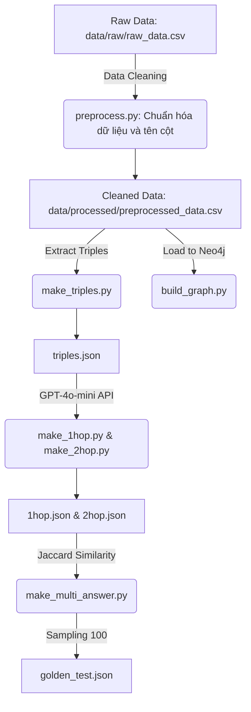
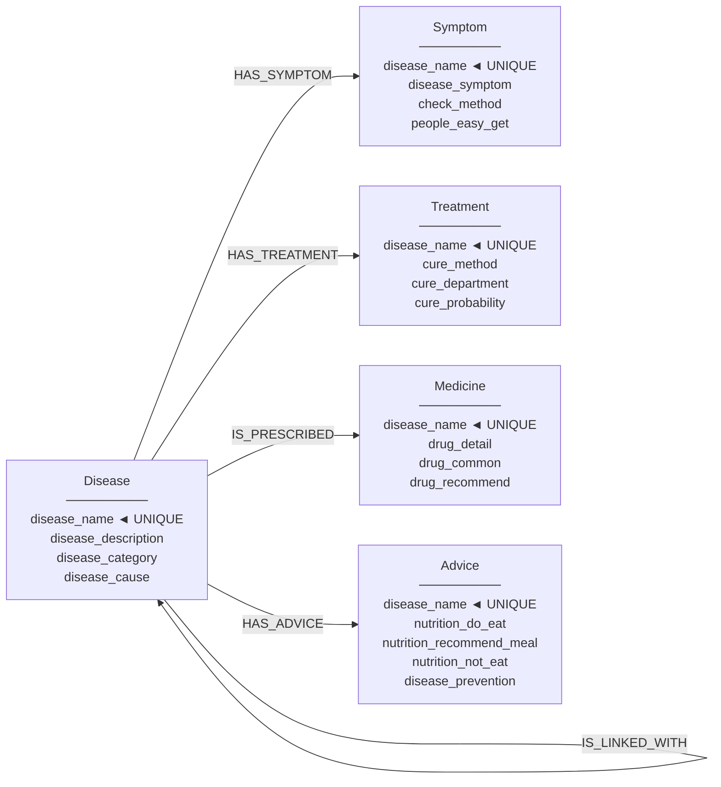

# THIẾT KẾ DATA PIPELINE & GRAPH SCHEMA — AegisHealth KBQA

**Phiên bản:** 3.0 (Modular ETL & Centralized Preprocessing)  
**Tham chiếu:** VietMedKG Paper — ACM TALLIP 2025 (https://doi.org/10.1145/3744740)  
**Kiến trúc:** Cấu trúc Microservice-ready với Phân tách Trách nhiệm (Separation of Concerns).  
**Mục tiêu:** Xây dựng Data Pipeline bền vững, làm sạch dữ liệu tập trung, tối ưu truy vấn Graph.

---

## 1. Triết Lý Thiết Kế (Design Principles)

| # | Nguyên tắc | Lý do / Lợi ích |
|---|---|---|
| 1 | **Tách biệt Môi trường (Dependency Isolation)** | Phân hệ ETL có tập tin `requirements.txt` độc lập, hỗ trợ tối ưu quá trình xây dựng Docker Image. |
| 2 | **Làm sạch Tập trung (Centralized Cleansing)** | Tập lệnh `preprocess.py` chuẩn hóa ký tự ngay từ giai đoạn Extract, loại bỏ sự dư thừa trong các kịch bản xử lý hạ nguồn. |
| 3 | **Ánh xạ Schema 1:1 (English Native)** | Dữ liệu sau tiền xử lý sử dụng định danh tiếng Anh, hỗ trợ ánh xạ trực tiếp vào Graph Database. |
| 4 | **Tái cấu trúc Module (Modularization)** | Phân tách thư mục `etl/` thành `data_cleaning`, `benchmark_gen` và `graph_builder` nhằm đảm bảo nguyên tắc Separation of Concerns. |
| 5 | **Kế thừa Schema VietMedKG** | Ứng dụng cấu trúc Đồ thị Tri thức đã được kiểm chứng thông qua các công bố khoa học (quy mô hơn 40.000 nodes). |

---

## 2. Kiến Trúc Dữ Liệu (Data Engineering Architecture)

Luồng xử lý dữ liệu (Data Flow) trong hệ thống được vận hành tự động theo mô hình ETL (Extract - Transform - Load):



---

## 3. Ánh Xạ Dữ Liệu (Schema Mapping)

Thông qua bước làm sạch tập trung, các thuộc tính dữ liệu được ánh xạ tĩnh theo tỷ lệ 1:1 vào đồ thị tri thức Neo4j:

```text
preprocessed_data.csv (Cleaned Columns)
├── disease_name ──────────────→ Disease.disease_name
├── disease_description ───────→ Disease.disease_description
├── disease_category ──────────→ Disease.disease_category
├── disease_cause ─────────────→ Disease.disease_cause
├── disease_symptom ───────────→ Symptom.disease_symptom
├── check_method ──────────────→ Symptom.check_method
├── people_easy_get ───────────→ Symptom.people_easy_get
├── cure_method ───────────────→ Treatment.cure_method
├── cure_department ───────────→ Treatment.cure_department
├── cure_probability ──────────→ Treatment.cure_probability
├── drug_recommend ────────────→ Medicine.drug_recommend
├── drug_common ───────────────→ Medicine.drug_common
├── drug_detail ───────────────→ Medicine.drug_detail
├── nutrition_do_eat ──────────→ Advice.nutrition_do_eat
├── nutrition_recommend_eat ───→ Advice.nutrition_recommend_meal
├── nutrition_not_eat ─────────→ Advice.nutrition_not_eat
├── disease_prevention ────────→ Advice.disease_prevention
└── associated_disease ────────→ IS_LINKED_WITH relationship
```

---

## 4. Đặc Tả Chi Tiết Graph Schema

### 4.1. Sơ Đồ Tổng Thể Đồ Thị



**Ghi chú thiết kế (Star schema):** 
Mỗi thực thể `Disease` đóng vai trò là một hub node trung tâm. Các thông tin y khoa liên quan (Symptom, Treatment, Medicine, Advice) được biểu diễn thành các node nhánh có quan hệ 1:1 chuyên biệt. Triệu chứng được biểu diễn dưới dạng chuỗi văn bản đã qua xử lý.

### 4.2. Mối quan hệ (Relationships)

| Relationship | Hướng | Ý nghĩa | Ví dụ |
|---|---|---|---|
| `HAS_SYMPTOM` | `(Disease)→(Symptom)` | Bệnh lý có biểu hiện lâm sàng | `(Viêm phổi)-[:HAS_SYMPTOM]->(...)` |
| `HAS_TREATMENT` | `(Disease)→(Treatment)` | Phương thức can thiệp y tế | `(Ho gà)-[:HAS_TREATMENT]->(...)` |
| `IS_PRESCRIBED` | `(Disease)→(Medicine)` | Chỉ định dược phẩm | `(Ho gà)-[:IS_PRESCRIBED]->(...)` |
| `HAS_ADVICE` | `(Disease)→(Advice)` | Khuyến nghị sinh hoạt/dinh dưỡng | `(Tiểu đường)-[:HAS_ADVICE]->(...)` |
| `IS_LINKED_WITH` | `(Disease)→(Disease)` | Bệnh lý đồng mắc | `(Viêm phổi)-[:IS_LINKED_WITH]->(Viêm phế quản)` |

---

## 5. Thống Kê Dữ Liệu Thực Tế (Runtime Validation)

Dựa trên quá trình khởi tạo đồ thị thực tế (tháng 06/2026):

| Thực thể | Số lượng (Thực tế) | Ý nghĩa thống kê |
|---|---|---|
| `Disease` nodes | 8,202 | Số lượng bệnh lý gốc được xác định |
| `Symptom` nodes | 8,164 | Số lượng hồ sơ triệu chứng độc lập |
| `Treatment` nodes | 8,195 | Số lượng phác đồ điều trị |
| `Medicine` nodes | 7,128 | Số lượng hướng dẫn dùng thuốc |
| `Advice` nodes | 8,185 | Số lượng lời khuyên dinh dưỡng/chăm sóc |
| **Tổng nodes** | **39,874** | Tối ưu hóa không gian lưu trữ (giảm thiểu redundancy) |
| **Tổng relationships** | **41,201** | |

---

## 6. Hướng Dẫn Vận Hành (Execution Guide)

Quy trình tự động hóa tích hợp dữ liệu yêu cầu thực thi tuần tự các bước sau:

- Cấu hình biến môi trường (`NEO4J_URI`, `NEO4J_USERNAME`, `NEO4J_PASSWORD`, `OPENAI_API_KEY`) trong `.env`.
- Cài đặt thư viện: `pip install -r etl/requirements.txt`.
- Khởi chạy Pipeline:
  - **Tiền xử lý (Cleaning):** `python3 -m etl.data_cleaning.preprocess`
  - **Tích hợp Đồ thị (Graph Building):** `python3 -m etl.graph_builder.build_graph`
  - **Khai phá Dữ liệu (Triples Extraction):** `python3 -m etl.benchmark_gen.make_triples`
  - **Sinh Benchmark:** Chạy tuần tự `make_1hop`, `make_2hop`, `make_multi_answer`, `make_benchmark`.

---

## 7. Các Mẫu Truy Vấn Cypher Phổ Biến

```cypher
-- Khảo sát biểu hiện lâm sàng của bệnh
MATCH (d:Disease {disease_name: "Viêm phổi"})-[:HAS_SYMPTOM]->(s:Symptom)
RETURN s.disease_symptom AS symptoms, s.check_method AS check;

-- Tra cứu phác đồ dùng thuốc
MATCH (d:Disease {disease_name: "Ho gà"})-[:IS_PRESCRIBED]->(m:Medicine)
RETURN m.drug_common AS medicine, m.drug_recommend AS recommended;

-- Phân tích bệnh lý đồng mắc
MATCH (d1:Disease {disease_name: "Viêm phổi"})-[:IS_LINKED_WITH]->(d2:Disease)
OPTIONAL MATCH (d2)-[:HAS_SYMPTOM]->(s:Symptom)
RETURN d2.disease_name AS linked_disease, s.disease_symptom AS symptoms;
```

---

*Tài liệu này được biên soạn nhằm chuẩn hóa kiến trúc Data Engineering, phục vụ cho hệ thống AegisHealth.*
