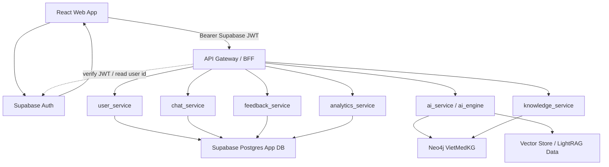
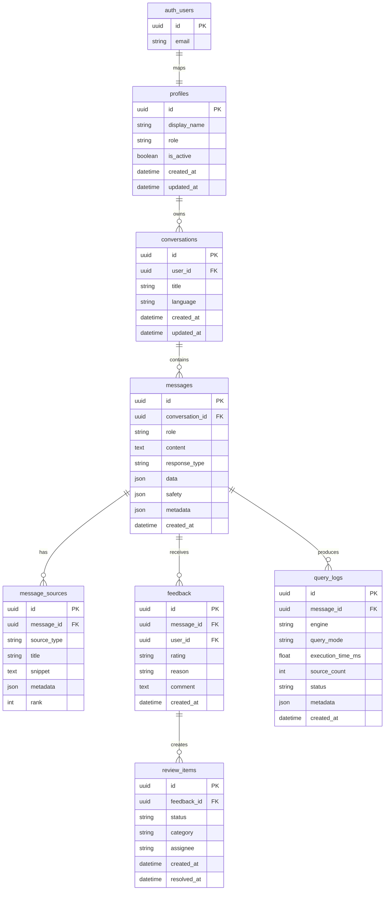

# 14. KẾ HOẠCH 3 NGƯỜI HOÀN THIỆN AEGISHEALTH KBQA END-TO-END

> **Delivery Plan:** Nâng cấp AegisHealth KBQA từ demo hỏi đáp thành ứng dụng end-to-end cho người dùng thật.  
> **Quy mô nhóm:** 3 người.  
> **Thời lượng:** 3 sprint, mỗi sprint 2 tuần, tổng 6 tuần.  
> **Phạm vi:** P0 + P1 lõi.  
> **Nguyên tắc:** Người 1 thiết kế nền tảng và contract trước, Người 2 và Người 3 triển khai song song theo contract.

---

## 1. Mục Tiêu Và Phạm Vi

### 1.1. Mục tiêu nâng cấp

Phiên bản hiện tại đã có AI Engine, backend và frontend web phục vụ demo. Mục tiêu của giai đoạn này là biến hệ thống thành một ứng dụng hỏi đáp y tế end-to-end có:

- Người dùng thật qua Supabase Auth hoặc anonymous session nếu bật trong Supabase.
- Lịch sử hội thoại bền vững.
- Chat API gắn với conversation và message.
- Nguồn/citation cho câu trả lời.
- Feedback loop để phát hiện câu trả lời sai.
- Knowledge explorer cho bệnh, triệu chứng, thuốc, điều trị, lời khuyên.
- Admin metrics cơ bản cho vận hành.
- Frontend hoàn chỉnh, không chỉ là một demo chat đơn trang.

### 1.2. Phạm vi P0 + P1 lõi

| Nhóm tính năng | Trạng thái cần đạt sau 6 tuần |
|---|---|
| Auth & Session | Supabase Auth cho đăng nhập/đăng ký, backend verify Supabase JWT, `GET /me` |
| Conversation | Tạo hội thoại, xem danh sách, xem chi tiết, lưu message |
| Medical QA | Chat API gọi Hybrid GraphRAG thật, lưu answer, metadata, sources |
| Safety | Có trường `safety`, render cảnh báo y tế rõ ràng |
| Citation | Hiển thị source/path/cypher/entity metadata ở frontend |
| Feedback | Thumbs up/down, report incorrect, tạo review item khi feedback xấu |
| Knowledge | API và UI tra cứu bệnh cơ bản |
| Admin | Metrics cơ bản: request count, latency, feedback, engine usage |
| Observability | Query logs, health check, execution metadata |

### 1.3. Ngoài phạm vi trong 6 tuần

- Tách microservice vật lý thành nhiều deployment riêng.
- Mobile app Flutter hoàn chỉnh.
- A/B testing prompt/model đầy đủ.
- Reviewer workflow phức tạp như ticketing system.
- Cá nhân hóa chuyên sâu theo bệnh sử cá nhân.
- Tích hợp EMR/EHR hoặc dữ liệu bệnh án thật.

---

## 2. Kiến Trúc Đích

### 2.1. Nguyên tắc kiến trúc

Hệ thống dùng **modular service-oriented backend**. Các service phần mềm được thiết kế ngang hàng với `ai_service`/`ai_engine`, nhưng giai đoạn đầu vẫn có thể chạy chung trong một FastAPI app để giảm độ phức tạp triển khai.



### 2.2. Service boundaries

| Service | Owner chính | Trách nhiệm |
|---|---|---|
| `api_gateway` | Người 1 | CORS, Supabase JWT verification, route registration, API versioning, response envelope |
| `user_service` | Người 2 | Profile, role, current user mapping từ Supabase Auth; không tự hash password hoặc phát JWT |
| `chat_service` | Người 2 | Conversation, message, gọi `ai_service`, lưu answer/sources/metadata |
| `ai_service` | Người 1 | Adapter bọc `ai_engine`, chuẩn hóa response, safety/source metadata |
| `feedback_service` | Người 2 | Feedback message, report incorrect, tạo review item |
| `knowledge_service` | Người 2 | Disease list/detail, schema/query an toàn từ Neo4j |
| `analytics_service` | Người 2 | Query log, metrics dashboard, engine usage, latency summary |
| Frontend app | Người 3 | App shell, chat UX, knowledge explorer, admin metrics, feedback UI |

### 2.3. Storage ownership

| Storage | Dùng cho | Không dùng cho |
|---|---|---|
| Supabase Auth | Đăng ký, đăng nhập, session, refresh token, anonymous auth nếu bật | Business data, Knowledge Graph |
| Supabase Postgres | Profiles, conversations, messages, sources, feedback, query logs, review items | Password/session token thô, Knowledge Graph y tế |
| Neo4j | Disease, Symptom, Treatment, Medicine, Advice, relationship y tế | User/session/history |
| Vector Store | LightRAG retrieval data | App state |

---

## 3. Vai Trò Và Quyền Quyết Định

### 3.1. Người 1 - Architect / Platform Lead

Đây là vai trò quan trọng nhất trong giai đoạn nâng cấp. Người 1 không chỉ viết code nền tảng mà còn quyết định contract để Người 2 và Người 3 có thể làm song song.

| Trách nhiệm | Deliverable bắt buộc |
|---|---|
| Chốt kiến trúc backend module | Service boundary, folder structure, dependency direction |
| Thiết kế Supabase database | Backend-owned Supabase SQL migrations, RLS policy, seed/dev data |
| Chốt API contract | OpenAPI, request/response examples, error envelope |
| Tích hợp `ai_engine` như `ai_service` | Adapter chuẩn hóa response chat mới |
| Thiết lập codebase | Supabase env/config, auth dependency, database access, test base |
| Review contract | Không để frontend/backend tự đổi schema riêng |

**Quyền quyết định của Người 1:**

- Được quyền chặn merge nếu thay đổi phá API contract hoặc DB schema chưa được migrate đúng.
- Là người duy nhất approve breaking changes trong response model.
- Là người sở hữu tài liệu contract và migration.

### 3.2. Người 2 - Backend / API Lead

| Trách nhiệm | Deliverable bắt buộc |
|---|---|
| Implement API theo skeleton của Người 1 | Current user/profile, conversation, message, feedback, knowledge, metrics |
| Viết service logic | Không nhét business logic vào router |
| Viết tests backend | Unit/integration tests cho API chính |
| Tích hợp AI pipeline vào chat flow | Lưu user message, assistant message, sources, query log |
| Error handling | User-friendly error, status code đúng, không leak secret |

### 3.3. Người 3 - Frontend Lead

| Trách nhiệm | Deliverable bắt buộc |
|---|---|
| Thiết kế app shell | Sidebar hội thoại, main chat, source panel, nav |
| Consume API contract | API client typed, không hard-code response tùy tiện |
| Render response types | Text, table, warning, disambiguation, citations |
| Feedback UX | Thumbs up/down, report incorrect |
| Knowledge/Admin UI | Knowledge explorer, admin metrics screen |
| Responsive QA | Desktop và mobile web đều dùng được |

---

## 4. Database Design

### 4.1. Supabase schema tối thiểu



### 4.2. Table notes

| Table | Ghi chú triển khai |
|---|---|
| `auth.users` | Bảng do Supabase quản lý; backend/frontend không tự ghi trực tiếp |
| `profiles` | App profile 1:1 với `auth.users.id`; `role` gồm `user`, `admin`; dùng trigger hoặc service bootstrap để tạo profile |
| `conversations` | `title` sinh từ câu hỏi đầu tiên hoặc fallback `"Cuộc trò chuyện mới"` |
| `messages` | `role` gồm `user`, `assistant`, `system`; assistant message lưu `response_type`, `data`, `safety`, `metadata` |
| `message_sources` | Chuẩn hóa citation từ Cypher, LightRAG entities, relationships, chunks |
| `feedback` | `rating` gồm `up`, `down`; `reason` dùng cho phân tích lỗi |
| `query_logs` | Không lưu secret, không lưu Supabase access token, chỉ lưu trace cần debug |
| `review_items` | Tạo tự động khi feedback `down` hoặc reason là `incorrect` |

### 4.3. Supabase Auth policy

| Chủ đề | Quyết định |
|---|---|
| Đăng ký/đăng nhập | Frontend gọi Supabase Auth trực tiếp bằng `supabase-js` |
| Backend auth | Client gửi `Authorization: Bearer <supabase_access_token>`; backend verify JWT và lấy `user_id` |
| Guest/anonymous | Dùng Supabase anonymous auth nếu project bật; nếu không bật thì chỉ cho phép authenticated user trong production |
| Authorization | API chỉ trả dữ liệu có `user_id = auth user id`; admin API yêu cầu `profiles.role = 'admin'` |
| RLS | Bật RLS cho app tables; policy user chỉ đọc/ghi dữ liệu của chính mình, admin đọc metrics/review |

---

## 5. API Contract

### 5.1. Endpoint bắt buộc

| Method | Path | Owner | Mục đích |
|---|---|---|---|
| `GET` | `/api/v1/me` | Người 2 | Lấy profile/current user từ Supabase token |
| `POST` | `/api/v1/conversations` | Người 2 | Tạo hội thoại |
| `GET` | `/api/v1/conversations` | Người 2 | Danh sách hội thoại |
| `GET` | `/api/v1/conversations/{id}` | Người 2 | Chi tiết hội thoại và messages |
| `POST` | `/api/v1/conversations/{id}/messages` | Người 2 | Gửi câu hỏi, gọi AI, lưu response |
| `POST` | `/api/v1/messages/{id}/feedback` | Người 2 | Gửi feedback cho assistant message |
| `GET` | `/api/v1/knowledge/diseases` | Người 2 | Tìm kiếm/danh sách bệnh |
| `GET` | `/api/v1/knowledge/diseases/{id}` | Người 2 | Chi tiết bệnh |
| `GET` | `/api/v1/admin/metrics` | Người 2 | Metrics vận hành cơ bản |
| `GET` | `/api/v1/health` | Người 1 | Health check toàn hệ thống |

**Auth không có endpoint backend riêng cho register/login.** Người 3 dùng Supabase client ở frontend:

- `supabase.auth.signUp(...)`
- `supabase.auth.signInWithPassword(...)`
- `supabase.auth.signOut()`
- `supabase.auth.getSession()`
- `supabase.auth.signInAnonymously()` nếu anonymous auth được bật.

### 5.2. Chat response shape

```json
{
  "conversation_id": "uuid",
  "message_id": "uuid",
  "status": "success",
  "response_type": "text",
  "answer": "Câu trả lời cho người dùng...",
  "data": null,
  "sources": [
    {
      "id": "uuid",
      "source_type": "cypher",
      "title": "Neo4j VietMedKG",
      "snippet": "MATCH ... RETURN ...",
      "rank": 1,
      "metadata": {
        "engine": "cypher_direct",
        "query_mode": "cypher:template:symptoms"
      }
    }
  ],
  "safety": {
    "level": "normal",
    "requires_emergency_notice": false,
    "disclaimer": "Thông tin chỉ mang tính chất tham khảo."
  },
  "suggested_questions": [
    "Bệnh này có những triệu chứng nguy hiểm nào?",
    "Khi nào nên đi khám bác sĩ?"
  ],
  "metadata": {
    "engine": "cypher_direct",
    "query_mode": "cypher:template:symptoms",
    "execution_time_ms": 120,
    "source_count": 1,
    "cypher": "MATCH ..."
  }
}
```

### 5.3. Response types frontend phải hỗ trợ

| `response_type` | Component |
|---|---|
| `text` | Markdown answer + citations |
| `table` | Structured table hoặc markdown fallback |
| `warning` | Medical warning block nổi bật |
| `disambiguation` | Danh sách lựa chọn khi entity mơ hồ |
| `source_list` | Source/citation panel |

---

## 6. Codebase Skeleton Đề Xuất

### 6.1. Backend

```text
backend/app/
├── main.py
├── config.py
├── database.py
├── api_gateway/
│   ├── dependencies.py
│   └── errors.py
├── models/
│   ├── app_models.py
│   └── schemas.py
├── routers/
│   ├── me.py
│   ├── conversations.py
│   ├── feedback.py
│   ├── knowledge.py
│   ├── admin.py
│   └── health.py
├── services/
│   ├── user_service.py
│   ├── chat_service.py
│   ├── ai_service.py
│   ├── feedback_service.py
│   ├── knowledge_service.py
│   └── analytics_service.py
└── migrations/
    └── supabase/
        ├── versions/
        └── rollbacks/
```

### 6.2. Frontend

```text
frontend/src/
├── app/
│   ├── AppShell.tsx
│   └── routes.tsx
├── features/
│   ├── auth/
│   ├── chat/
│   ├── knowledge/
│   └── admin/
├── services/
│   ├── supabase.ts
│   └── api.ts
├── types/
│   └── api.ts
└── components/
    ├── ResponseRenderer.tsx
    ├── SourcePanel.tsx
    └── FeedbackControls.tsx
```

### 6.3. Environment variables

| App | Biến môi trường | Ghi chú |
|---|---|---|
| Frontend | `VITE_SUPABASE_URL` | Supabase project URL |
| Frontend | `VITE_SUPABASE_ANON_KEY` | Public anon key, được phép dùng trong browser |
| Frontend | `VITE_API_BASE_URL` | URL FastAPI backend |
| Backend | `SUPABASE_URL` | Supabase project URL |
| Backend | `SUPABASE_ANON_KEY` | Public anon key, useful for backend-side dev smoke tests; not a service key |
| Backend | `SUPABASE_JWT_SECRET` hoặc JWKS config | Dùng để verify Supabase access token |
| Backend | `SUPABASE_SERVICE_ROLE_KEY` | Chỉ dùng server-side khi cần admin operation; tuyệt đối không đưa vào frontend |
| Backend | `SUPABASE_DB_URL` | Connection string tới Supabase Postgres nếu backend dùng SQLAlchemy/Alembic |
| Backend | `NEO4J_URI`, `NEO4J_USERNAME`, `NEO4J_PASSWORD` | Knowledge Graph hiện tại |
| Backend | `LLM_*`, `DEFAULT_QUERY_MODE` | AI Engine hiện tại |

---

## 7. Sprint Plan Chi Tiết

## Sprint 1 - Nền Tảng Kiến Trúc Và Codebase

**Mục tiêu:** Người 1 mở khóa toàn bộ codebase, DB schema và API contract để Người 2 và Người 3 làm song song.

| Task ID | Owner | Task | DoD | Deps |
|---|---|---|---|---|
| S1-ARCH-01 | Người 1 | Chốt service boundaries và dependency direction | Có sơ đồ service, rule module import, trách nhiệm từng service | Không |
| S1-ARCH-02 | Người 1 | Thiết kế Supabase ERD, backend-owned SQL migrations và RLS policies đầu tiên | Migration tạo đủ app tables, RLS bật đúng, rollback/redo rõ | S1-ARCH-01 |
| S1-ARCH-03 | Người 1 | Thiết lập Supabase config/env và backend auth dependency | App đọc Supabase URL/JWT secret/service role key đúng, backend verify token được | S1-ARCH-02 |
| S1-ARCH-04 | Người 1 | Viết OpenAPI contract stub và examples | Tất cả endpoint chính có request/response sample | S1-ARCH-01 |
| S1-ARCH-05 | Người 1 | Tạo backend skeleton theo service-oriented modules | Router mỏng, service layer rõ, app vẫn start được | S1-ARCH-03 |
| S1-BE-01 | Người 2 | Implement current-user/profile service | `GET /me` đọc Supabase user id, tạo/lấy profile, trả role đúng | S1-ARCH-05 |
| S1-BE-02 | Người 2 | Implement Supabase-authenticated API dependencies | Request thiếu/invalid token bị 401, admin dependency kiểm tra `profiles.role` | S1-BE-01 |
| S1-BE-03 | Người 2 | Implement conversation CRUD cơ bản | Tạo/list/detail conversation, phân quyền theo Supabase user id | S1-BE-02 |
| S1-BE-04 | Người 2 | Implement message persistence mock | Lưu user message và assistant mock response | S1-BE-03 |
| S1-BE-05 | Người 2 | Viết unit tests profile/conversation/message | Tests pass, cover success và unauthorized cases | S1-BE-04 |
| S1-FE-01 | Người 3 | Build app shell mới | Sidebar, main content, top status, responsive base | S1-ARCH-04 |
| S1-FE-02 | Người 3 | Tạo Supabase client và typed API client từ contract mock | Supabase sign up/sign in/sign out, API client tự gắn Bearer token | S1-FE-01 |
| S1-FE-03 | Người 3 | Build conversation sidebar | List, active state, create new conversation | S1-FE-02 |
| S1-FE-04 | Người 3 | Build chat workspace mock | Message list, composer, loading, error state | S1-FE-03 |
| S1-FE-05 | Người 3 | Build base response renderer | Text/table/warning placeholder render đúng | S1-FE-04 |

**Sprint 1 demo bắt buộc:**

- Start backend.
- Đăng ký/đăng nhập bằng Supabase Auth hoặc anonymous auth nếu bật.
- Tạo conversation.
- Gửi message và nhận mock assistant response.
- Frontend hiển thị conversation và message từ API/mock contract.

---

## Sprint 2 - Tích Hợp AI Và Luồng Hỏi Đáp Thật

**Mục tiêu:** Chat API gọi Hybrid GraphRAG thật và frontend hiển thị câu trả lời có source/citation/feedback.

| Task ID | Owner | Task | DoD | Deps |
|---|---|---|---|---|
| S2-ARCH-01 | Người 1 | Tạo `ai_service` adapter bọc pipeline hiện tại | Adapter trả response shape mới, không làm router gọi trực tiếp `ai_engine` | S1-ARCH-05 |
| S2-ARCH-02 | Người 1 | Chuẩn hóa source metadata policy | Cypher và LightRAG đều map được sang `sources[]` | S2-ARCH-01 |
| S2-ARCH-03 | Người 1 | Chuẩn hóa safety payload | `normal`, `caution`, `emergency` có contract rõ | S2-ARCH-01 |
| S2-ARCH-04 | Người 1 | Review và lock chat response contract | Người 2 và Người 3 dùng cùng một shape | S2-ARCH-02 |
| S2-BE-01 | Người 2 | Implement real chat API | `POST /conversations/{id}/messages` gọi AI thật và lưu đủ messages | S2-ARCH-04 |
| S2-BE-02 | Người 2 | Lưu `message_sources` và `query_logs` | Source và logs truy xuất được theo message | S2-BE-01 |
| S2-BE-03 | Người 2 | Implement feedback API | Up/down/comment lưu DB, validate assistant message | S2-BE-02 |
| S2-BE-04 | Người 2 | Tạo review item khi feedback xấu | Feedback `down` hoặc reason `incorrect` tạo item pending | S2-BE-03 |
| S2-BE-05 | Người 2 | Integration tests chat + feedback | Mock AI adapter và real adapter smoke test đều pass | S2-BE-04 |
| S2-FE-01 | Người 3 | Kết nối chat UI với API thật | Gửi câu hỏi, nhận assistant response, reload vẫn còn lịch sử | S2-BE-01 |
| S2-FE-02 | Người 3 | Build source/citation panel | Hiển thị source type, title, snippet, metadata cơ bản | S2-FE-01 |
| S2-FE-03 | Người 3 | Build feedback controls | Up/down/report incorrect gửi API đúng | S2-FE-01 |
| S2-FE-04 | Người 3 | Build warning và disambiguation UI | Warning nổi bật, entity mơ hồ render danh sách chọn | S2-FE-01 |
| S2-FE-05 | Người 3 | Loading/error polish | LightRAG chậm vẫn có loading rõ, lỗi hiện thân thiện | S2-FE-04 |

**Sprint 2 demo bắt buộc:**

- User gửi câu hỏi thật.
- Backend gọi Hybrid GraphRAG.
- Assistant response được lưu lại.
- Source/citation hiển thị ở frontend.
- Feedback gửi thành công.
- Query log có execution time, engine, query mode.

---

## Sprint 3 - Knowledge, Admin, Hardening

**Mục tiêu:** Bổ sung phần tra cứu knowledge, admin metrics và hardening để hệ thống đủ dùng như ứng dụng end-to-end.

| Task ID | Owner | Task | DoD | Deps |
|---|---|---|---|---|
| S3-ARCH-01 | Người 1 | Hoàn thiện dev stack với Supabase | Backend, frontend, Supabase local hoặc remote dev project chạy theo hướng dẫn rõ ràng | S2-BE-05 |
| S3-ARCH-02 | Người 1 | Seed/dev data cho Supabase | Có admin profile, sample conversations, sample query logs | S3-ARCH-01 |
| S3-ARCH-03 | Người 1 | Monitoring baseline | Health check gồm DB, Neo4j, AI, app version | S3-ARCH-01 |
| S3-ARCH-04 | Người 1 | Architecture sign-off | Review service boundary, DB schema, API contract cuối | S3-BE-04 |
| S3-BE-01 | Người 2 | Implement disease list/search API | Search theo tên bệnh, phân trang, trả summary | S2-BE-05 |
| S3-BE-02 | Người 2 | Implement disease detail API | Trả description, symptoms, treatment, medicine, advice nếu có | S3-BE-01 |
| S3-BE-03 | Người 2 | Implement admin metrics API | Request count, latency avg/P95, feedback negative rate, engine usage | S2-BE-02 |
| S3-BE-04 | Người 2 | Implement review queue read API | Admin xem pending review items từ feedback xấu | S2-BE-04 |
| S3-BE-05 | Người 2 | Backend hardening tests | Knowledge/admin/auth/chat regression tests pass | S3-BE-04 |
| S3-FE-01 | Người 3 | Build knowledge explorer | Search/list diseases, open detail page | S3-BE-01 |
| S3-FE-02 | Người 3 | Build disease detail UI | Render symptoms, treatment, medicine, advice rõ ràng | S3-BE-02 |
| S3-FE-03 | Người 3 | Build admin metrics screen | Cards/charts đơn giản cho metrics | S3-BE-03 |
| S3-FE-04 | Người 3 | Build review queue UI tối thiểu | Admin xem item pending, link về message liên quan | S3-BE-04 |
| S3-FE-05 | Người 3 | Responsive QA và polish | Desktop/mobile web không vỡ layout, empty states rõ | S3-FE-04 |

**Sprint 3 demo bắt buộc:**

- Local stack chạy được theo tài liệu.
- User dùng chat end-to-end.
- User mở lại lịch sử hội thoại.
- User xem source và gửi feedback.
- Admin xem metrics.
- Admin xem review item từ feedback xấu.
- User tra cứu disease trong knowledge explorer.

---

## 8. Collaboration Rules

### 8.1. Contract-first workflow

1. Người 1 tạo hoặc sửa contract trước.
2. Người 2 implement backend theo contract.
3. Người 3 consume contract bằng mock API hoặc API thật.
4. Nếu cần đổi contract, phải có update docs + migration/test tương ứng.

### 8.2. Handoff bắt buộc

| Handoff | Từ | Đến | Nội dung |
|---|---|---|---|
| API contract | Người 1 | Người 2, Người 3 | Endpoint, request, response, error shape |
| Supabase migration/RLS | Người 1 | Người 2 | Tables, relationships, policies, seed rules |
| Backend ready | Người 2 | Người 3 | Endpoint URL, auth flow, example payload |
| UI feedback | Người 3 | Người 1, Người 2 | Gaps trong response shape hoặc UX |
| Integration report | Cả 3 | Cả 3 | Demo checklist, bug list, owner fix |

### 8.3. Branch naming cho nhóm 3 người

```text
feature/architect/<task-name>
feature/backend/<task-name>
feature/frontend/<task-name>
```

Ví dụ:

```text
feature/architect/supabase-schema
feature/backend/conversation-api
feature/frontend/chat-shell
```

---

## 9. Acceptance Checklist

### 9.1. Backend

- [ ] App start được với Supabase config.
- [ ] Supabase migrations tạo đủ bảng app data và RLS policies.
- [ ] Supabase Auth sign up/sign in hoạt động; anonymous auth hoạt động nếu được bật.
- [ ] Conversation được lưu và phân quyền đúng.
- [ ] Message API gọi AI thật.
- [ ] Assistant response lưu đủ answer, response_type, metadata, sources, safety.
- [ ] Feedback tạo review item khi cần.
- [ ] Knowledge API đọc Neo4j an toàn.
- [ ] Admin metrics đọc query logs.
- [ ] Tests backend pass.

### 9.2. Frontend

- [ ] User đăng nhập bằng Supabase Auth hoặc anonymous auth vào app được.
- [ ] Sidebar hiển thị lịch sử hội thoại.
- [ ] Chat workspace gửi câu hỏi và hiển thị câu trả lời thật.
- [ ] Source/citation panel hiển thị được.
- [ ] Warning response nổi bật và dễ hiểu.
- [ ] Feedback controls hoạt động.
- [ ] Knowledge explorer dùng được.
- [ ] Admin metrics dùng được với admin user.
- [ ] Responsive desktop/mobile web đạt mức demo production.

### 9.3. E2E scenarios tối thiểu

| Case | Mô tả | Kết quả mong đợi |
|---|---|---|
| E2E-01 | Anonymous hoặc authenticated user tạo conversation và hỏi câu Cypher path | Có answer, source `cypher`, lưu history |
| E2E-02 | User đăng nhập bằng Supabase hỏi câu LightRAG path | Có answer, source retrieval, query log engine `lightrag` |
| E2E-03 | Câu hỏi entity mơ hồ | Render disambiguation hoặc câu hỏi làm rõ |
| E2E-04 | Câu hỏi triệu chứng nguy hiểm | Render warning, safety level `emergency` hoặc `caution` |
| E2E-05 | Feedback down với reason incorrect | Tạo review item pending |
| E2E-06 | Reload browser | Conversation history vẫn còn |
| E2E-07 | Search disease | Knowledge explorer trả danh sách |
| E2E-08 | Open disease detail | Hiển thị symptoms/treatment/medicine/advice |
| E2E-09 | Admin mở metrics | Có request count, latency, feedback rate |
| E2E-10 | AI service lỗi hoặc timeout | UI hiện lỗi thân thiện, backend không crash |

---

## 10. Rủi Ro Và Biện Pháp Giảm Thiểu

| Rủi ro | Ảnh hưởng | Giảm thiểu |
|---|---|---|
| Người 1 chậm contract | Người 2 và 3 bị block | Sprint 1 ưu tiên contract stub trước code chi tiết |
| DB schema đổi nhiều | Backend/frontend vỡ contract | Dùng migration, version response, review breaking changes |
| LightRAG latency cao | UX chờ lâu | Loading rõ, timeout thân thiện, logging latency |
| Scope lan rộng | Không xong trong 6 tuần | Giữ P0 + P1 lõi, bỏ P2 |
| Frontend chờ backend | Người 3 bị block | Dùng mock API từ OpenAPI examples |
| Feedback/review quá phức tạp | Sprint 3 quá tải | Review queue chỉ cần pending list tối thiểu |

---

## 11. Definition Of Done Toàn Dự Án

Dự án được xem là hoàn thiện giai đoạn end-to-end khi:

1. Một người dùng mới có thể vào app bằng Supabase Auth hoặc anonymous auth nếu project bật.
2. Người dùng tạo hội thoại, gửi câu hỏi y tế, nhận câu trả lời từ Hybrid GraphRAG.
3. Câu trả lời có metadata, source/citation và safety payload.
4. Người dùng gửi feedback cho câu trả lời.
5. Feedback xấu tạo review item để nhóm xử lý sau.
6. Người dùng mở lại được lịch sử hội thoại.
7. Người dùng tra cứu được disease trong knowledge explorer.
8. Admin xem được metrics vận hành cơ bản.
9. Backend có tests cho các flow chính.
10. Frontend chạy ổn ở desktop và mobile web.
