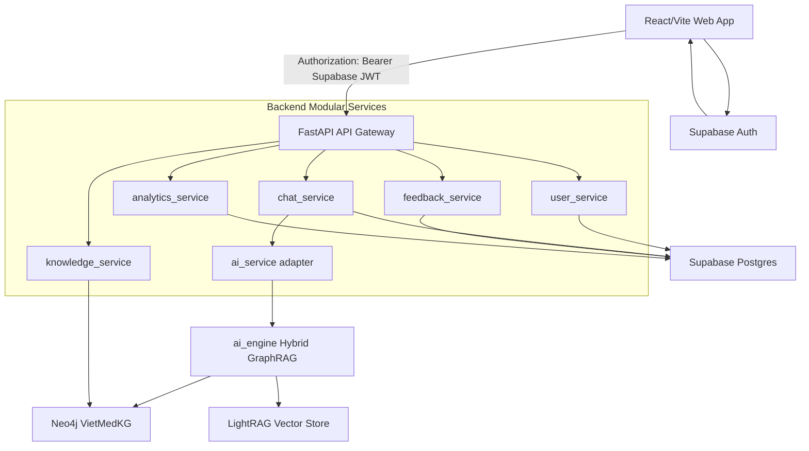
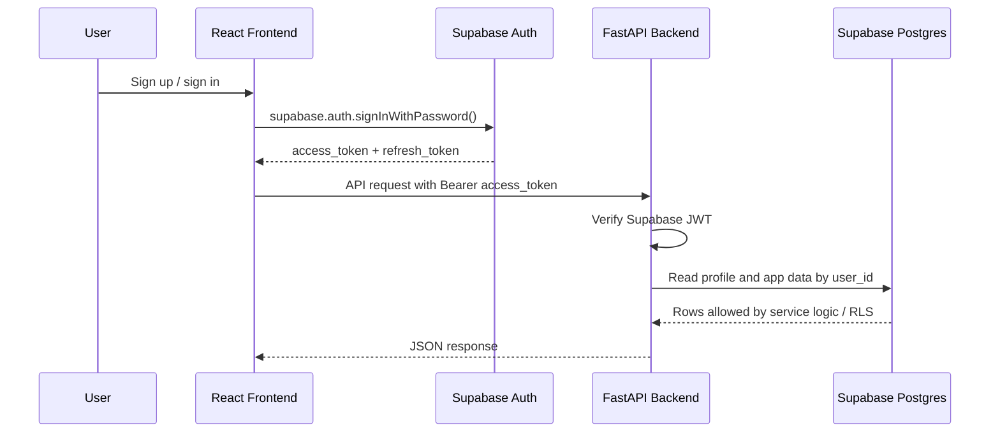
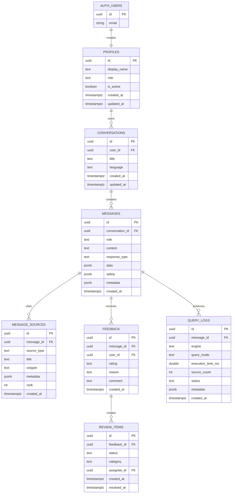

# 15. SPRINT 1 — ARCHITECTURE FOUNDATION

> **Scope:** Hoàn thành S1-ARCH-01 và S1-ARCH-02 cho Người 1.  
> **Owner:** Người 1 — Architect / Platform Lead.  
> **Output:** Service boundaries, dependency direction, Supabase ERD, SQL migration, RLS policy và rollback path.

---

## 1. S1-ARCH-01 — Service Boundaries

### 1.1. Runtime architecture



### 1.2. Service responsibility table

| Module | Responsibility | Owns data | Must not do |
|---|---|---|---|
| `api_gateway` | Request entrypoint, CORS, Supabase JWT verification, current-user dependency, error envelope, router registration | None | Business logic, direct AI pipeline logic |
| `user_service` | Map Supabase user to `profiles`, expose current user, check role/admin status | `profiles` | Password hashing, issuing JWT, storing refresh token |
| `chat_service` | Conversation/message lifecycle, call `ai_service`, persist assistant response, message sources and query logs | `conversations`, `messages`, `message_sources`, `query_logs` | Direct Neo4j query composition, Supabase Auth sign-in |
| `ai_service` | Adapter over existing `ai_engine` pipeline, normalize answer/source/safety/metadata shape | None | App persistence, user authorization |
| `feedback_service` | Persist feedback and create review item for negative/incorrect reports | `feedback`, `review_items` | Re-running AI pipeline, editing knowledge graph |
| `knowledge_service` | Read-only knowledge browsing/search from Neo4j | None in Supabase | User history storage, graph mutation in v1 |
| `analytics_service` | Aggregate metrics from query logs, feedback, review items | Reads app tables | Storing raw secrets/tokens |
| Frontend `services/supabase.ts` | Supabase sign up/sign in/sign out/session retrieval | Supabase Auth session in browser | Storing service-role key |
| Frontend `services/api.ts` | Call FastAPI with Supabase access token | None | Calling app tables directly unless explicitly approved |

### 1.3. Dependency direction rules

Backend dependency direction is one-way:

```text
routers -> api_gateway dependencies -> services -> repositories/database clients
services -> schemas/models
ai_service -> ai_engine
knowledge_service -> Neo4j graph_service
```

Allowed imports:

- `routers/*` may import schemas, dependencies and service functions.
- `services/chat_service.py` may import `services/ai_service.py`, `analytics_service.py` and app database access.
- `services/ai_service.py` may import existing `ai_engine` code and must return the normalized chat response shape.
- `services/knowledge_service.py` may import existing Neo4j graph access code.
- `api_gateway/dependencies.py` may verify Supabase JWT and expose `CurrentUser`.

Forbidden imports:

- `ai_engine` must not import `backend.app.*`.
- `ai_service` must not write conversations, feedback or query logs.
- `routers/*` must not call `ai_engine` directly.
- `frontend/*` must not use `SUPABASE_SERVICE_ROLE_KEY`.
- `frontend/*` must not call admin endpoints unless the profile role is `admin`.

### 1.4. Auth and authorization direction



Default decision:

- Frontend owns Supabase sign up/sign in UI.
- Backend owns authorization for app APIs.
- Supabase Postgres RLS is enabled as a second line of defense.
- Backend can use service-role key only server-side for trusted operations, never in frontend.

---

## 2. S1-ARCH-02 — Supabase ERD And Migration

### 2.1. App schema



### 2.2. Migration files

| File | Purpose |
|---|---|
| `backend/migrations/supabase/versions/202606110001_app_core_schema.sql` | Redo migration: create app tables, indexes, profile trigger and RLS policies |
| `backend/migrations/supabase/rollbacks/202606110001_app_core_schema_down.sql` | Manual rollback: drop policies/tables/functions created by the redo migration |

Migration được đặt dưới `backend/` vì backend là owner của app-data schema. Không đặt ở root `supabase/` để tránh nhầm rằng đây là một infra package độc lập với backend.

Apply with Supabase CLI if the project later adopts root-level Supabase config:

```bash
supabase db push
```

For the current backend-owned layout, the most direct path is Supabase SQL Editor or a small backend migration runner in S1-ARCH-03.

Manual apply through Supabase SQL Editor:

1. Open Supabase project.
2. Go to SQL Editor.
3. Run `backend/migrations/supabase/versions/202606110001_app_core_schema.sql`.
4. Confirm all app tables exist under `public`.
5. Confirm RLS is enabled for every app table.

Manual rollback:

1. Back up data first if the project contains real users or conversations.
2. Run `backend/migrations/supabase/rollbacks/202606110001_app_core_schema_down.sql`.
3. Re-run the redo migration when needed.

### 2.3. Why SQL instead of Python migration code?

Python does have migration tools. The normal equivalent to Knex is **Alembic** with SQLAlchemy:

- Alembic migration files are Python files.
- They can create tables with `op.create_table(...)`.
- They can also run raw SQL with `op.execute(...)`.

For this first Supabase migration, SQL is the better default because most important objects are Postgres/Supabase-specific: RLS policies, `auth.uid()`, `auth.users` triggers, security-definer functions and grants. Alembic can manage these, but it would still need large `op.execute("""SQL...""")` blocks. That adds another framework without reducing complexity.

Decision for Sprint 1:

- Use backend-owned SQL migrations for Supabase-native schema and RLS.
- Add Alembic later only if backend also starts using SQLAlchemy ORM heavily.
- If Alembic is added later, keep RLS/policies/functions as explicit SQL inside Alembic revisions, not hidden in ORM models.

### 2.4. RLS policy summary

| Table | User access | Admin access | Service role |
|---|---|---|---|
| `profiles` | Select own profile | Select/update all profiles | Bypasses RLS |
| `conversations` | CRUD own conversations | Select all | Bypasses RLS |
| `messages` | Select own conversation messages, insert own user messages | Select all | Bypasses RLS |
| `message_sources` | Select sources for own messages | Select all | Bypasses RLS |
| `feedback` | Select/insert/update own feedback for owned messages | Select all | Bypasses RLS |
| `query_logs` | No direct user access | Select all | Bypasses RLS |
| `review_items` | No direct user access | Select/update all | Bypasses RLS |

### 2.5. Implementation notes for Người 2

- Use `auth.users.id` / Supabase JWT `sub` as the canonical user id.
- Do not create backend `/register` or `/login` endpoints.
- `GET /api/v1/me` should return `profiles` data for the verified Supabase user.
- User-facing APIs must scope by `user_id = current_user.id`.
- Admin APIs must check `profiles.role = 'admin'`.

### 2.6. Implementation notes for Người 3

- Use `@supabase/supabase-js` in `frontend/src/services/supabase.ts`.
- Store no service-role key in frontend.
- For every FastAPI request, read current Supabase session and attach:

```text
Authorization: Bearer <access_token>
```

- Use Supabase Auth for sign up, sign in, sign out and optional anonymous auth.
