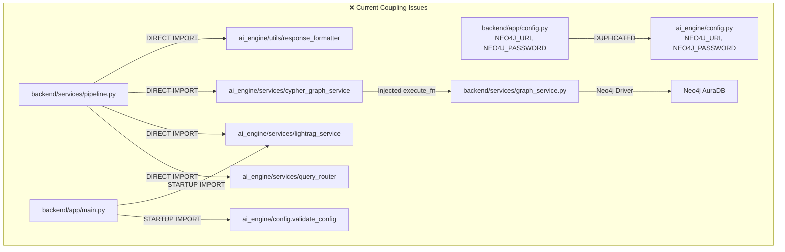
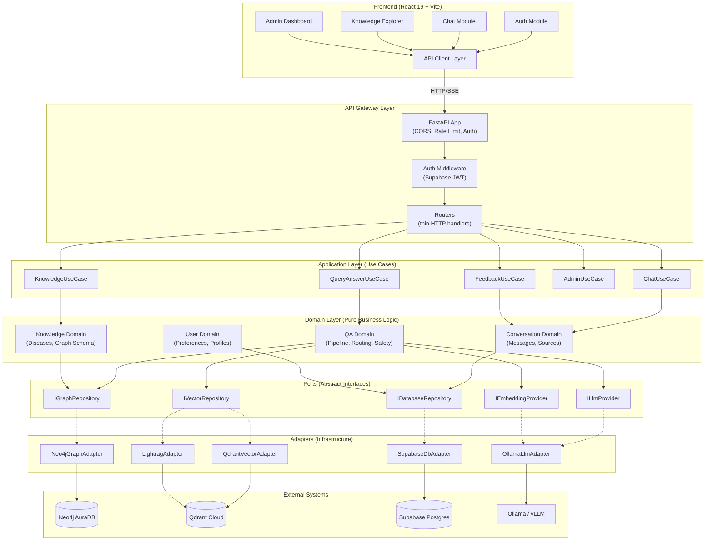
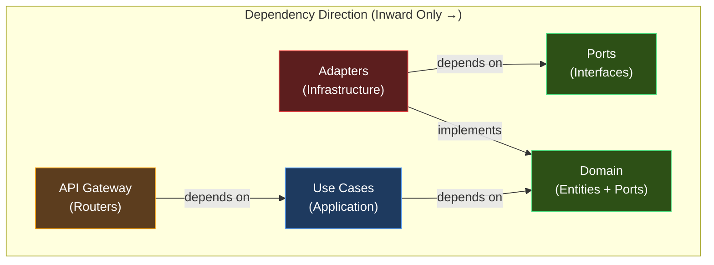
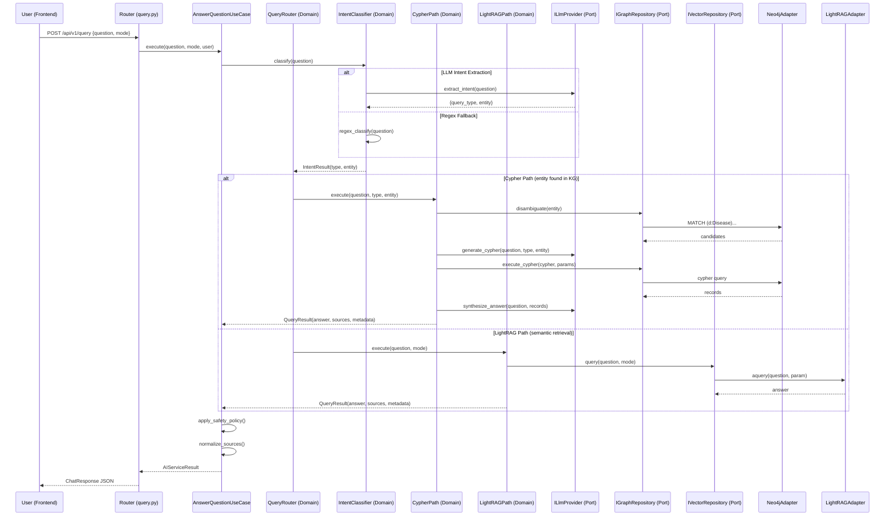
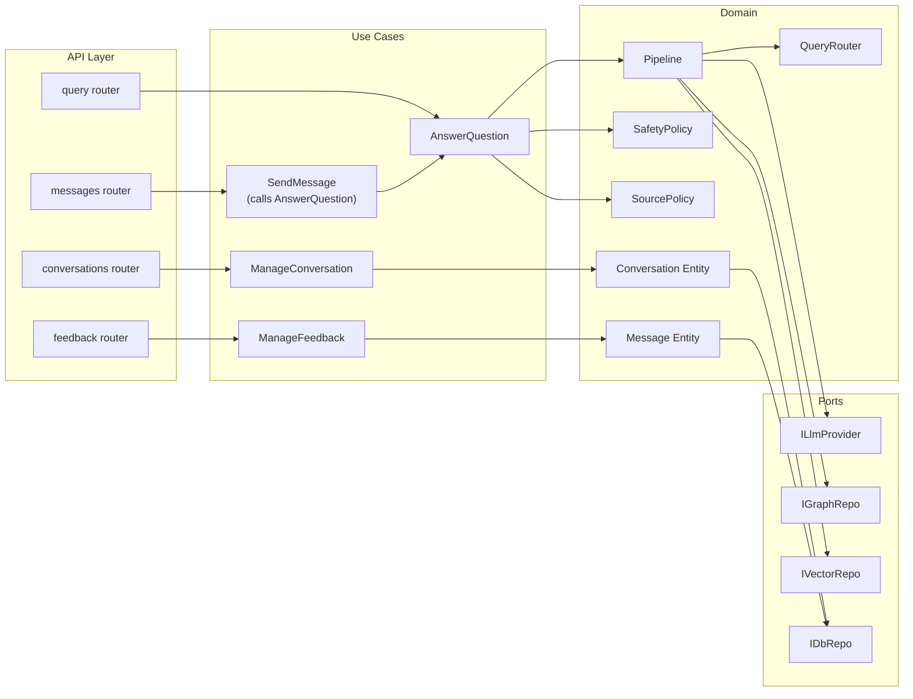

# Architecture Blueprint: KBQA Medical QA System Refactoring

> **Document Type:** Architecture Blueprint
> **Generated:** 2026-06-15
> **Pattern:** Modular Monolith + Clean Architecture (Hexagonal/Ports & Adapters)
> **Status:** ✅ APPROVED (2026-06-15)

---

## 1. Current Architecture Analysis

### 1.1 Cấu trúc hiện tại (AS-IS)

```
kbqa/
├── ai_engine/           # AI/ML logic (intent, Cypher, LightRAG, prompts)
│   ├── config.py        # AI-specific env vars (LLM, Neo4j, embedding)
│   ├── services/        # 10 service files (query_router, lightrag, cypher, etc.)
│   ├── prompts/         # Prompt templates
│   ├── utils/           # Formatters, validators, sanitizers
│   └── tests/           # 7 test files
├── backend/             # FastAPI HTTP layer + business services
│   └── app/
│       ├── main.py      # App entry + rate limiter + router registration
│       ├── config.py    # Backend env vars (Supabase, Neo4j duplicated)
│       ├── database.py  # Supabase Postgres access layer
│       ├── api_gateway/  # Auth (Supabase JWT), dependencies
│       ├── models/       # Pydantic contracts (18+ models in 1 file)
│       ├── routers/      # 9 route files
│       └── services/     # 16 service files (pipeline, chat, AI adapter, etc.)
├── etl/                 # Data pipeline scripts
│   ├── data_cleaning/   # CSV preprocessing
│   ├── graph_builder/   # Neo4j import from CSV
│   └── benchmark_gen/   # Test data generation
├── frontend/            # React 19 + Vite + TypeScript
│   └── src/
│       ├── features/    # Feature-based (auth, chat, knowledge, admin, settings)
│       ├── components/  # Shared components (3 files)
│       ├── services/    # API client + Supabase client
│       └── types/       # Type definitions
└── scripts/             # Deployment + data sync scripts
```

### 1.2 Phân tích Điểm nghẽn & Coupling



#### 🔴 Vấn đề nghiêm trọng (Critical Issues)

| # | Vấn đề | File liên quan | Mức độ |
|---|--------|---------------|--------|
| C1 | **Config trùng lặp**: Neo4j credentials khai báo ở CẢ HAI `backend/config.py` VÀ `ai_engine/config.py` | [config.py](file:///Users/nguyenbaoan/codeLab/kbqa/backend/app/config.py), [config.py](file:///Users/nguyenbaoan/codeLab/kbqa/ai_engine/config.py) | 🔴 High |
| C2 | **Pipeline God Object**: [pipeline.py](file:///Users/nguyenbaoan/codeLab/kbqa/backend/app/services/pipeline.py) (596 dòng) chứa toàn bộ routing logic, entity disambiguation, cả Cypher path VÀ LightRAG path | pipeline.py | 🔴 High |
| C3 | **Cross-module direct imports**: `pipeline.py` import trực tiếp 5+ modules từ `ai_engine` → không thể test pipeline mà không mock toàn bộ ai_engine | pipeline.py | 🔴 High |
| C4 | **Monolithic contracts file**: [contracts.py](file:///Users/nguyenbaoan/codeLab/kbqa/backend/app/models/contracts.py) (567 dòng) chứa 25+ Pydantic models lẫn lộn API contracts, internal DTOs, streaming types | contracts.py | 🟡 Medium |
| C5 | **In-process rate limiter**: Rate limit state lưu trong memory dict, mất khi restart, không scale nhiều instance | [main.py](file:///Users/nguyenbaoan/codeLab/kbqa/backend/app/main.py) L28-48 | 🟡 Medium |

#### 🟡 Vấn đề trung bình (Moderate Issues)

| # | Vấn đề | Chi tiết |
|---|--------|----------|
| M1 | **Thiếu Domain Layer**: Business logic (safety, source normalization, suggestion generation) nằm trực tiếp trong services — không có entity/value object thuần túy | `backend/app/services/` |
| M2 | **Không có Interface/Port**: `ai_service.py` gọi thẳng `pipeline.run_pipeline()` thay vì thông qua abstract interface → không swap được implementation | `ai_service.py` |
| M3 | **ETL scripts nằm rải rác**: `etl/graph_builder/`, `scripts/ingest_to_neo4j.py` cùng làm việc import vào Neo4j nhưng nằm ở 2 nơi khác nhau | `etl/`, `scripts/` |
| M4 | **Frontend thiếu state management**: Không có global state (Redux/Zustand), mỗi feature tự quản lý state riêng | `frontend/src/features/` |
| M5 | **Test boundary không rõ**: Backend tests import trực tiếp concrete classes, không dùng in-memory adapter | `backend/tests/` |

#### 🟢 Điểm tích cực (Strengths)

| # | Điểm mạnh | Chi tiết |
|---|-----------|----------|
| S1 | **AI Engine đã tách biệt**: `ai_engine/` có `__init__.py`, không import ngược từ `backend` (ngoại trừ `execute_fn` injection) | Tốt |
| S2 | **Dependency injection pattern bắt đầu**: `cypher_graph_service.query()` nhận `execute_fn` thay vì import trực tiếp Neo4j driver | Rất tốt |
| S3 | **Frontend feature-based structure**: Đã tổ chức theo feature (auth, chat, knowledge, admin) | Tốt |
| S4 | **Pydantic contracts rõ ràng**: API contracts có schema examples, validation, type hints đầy đủ | Rất tốt |
| S5 | **Test coverage tốt**: 12 test files backend + 7 test files ai_engine, asyncio mode | Tốt |

---

## 2. Proposed Architecture: Modular Monolith + Clean Architecture

### 2.1 Lý do chọn Modular Monolith (không phải Microservices)

> [!IMPORTANT]
> **Đề xuất: Modular Monolith + Clean Architecture boundaries** thay vì tách Microservices.

| Tiêu chí | Microservices | Modular Monolith ✅ |
|----------|---------------|---------------------|
| Team size (1-3 người) | Overhead quá lớn | Phù hợp |
| Deployment complexity | Cần K8s/Docker Compose | Single process, đơn giản |
| AI Engine latency | Network hop thêm 5-50ms | In-process, ~0ms |
| Shared Neo4j connection | Cần connection pooling riêng | Shared driver singleton |
| Data consistency | Eventual consistency phức tạp | Single transaction |
| Testing | Integration tests cần Docker | In-memory adapters đủ |
| Future migration | — | Dễ tách ra Microservice khi cần |

### 2.2 Kiến trúc Mục tiêu — System Overview



### 2.3 Dependency Rule



> **Quy tắc bất biến:**
> - Domain KHÔNG import từ bất kỳ layer nào khác
> - Use Cases CHỈ import Domain entities + Ports
> - Adapters implement Ports, KHÔNG được import Use Cases
> - Routers CHỈ gọi Use Cases, KHÔNG gọi trực tiếp Domain/Adapters

---

## 3. Proposed Folder Structure (TO-BE)

```
kbqa/
├── pyproject.toml                    # Single source of truth for Python deps
│
├── src/                              # ── ALL Python source code ──
│   ├── domain/                       # 🟢 INNERMOST LAYER — Pure business logic
│   │   ├── __init__.py
│   │   ├── qa/                       # QA domain (the core)
│   │   │   ├── __init__.py
│   │   │   ├── entities.py           # QueryResult, IntentClassification, etc.
│   │   │   ├── value_objects.py      # QueryType, EntityName, CypherQuery, etc.
│   │   │   ├── pipeline.py           # Pipeline orchestration (pure logic, no I/O)
│   │   │   ├── intent_classifier.py  # Regex + LLM intent extraction
│   │   │   ├── query_router.py       # Route decision logic (Cypher vs LightRAG)
│   │   │   ├── cypher_builder.py     # Text-to-Cypher generation
│   │   │   ├── answer_synthesizer.py # LLM answer synthesis
│   │   │   ├── safety_policy.py      # Safety classification
│   │   │   ├── source_policy.py      # Source normalization
│   │   │   └── response_formatter.py # Response formatting
│   │   ├── conversation/             # Conversation domain
│   │   │   ├── __init__.py
│   │   │   ├── entities.py           # Conversation, Message, Feedback
│   │   │   └── value_objects.py      # MessageRole, FeedbackRating, etc.
│   │   ├── knowledge/                # Knowledge Graph domain
│   │   │   ├── __init__.py
│   │   │   ├── entities.py           # Disease, Symptom, Treatment, etc.
│   │   │   └── value_objects.py      # DiseaseName, GraphSchema
│   │   ├── user/                     # User domain
│   │   │   ├── __init__.py
│   │   │   ├── entities.py           # UserProfile, UserPreferences
│   │   │   └── value_objects.py      # UserId, UserRole
│   │   └── shared/                   # Cross-domain shared kernel
│   │       ├── __init__.py
│   │       ├── errors.py             # Domain exceptions
│   │       └── types.py              # Shared type aliases
│   │
│   ├── ports/                        # 🟢 ABSTRACT INTERFACES (part of Domain)
│   │   ├── __init__.py
│   │   ├── llm.py                    # ILlmProvider, IEmbeddingProvider
│   │   ├── graph.py                  # IGraphRepository (Neo4j abstraction)
│   │   ├── vector.py                 # IVectorRepository (Qdrant/LightRAG)
│   │   ├── database.py              # IDatabaseRepository (Supabase Postgres)
│   │   └── auth.py                   # IAuthProvider (Supabase Auth)
│   │
│   ├── use_cases/                    # 🔵 APPLICATION LAYER — Orchestration
│   │   ├── __init__.py
│   │   ├── answer_question.py        # Main QA use case
│   │   ├── answer_question_stream.py # Streaming variant
│   │   ├── manage_conversation.py    # CRUD conversations
│   │   ├── manage_feedback.py        # Feedback submission
│   │   ├── explore_knowledge.py      # KG browsing
│   │   ├── manage_preferences.py     # User preferences
│   │   └── admin_analytics.py        # Admin metrics/review
│   │
│   ├── adapters/                     # 🔴 OUTERMOST LAYER — Infrastructure
│   │   ├── __init__.py
│   │   ├── neo4j/                    # Neo4j AuraDB adapter
│   │   │   ├── __init__.py
│   │   │   ├── driver.py             # Singleton driver management
│   │   │   └── graph_repository.py   # IGraphRepository implementation
│   │   ├── qdrant/                   # Qdrant Cloud adapter
│   │   │   ├── __init__.py
│   │   │   └── vector_repository.py  # IVectorRepository implementation
│   │   ├── lightrag/                 # LightRAG framework adapter
│   │   │   ├── __init__.py
│   │   │   ├── lightrag_adapter.py   # LightRAG init + query wrapper
│   │   │   ├── llm_adapter.py        # Ollama/vLLM OpenAI-compat wrapper
│   │   │   └── embedding_adapter.py  # bge-m3 embedding wrapper
│   │   ├── supabase/                 # Supabase adapters
│   │   │   ├── __init__.py
│   │   │   ├── database.py           # SupabaseDatabase (psycopg)
│   │   │   └── auth.py               # JWT verification
│   │   ├── ollama/                   # LLM provider adapter
│   │   │   ├── __init__.py
│   │   │   └── llm_provider.py       # OpenAI-compat client
│   │   └── in_memory/                # Test doubles
│   │       ├── __init__.py
│   │       ├── graph_repository.py   # In-memory graph for tests
│   │       ├── vector_repository.py  # In-memory vector store for tests
│   │       └── database.py           # In-memory DB for tests
│   │
│   ├── api/                          # 🟠 API GATEWAY — FastAPI HTTP layer
│   │   ├── __init__.py
│   │   ├── app.py                    # FastAPI app factory
│   │   ├── config.py                 # ✅ SINGLE config module (all env vars)
│   │   ├── dependencies.py           # DI container (wire ports → adapters)
│   │   ├── middleware/
│   │   │   ├── __init__.py
│   │   │   ├── cors.py
│   │   │   ├── rate_limit.py
│   │   │   └── auth.py               # Auth dependency (thin, delegates to adapter)
│   │   ├── routers/                  # Thin HTTP handlers
│   │   │   ├── __init__.py
│   │   │   ├── query.py
│   │   │   ├── conversations.py
│   │   │   ├── messages.py
│   │   │   ├── feedback.py
│   │   │   ├── knowledge.py
│   │   │   ├── admin.py
│   │   │   ├── health.py
│   │   │   ├── schema.py
│   │   │   └── me.py
│   │   └── schemas/                  # API-specific Pydantic models
│   │       ├── __init__.py
│   │       ├── requests.py           # Inbound request schemas
│   │       ├── responses.py          # Outbound response schemas
│   │       └── streaming.py          # SSE event schemas
│   │
│   └── prompts/                      # Prompt templates (shared resource)
│       ├── text_to_cypher.md
│       ├── intent_system.md
│       └── medical_user.md
│
├── data_pipeline/                    # ── ETL & Data Tooling (standalone) ──
│   ├── __init__.py
│   ├── cli.py                        # Unified CLI entry point
│   ├── cleaning/
│   │   └── preprocess.py
│   ├── graph_import/
│   │   ├── csv_to_neo4j.py           # VietMedKG CSV → Neo4j
│   │   └── qdrant_to_neo4j.py        # LightRAG entities → Neo4j sync
│   └── benchmark/
│       ├── make_1hop.py
│       ├── make_2hop.py
│       └── make_benchmark.py
│
├── frontend/                         # ── React Frontend (unchanged structure) ──
│   ├── package.json
│   ├── src/
│   │   ├── app/
│   │   │   ├── AppShell.tsx
│   │   │   └── store.ts              # [NEW] Zustand global state
│   │   ├── features/
│   │   │   ├── auth/
│   │   │   ├── chat/
│   │   │   ├── knowledge/
│   │   │   ├── admin/
│   │   │   └── settings/
│   │   ├── components/               # Shared UI components
│   │   ├── services/
│   │   │   ├── api.ts                # API client (refactored with proper error handling)
│   │   │   └── supabase.ts
│   │   ├── hooks/                    # [NEW] Shared React hooks
│   │   └── types/
│   │       └── api.ts
│   └── vite.config.ts
│
├── tests/                            # ── Centralized tests ──
│   ├── unit/
│   │   ├── domain/                   # Pure domain logic tests (no I/O)
│   │   ├── use_cases/                # Use case tests with in-memory adapters
│   │   └── adapters/                 # Adapter unit tests
│   ├── integration/
│   │   ├── test_neo4j.py
│   │   ├── test_supabase.py
│   │   └── test_lightrag.py
│   └── e2e/
│       └── test_api.py
│
├── scripts/                          # Deployment & ops scripts
│   └── deploy_ec2.sh
│
└── docs/
    ├── ARCHITECTURE_BLUEPRINT.md     # This document (promoted from artifact)
    ├── adr/                          # Architecture Decision Records
    └── ...existing docs...
```

---

## 4. Core Data Flow Diagrams

### 4.1 Query Pipeline — Happy Path



### 4.2 Component Interaction Map



---

## 5. API Boundaries & Port Interfaces

### 5.1 Port Definitions

```python
# src/ports/llm.py
from abc import ABC, abstractmethod

class ILlmProvider(ABC):
    """Port for LLM interactions (chat completions)."""
    
    @abstractmethod
    async def chat_completion(
        self, messages: list[dict], *, temperature: float = 0.0, max_tokens: int = 4096
    ) -> str: ...
    
    @abstractmethod
    async def chat_completion_stream(
        self, messages: list[dict], *, temperature: float = 0.0
    ) -> AsyncIterator[str]: ...
    
    @abstractmethod
    async def check_availability(self) -> bool: ...


# src/ports/graph.py
class IGraphRepository(ABC):
    """Port for Knowledge Graph operations (Neo4j abstraction)."""

    @abstractmethod
    async def execute_cypher(self, query: str, params: dict | None = None) -> list[dict]: ...
    
    @abstractmethod
    async def find_diseases_by_name(self, name: str, limit: int = 30) -> list[str]: ...
    
    @abstractmethod
    async def get_schema_info(self) -> dict: ...
    
    @abstractmethod
    async def check_connectivity(self) -> bool: ...


# src/ports/vector.py  
class IVectorRepository(ABC):
    """Port for semantic vector search (LightRAG/Qdrant abstraction)."""
    
    @abstractmethod
    async def query(self, question: str, mode: str = "naive") -> dict: ...
    
    @abstractmethod
    async def query_stream(self, question: str, mode: str = "naive") -> tuple[str, AsyncIterator[str]]: ...
    
    @abstractmethod
    async def health_check(self) -> dict: ...


# src/ports/database.py
class IDatabaseRepository(ABC):
    """Port for relational database operations (Supabase Postgres)."""
    
    @abstractmethod
    def fetch_one(self, query: str, params: tuple = ()) -> dict | None: ...
    
    @abstractmethod
    def fetch_all(self, query: str, params: tuple = ()) -> list[dict]: ...
    
    @abstractmethod
    def execute(self, query: str, params: tuple = ()) -> None: ...
    
    @abstractmethod
    def transaction(self) -> ContextManager: ...
```

### 5.2 Key Boundary: API Gateway ↔ Use Cases

| Router | Use Case | Input | Output |
|--------|----------|-------|--------|
| `POST /api/v1/query` | `AnswerQuestionUseCase` | `question: str, mode: str?` | `AIServiceResult` |
| `POST /api/v1/conversations` | `ManageConversationUseCase.create` | `title: str?, language: str` | `ConversationSummary` |
| `POST /api/v1/conversations/{id}/messages` | `SendMessageUseCase` | `question: str, mode: str?` | `ChatResponse` |
| `POST /api/v1/conversations/{id}/messages` (SSE) | `SendMessageStreamUseCase` | `question: str` | `SSE stream` |
| `POST /api/v1/messages/{id}/feedback` | `ManageFeedbackUseCase` | `rating, reason, comment` | `FeedbackResponse` |
| `GET /api/v1/knowledge/diseases` | `ExploreKnowledgeUseCase` | `search?, limit, offset` | `DiseaseListResponse` |

### 5.3 Key Boundary: Domain ↔ AI Engine (Currently `ai_engine/`)

> [!IMPORTANT]
> Thay đổi quan trọng nhất: **`ai_engine/` sẽ được phân rã**:
> - **Business logic** (intent classification, Cypher query building, answer synthesis, routing) → `src/domain/qa/`
> - **Infrastructure** (LightRAG wrapper, Ollama client, embedding functions) → `src/adapters/lightrag/`, `src/adapters/ollama/`
> - **Prompts** → `src/prompts/` (shared resource)

---

## 6. Benefits & Trade-offs

### ✅ Lợi ích (Benefits)

| # | Lợi ích | Giải thích |
|---|---------|-----------|
| B1 | **Testable without infrastructure** | Domain + Use Cases test được với in-memory adapters, không cần Neo4j/Qdrant/Supabase running |
| B2 | **Single config source** | Một file `src/api/config.py` quản lý toàn bộ env vars, truyền qua DI container |
| B3 | **Swap infrastructure freely** | Thay Neo4j bằng ArangoDB? Chỉ cần viết adapter mới implement `IGraphRepository` |
| B4 | **AI Engine replaceable** | Thay LightRAG bằng LlamaIndex? Viết adapter mới cho `IVectorRepository` |
| B5 | **Clear dependency graph** | Import errors phát hiện ngay lúc compile time vì mỗi layer chỉ nhìn thấy layer bên trong |
| B6 | **AI-navigable** | Codebase có naming convention rõ ràng, AI agent dễ tìm đúng file cần sửa |
| B7 | **Future Microservice-ready** | Mỗi domain module + ports có thể tách ra thành service riêng khi team scale up |

### ⚠️ Đánh đổi (Trade-offs)

| # | Trade-off | Giải thích | Mitigation |
|---|-----------|-----------|------------|
| T1 | **Nhiều file hơn** | Tăng từ ~60 files → ~90 files Python | Naming convention rõ ràng, IDE navigation |
| T2 | **Boilerplate ports** | Mỗi external system cần 1 port interface + 1 adapter | Port interface ổn định, ít thay đổi |
| T3 | **Learning curve** | Team cần hiểu dependency rules | Viết ADR + lint rules enforce |
| T4 | **Refactor effort** | 5-6 phases, mỗi phase 2-4 ngày | Incremental, backward-compatible |
| T5 | **Over-engineering risk** | Cho dự án 1-3 người, Clean Arch có thể nặng nề | Chỉ áp dụng ở boundary quan trọng, không áp toàn bộ DDD tactical patterns |

---

## 7. Refactoring Roadmap (6 Phases)

> [!NOTE]
> Mỗi phase kết thúc với một codebase **hoạt động và test pass**. Không phase nào break hệ thống.

### Phase 0: Preparation (1 ngày)
- [ ] Tạo `src/` directory scaffold (chưa move code)
- [ ] Tạo `CONTEXT.md` glossary cho domain terms
- [ ] Tạo ADR-001: "Adopt Modular Monolith + Clean Architecture"
- [ ] Setup import linting rules (ruff)
- [ ] Đảm bảo tất cả tests hiện tại pass

### Phase 1: Extract Domain (2-3 ngày)
- [ ] Tạo `src/domain/shared/errors.py` — domain exceptions
- [ ] Tạo `src/domain/qa/value_objects.py` — QueryType, EntityName, etc.
- [ ] Move + refactor `query_router.py` regex logic → `src/domain/qa/intent_classifier.py`
- [ ] Move `safety_policy.py` → `src/domain/qa/safety_policy.py`
- [ ] Move `source_policy.py` → `src/domain/qa/source_policy.py`
- [ ] Move `response_formatter.py` → `src/domain/qa/response_formatter.py`
- [ ] **Tests**: Domain unit tests with pure functions (no mocks needed)

### Phase 2: Define Ports (1-2 ngày)
- [ ] Tạo `src/ports/llm.py` — `ILlmProvider`
- [ ] Tạo `src/ports/graph.py` — `IGraphRepository`
- [ ] Tạo `src/ports/vector.py` — `IVectorRepository`
- [ ] Tạo `src/ports/database.py` — `IDatabaseRepository`
- [ ] Tạo `src/adapters/in_memory/` — test doubles for all ports
- [ ] **Tests**: Use case skeleton tests with in-memory adapters

### Phase 3: Extract Adapters (2-3 ngày)
- [ ] Move `graph_service.py` → `src/adapters/neo4j/graph_repository.py` (implement `IGraphRepository`)
- [ ] Move `database.py` → `src/adapters/supabase/database.py` (implement `IDatabaseRepository`)
- [ ] Move `lightrag_service.py` + `lightrag_llm_adapter.py` → `src/adapters/lightrag/`
- [ ] Move `llm_provider.py` → `src/adapters/ollama/llm_provider.py` (implement `ILlmProvider`)
- [ ] Consolidate `backend/config.py` + `ai_engine/config.py` → `src/api/config.py`
- [ ] **Tests**: Adapter integration tests

### Phase 4: Refactor Use Cases + Pipeline (2-3 ngày)
- [ ] Tạo `src/use_cases/answer_question.py` — extract from `pipeline.py` + `ai_service.py`
- [ ] Tạo `src/use_cases/manage_conversation.py` — extract from `chat_service.py`
- [ ] Refactor `pipeline.py` logic into domain: `src/domain/qa/pipeline.py`
- [ ] Wire DI container: `src/api/dependencies.py`
- [ ] **Tests**: Full pipeline test with in-memory adapters

### Phase 5: Clean Up API Layer (1-2 ngày)
- [ ] Split `contracts.py` into `src/api/schemas/requests.py` + `responses.py` + `streaming.py`
- [ ] Thin down routers to: parse → call use case → format response
- [ ] Extract middleware (CORS, rate limit, auth) into `src/api/middleware/`
- [ ] Consolidate ETL scripts → `data_pipeline/`
- [ ] **Tests**: API integration tests pass

### Phase 6: Frontend & Polish (1-2 ngày)
- [ ] Add Zustand store for global state management
- [ ] Refactor `api.ts` with proper error handling and type-safe responses
- [ ] Add shared hooks (`useApi`, `useStream`, etc.)
- [ ] Update all import paths, remove legacy files
- [ ] Final test run, documentation update

---

## Finalized Decisions (Approved 2026-06-15)

| # | Question | Decision |
|---|----------|----------|
| Q1 | `contracts.py` split strategy | ✅ **(A)** Tách thành `requests.py`, `responses.py`, `internal.py` |
| Q2 | Prompts management | ✅ **(A)** Extract thành `.md` files trong `src/prompts/` |
| Q3 | ETL/Data Pipeline | ✅ **(A)** Merge vào `data_pipeline/` với CLI entry point |
| Q4 | Frontend state management | ✅ **(A)** Thêm Zustand |
| Q5 | In-memory adapter scope | ✅ Viết TẤT CẢ 4 ports (Graph, Vector, DB, LLM) ngay Phase 2 |
| Q6 | `pyproject.toml` packages | ✅ Đổi sang `src layout` chuẩn |

**Architecture:** Modular Monolith ✅ Approved
**Roadmap:** 6-phase ✅ Approved
**Folder structure:** `src/domain/`, `src/ports/`, `src/adapters/`, `src/api/` ✅ Approved

