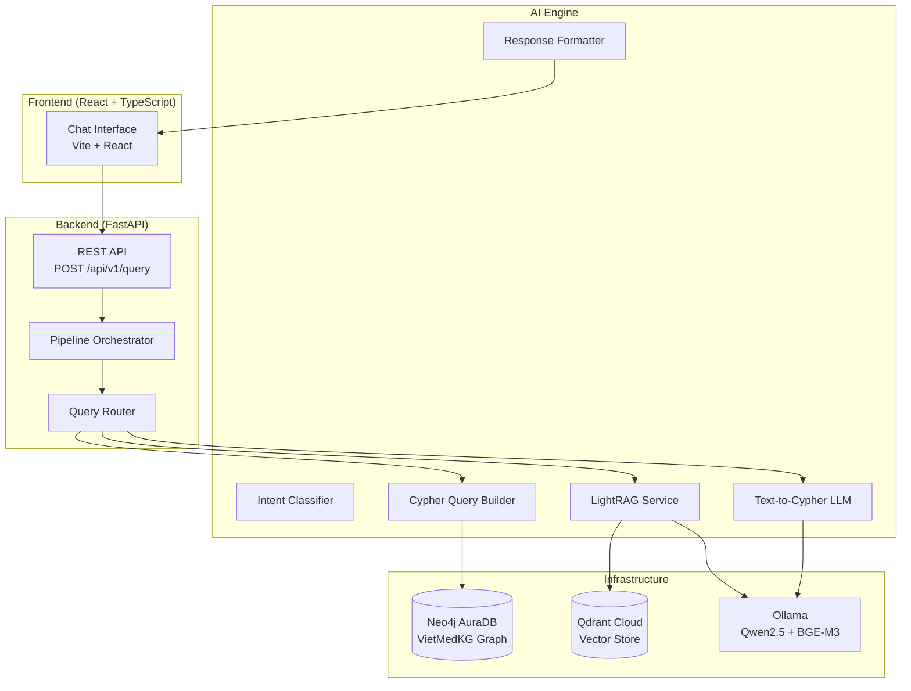

# 📋 Kịch Bản Seminar — AegisHealth KBQA
## Knowledge Base Question-Answering System cho Y tế Việt Nam

> **Dự án**: Đề tài #3 — Knowledge Base Question-Answering System  
> **Tên hệ thống**: AegisHealth KBQA  
> **Kiến trúc**: Hybrid GraphRAG = Cypher Templates + LightRAG Semantic Retrieval  
> **Tech Stack**: FastAPI · Neo4j AuraDB · Qdrant Cloud · LightRAG · Ollama (Qwen2.5) · BGE-M3 · React + TypeScript

---

## 🎯 Mục 1 — Business Problem & Motivation

### 1.1. Bài toán thực tế
- **Vấn đề**: Người dân Việt Nam thiếu nguồn tra cứu y tế chính xác, dễ tiếp cận bằng ngôn ngữ tự nhiên tiếng Việt
- **Khoảng trống**: Các hệ thống search truyền thống (Google, wiki y tế) trả kết quả dạng document, không trả lời trực tiếp câu hỏi cụ thể như *"bệnh tiểu đường có triệu chứng gì?"*
- **Giải pháp**: Xây dựng hệ thống KBQA (Knowledge Base Question-Answering) chuyên về y tế Việt Nam, cho phép hỏi bằng ngôn ngữ tự nhiên → nhận câu trả lời chính xác từ Knowledge Graph

### 1.2. Đối tượng sử dụng
- Người dân muốn tra cứu thông tin sức khỏe
- Sinh viên y khoa tra cứu nhanh kiến thức
- Nhân viên y tế tra cứu thông tin thuốc, triệu chứng

### 1.3. Phạm vi
- **Dữ liệu**: VietMedKG — Vietnamese Medical Knowledge Graph (bộ dữ liệu y tế tiếng Việt)
- **Ngôn ngữ**: Hỗ trợ tiếng Việt (chính) + tiếng Anh (phụ)
- **Tương tác**: Chat interface đặt câu hỏi → nhận câu trả lời ngay

> **📂 Code reference**: Mô tả trong [main.py](file:///Users/nguyenbaoan/codeLab/kbqa/backend/app/main.py#L91-L101) — FastAPI app description

---

## 🧠 Mục 2 — NLP Approach / Proposed Solution

### 2.1. Kiến trúc tổng quan — Hybrid Dual-Path Architecture (Phương án C)

```
┌─────────────────┐
│   Câu hỏi NL    │  (người dùng nhập bằng tiếng Việt/Anh)
└────────┬────────┘
         │
┌────────▼────────┐
│  Query Router    │  Regex fast-path + LLM fallback
└───┬─────────┬───┘
    │         │
┌───▼────┐ ┌──▼──────────────┐
│ CYPHER │ │   LIGHTRAG       │
│ Path   │ │   (Semantic)     │
│        │ │                  │
│ Template│ │ BGE-M3 → Qdrant │
│   ↓    │ │ Entity + Rel     │
│ Neo4j  │ │ Vector search    │
│ AuraDB │ │   ↓              │
│   ↓    │ │ LLM Synthesis    │
│ Format │ │                  │
└───┬────┘ └──┬──────────────┘
    │         │
┌───▼─────────▼───┐
│  API Response    │  {status, response_type, answer, data, metadata}
└─────────────────┘
```

### 2.2. Chi tiết hai đường đi (Dual-Path)

#### Path 1: CYPHER (Truy vấn cấu trúc trực tiếp)
- **Khi nào**: Câu hỏi có intent rõ ràng + entity xác định được trong KG
- **Flow**: Intent Classification → Entity Disambiguation → Cypher Template / LLM Text2Cypher → Neo4j Query → LLM Answer Synthesis
- **Ưu điểm**: Chính xác, nhanh (~5-20s), trả đúng data từ graph

> **📂 Code**: [pipeline.py → _execute_cypher_path()](file:///Users/nguyenbaoan/codeLab/kbqa/backend/app/services/pipeline.py#L279-L376)

#### Path 2: LIGHTRAG (Semantic Retrieval)
- **Khi nào**: Câu hỏi mơ hồ, không có entity rõ ràng, hoặc entity không tồn tại trong KG
- **Flow**: Question → BGE-M3 Embedding → Qdrant Vector Search (entities + relationships + chunks) → LLM Synthesis
- **Ưu điểm**: Xử lý được câu hỏi open-ended, câu hỏi liên quan đến context rộng

> **📂 Code**: [pipeline.py → _execute_lightrag_path()](file:///Users/nguyenbaoan/codeLab/kbqa/backend/app/services/pipeline.py#L401-L472)

### 2.3. Pipeline chi tiết — 8 bước xử lý

| Bước | Mô tả | Code Reference |
|------|-------|----------------|
| **Step 0** | Wrap toàn bộ pipeline trong `asyncio.wait_for(timeout=120s)` | [pipeline.py:86-98](file:///Users/nguyenbaoan/codeLab/kbqa/backend/app/services/pipeline.py#L86-L98) |
| **Step 1** | Validate input: kiểm tra câu hỏi trống | [pipeline.py:117-124](file:///Users/nguyenbaoan/codeLab/kbqa/backend/app/services/pipeline.py#L117-L124) |
| **Step 2** | Force LightRAG nếu `mode` được set rõ ràng | [pipeline.py:128-130](file:///Users/nguyenbaoan/codeLab/kbqa/backend/app/services/pipeline.py#L128-L130) |
| **Step 3** | **LLM Intent Extraction** (gọi LLM trước) — trích `(query_type, entity)` | [pipeline.py:133-134](file:///Users/nguyenbaoan/codeLab/kbqa/backend/app/services/pipeline.py#L133-L134) |
| **Step 4** | **Regex fallback** khi LLM miss entity → `classify_cypher_intent()` | [pipeline.py:137-143](file:///Users/nguyenbaoan/codeLab/kbqa/backend/app/services/pipeline.py#L137-L143) |
| **Step 4b** | Reverse-query bypass: `find_by_*` types → CYPHER trực tiếp (entity là keyword, không phải disease name) | [pipeline.py:152-167](file:///Users/nguyenbaoan/codeLab/kbqa/backend/app/services/pipeline.py#L152-L167) |
| **Step 5-6** | Count → CYPHER; No entity → LIGHTRAG | [pipeline.py:170-182](file:///Users/nguyenbaoan/codeLab/kbqa/backend/app/services/pipeline.py#L170-L182) |
| **Step 7** | Entity Disambiguation: tìm canonical name trong Neo4j → nếu không thấy → LIGHTRAG fallback | [pipeline.py:185-207](file:///Users/nguyenbaoan/codeLab/kbqa/backend/app/services/pipeline.py#L185-L207) |
| **Step 8** | Canonical found → CYPHER with **exact match** | [pipeline.py:209-220](file:///Users/nguyenbaoan/codeLab/kbqa/backend/app/services/pipeline.py#L209-L220) |

### 2.4. Thành phần NLP chính

#### A. Query Router — Intent Classification

- **Regex Fast Path** (50+ patterns tiếng Việt + Anh):
  - **Forward queries** (entity = tên bệnh): `symptoms`, `medicine`, `treatment`, `advice`, `prevention`, `department`, `profile`, `linked_diseases`
  - **Reverse queries** (entity = keyword tìm kiếm): `find_by_symptom`, `find_by_medicine`, `find_by_nutrition_avoid`, `find_by_nutrition_eat`, `find_by_prevention`
  - **Statistics**: `count`

> **📂 Code**: [query_router.py](file:///Users/nguyenbaoan/codeLab/kbqa/ai_engine/services/query_router.py#L124-L290) — 170 dòng regex patterns

- **LLM Fallback** — Structured JSON extraction với Qwen2.5:
  - System prompt chi tiết với schema VietMedKG, 25+ few-shot examples
  - Output: `{"query_type": "...", "entity": "..."}`
  - Temperature=0.0 cho deterministic output

> **📂 Code**: [query_router.py → extract_intent_with_llm()](file:///Users/nguyenbaoan/codeLab/kbqa/ai_engine/services/query_router.py#L458-L496)  
> **📂 Prompt**: [query_router.py:298-455](file:///Users/nguyenbaoan/codeLab/kbqa/ai_engine/services/query_router.py#L298-L455) — 157 dòng system prompt

#### B. Entity Disambiguation

- Fuzzy matching: `toLower(disease_name) CONTAINS toLower(entity)`
- Tiered scoring: exact → "bệnh " + exact → starts-with → contains
- Single match → dùng trực tiếp; Multiple matches → disambiguation list cho user

> **📂 Code**: [pipeline.py → _disambiguate_entity()](file:///Users/nguyenbaoan/codeLab/kbqa/backend/app/services/pipeline.py#L237-L273)

#### C. Cypher Query Builder — Template Library

- **15 template types** đã pre-validated cho VietMedKG schema
- Tiered matching với `CASE` expression cho entity name
- Parameterized queries (`$name`, `$limit`, `$keyword`) để chống injection

> **📂 Code**: [cypher_query_builder.py](file:///Users/nguyenbaoan/codeLab/kbqa/ai_engine/services/cypher_query_builder.py) — 463 dòng, 15 templates

#### D. Text-to-Cypher (LLM Fallback)

- Khi không có template phù hợp → LLM tự sinh Cypher
- Schema prompt + 11 few-shot examples
- Output: raw Cypher string (không markdown)

> **📂 Code**: [text2cypher.py → generate_cypher()](file:///Users/nguyenbaoan/codeLab/kbqa/ai_engine/services/text2cypher.py#L233-L261)

#### E. Answer Synthesis (NLG)

- Payload budget: max 5 records, 300 chars/field, 3000 chars total
- Blob field splitting: comma-separated strings → structured lists
- Vietnamese key localization: `drug_common` → `"Thuốc phổ biến"`
- System prompt y tế chuyên nghiệp: AegisHealth persona, tiếng Việt, emoji, markdown

> **📂 Code**: [text2cypher.py → synthesize_answer()](file:///Users/nguyenbaoan/codeLab/kbqa/ai_engine/services/text2cypher.py#L264-L310)

#### F. Response Formatter — Backend-Driven UI

- **3 response types**: `text`, `table`, `warning`
- Emergency detection: 2 layers (intent_classifier regex + question keyword scan)
- Medical disclaimer logic: chỉ hiện cho medical advice queries (symptoms, medicine, treatment, advice, prevention, profile), KHÔNG hiện cho navigational queries (count, department, find_by_*, linked_diseases)

> **📂 Code**: [response_formatter.py](file:///Users/nguyenbaoan/codeLab/kbqa/ai_engine/utils/response_formatter.py) — 325 dòng

---

## 🏗️ Mục 3 — System Architecture

### 3.1. Kiến trúc hệ thống



### 3.2. Cấu trúc thư mục dự án

```
project-root/
├── ai_engine/              # Core AI logic
│   ├── config.py           # Centralized configuration
│   ├── services/           # Core services
│   │   ├── query_router.py       # Intent classification (Regex + LLM)
│   │   ├── cypher_query_builder.py  # 15 Cypher templates
│   │   ├── text2cypher.py        # LLM Text-to-Cypher + Answer Synthesis
│   │   ├── lightrag_service.py   # Qdrant vector search via LightRAG
│   │   ├── llm_service.py        # Ollama/vLLM OpenAI-compatible client
│   │   ├── indexing_service.py   # CSV → document conversion
│   │   └── intent_classifier.py  # Emergency/list intent detection
│   ├── utils/              # Utilities
│   │   ├── response_formatter.py # API response formatting
│   │   ├── cypher_validator.py   # Schema & safety validation
│   │   └── sanitizer.py         # Destructive command blocking
│   ├── prompts/            # Prompt documentation
│   ├── eval/               # Benchmark suite (45 test cases)
│   └── scripts/            # Data ingestion scripts
├── backend/                # FastAPI web server
│   ├── app/
│   │   ├── main.py              # FastAPI entry point + middleware
│   │   ├── config.py            # Backend configuration
│   │   ├── routers/             # API endpoints
│   │   │   ├── query.py         # POST /api/v1/query
│   │   │   ├── health.py        # GET /api/v1/health
│   │   │   └── schema.py        # GET /api/v1/schema
│   │   ├── models/              # Pydantic schemas
│   │   │   ├── request.py       # QueryRequest
│   │   │   └── response.py      # QueryResponse, HealthResponse
│   │   └── services/            # Backend services
│   │       ├── pipeline.py      # Pipeline orchestrator (472 lines)
│   │       └── graph_service.py # Neo4j driver singleton
│   ├── Dockerfile               # Docker deployment
│   └── requirements.txt
├── frontend/               # React + TypeScript UI
│   └── src/
│       ├── App.tsx              # Main chat application
│       ├── components/
│       │   └── ResponseRenderer.tsx  # Markdown/Warning renderer
│       ├── services/api.ts      # HTTP client
│       ├── types/api.ts         # TypeScript interfaces
│       └── styles.css           # UI styles
├── etl/                    # Data pipeline
│   ├── data_cleaning/preprocess.py    # Raw → cleaned CSV
│   ├── graph_builder/build_graph.py   # CSV → Neo4j (batch UNWIND)
│   └── benchmark_gen/                 # Benchmark generation
│       ├── make_1hop.py, make_2hop.py # 1-hop, 2-hop question generation
│       ├── make_multi_answer.py       # Multi-answer questions
│       └── make_triples.py           # Triple extraction
├── data/                   # Preprocessed dataset
│   └── preprocessed_data.csv         # 60MB, ~8,000+ diseases
├── notebooks/              # Kaggle notebooks
│   ├── kaggle_ingest_entities_relationships.ipynb
│   ├── kaggle_ingest_qdrant.ipynb
│   └── kaggle_benchmark.ipynb
├── scripts/
│   └── ingest_to_neo4j.py          # Qdrant → Neo4j sync
├── docs/                   # 15+ design documents
├── pyproject.toml          # Project config (setuptools)
├── requirements.txt
└── .env.example            # Environment template
```

### 3.3. API Design

| Endpoint | Method | Mô tả |
|----------|--------|--------|
| `POST /api/v1/query` | POST | Hỏi đáp y tế — nhận câu hỏi, trả answer + metadata |
| `GET /api/v1/health` | GET | Health check tất cả services (Neo4j, LLM, Embedding, LightRAG) |
| `GET /api/v1/schema` | GET | Thông tin schema graph (node labels, counts, properties) |
| `GET /docs` | GET | Swagger UI auto-generated |

**Request schema** ([request.py](file:///Users/nguyenbaoan/codeLab/kbqa/backend/app/models/request.py)):
```json
{
  "question": "Bệnh tiểu đường có triệu chứng gì?",
  "mode": null  // optional: naive, local, global, hybrid, mix
}
```

**Response schema** ([response.py](file:///Users/nguyenbaoan/codeLab/kbqa/backend/app/models/response.py)):
```json
{
  "status": "success",
  "response_type": "table",   // Backend-Driven UI: text | table | warning
  "answer": "Bệnh tiểu đường có triệu chứng...",
  "data": [...],              // Structured data for frontend rendering
  "metadata": {
    "query_mode": "cypher:template:symptoms",
    "execution_time_ms": 12345.6,
    "source_count": 3,
    "engine": "cypher_direct",
    "cypher": "MATCH (d:Disease)..."
  }
}
```

---

## 📊 Mục 4 — Data Management

### 4.1. Nguồn dữ liệu
- **VietMedKG** (Vietnamese Medical Knowledge Graph) — published tại ACM TALLIP 2025
- **Nguồn gốc**: Crawled từ các website y tế uy tín Việt Nam
- **Giấy phép**: Public dataset cho nghiên cứu (academic use)
- **File**: `data/preprocessed_data.csv` — 63MB

### 4.2. Preprocessing Pipeline

**ETL Flow**: Raw crawled data → Clean → Transform → Neo4j Graph + Qdrant Vectors

#### Step 1: Data Cleaning ([preprocess.py](file:///Users/nguyenbaoan/codeLab/kbqa/etl/data_cleaning/preprocess.py))
- Loại bỏ brackets, quotes từ raw scraped data: `"['A', 'B']"` → `"A, B"`
- Xử lý giá trị null/NaN/None/"Không có thông tin"
- Rename 17 cột tiếng Việt → English schema
- Drop duplicates
- Drop rows thiếu `disease_name`

#### Step 2: Graph Construction ([build_graph.py](file:///Users/nguyenbaoan/codeLab/kbqa/etl/graph_builder/build_graph.py))
- Batch import bằng `UNWIND` (hiệu suất cao)
- 5 loại node: Disease, Symptom, Treatment, Medicine, Advice
- 5 loại relationship: HAS_SYMPTOM, HAS_TREATMENT, IS_PRESCRIBED, HAS_ADVICE, IS_LINKED_WITH
- Tạo UNIQUENESS constraints trên `disease_name`
- Xử lý comma-separated `associated_disease` field

#### Step 3: Vector Ingestion
- **CSV → Documents**: [indexing_service.py](file:///Users/nguyenbaoan/codeLab/kbqa/ai_engine/services/indexing_service.py) — Mỗi row CSV → 1 paragraph tiếng Việt
- **Qdrant ingestion**: Qua Kaggle notebooks ([kaggle_ingest_qdrant.ipynb](file:///Users/nguyenbaoan/codeLab/kbqa/notebooks/kaggle_ingest_qdrant.ipynb)) → 3 collections: entities, relationships, chunks
- **Neo4j sync**: [ingest_to_neo4j.py](file:///Users/nguyenbaoan/codeLab/kbqa/scripts/ingest_to_neo4j.py) — Sync 34,955 entities + 48,125 relationships từ Qdrant → Neo4j (:base label)

### 4.3. Graph Schema — VietMedKG

```
(Disease) ──HAS_SYMPTOM──→ (Symptom)
           ──HAS_TREATMENT→ (Treatment)
           ──IS_PRESCRIBED→ (Medicine)
           ──HAS_ADVICE───→ (Advice)
           ──IS_LINKED_WITH→ (Disease)
```

**Chi tiết properties từng node** (từ [cypher_query_builder.py](file:///Users/nguyenbaoan/codeLab/kbqa/ai_engine/services/cypher_query_builder.py)):

| Node | Properties |
|------|-----------|
| Disease | disease_name, disease_description, disease_category, disease_cause |
| Symptom | disease_symptom (blob string), check_method, people_easy_get |
| Treatment | cure_method, cure_department, cure_probability |
| Medicine | drug_recommend, drug_common, drug_detail |
| Advice | nutrition_do_eat, nutrition_not_eat, nutrition_recommend_meal, disease_prevention |

### 4.4. Đặc điểm dữ liệu & Limitations
- Symptom lưu dạng **blob string** (không phải individual nodes) → phải dùng `CONTAINS` search
- 38% Advice nodes chỉ có `disease_prevention`, thiếu nutrition fields
- Dữ liệu chủ yếu tiếng Việt, một số tên thuốc có gốc Latin
- Dataset size: ~8,000+ diseases, tổng ~63MB CSV

---

## 🤖 Mục 5 — Model Selection & Optimization

### 5.1. LLM Selection — Qwen2.5 (14B / 7B)

| Tiêu chí | Lựa chọn | Lý do |
|-----------|----------|-------|
| **Model** | Qwen2.5:14b (primary), Qwen2.5:7b (fallback) | Hỗ trợ tiếng Việt tốt, chạy local qua Ollama |
| **Serving** | Ollama (OpenAI-compatible API) | Miễn phí, chạy local, không cần API key |
| **Interface** | `AsyncOpenAI` client (`base_url=localhost:11434/v1`) | Chuẩn OpenAI SDK, dễ swap sang vLLM/cloud |
| **Temperature** | 0.0 (intent), 0.1 (synthesis), 0.3 (general) | Low temp cho deterministic classification |

> **📂 Code**: [llm_service.py](file:///Users/nguyenbaoan/codeLab/kbqa/ai_engine/services/llm_service.py) — LLM + Embedding wrapper functions

### 5.2. Embedding Model — BGE-M3

| Tiêu chí | Giá trị |
|-----------|---------|
| **Model** | `BAAI/bge-m3` |
| **Dimension** | 1024 |
| **Max tokens** | 8192 |
| **Multilingual** | Hỗ trợ 100+ ngôn ngữ (bao gồm Tiếng Việt) |
| **Serving** | Ollama (cùng instance với LLM) |

> **📂 Code**: [llm_service.py → embedding_func()](file:///Users/nguyenbaoan/codeLab/kbqa/ai_engine/services/llm_service.py#L113-L152)

### 5.3. Baseline Comparison & Evaluation

#### Benchmark Suite — 45 Test Cases, 7 Groups

| Group | Mô tả | Số câu |
|-------|--------|--------|
| A | Forward CYPHER (paraphrase mới) | 9 |
| B | Reverse CYPHER | 5 |
| C | LightRAG semantic | 6 |
| D | Adversarial / boundary | 8 |
| E | Input kỳ lạ / edge cases | 7 |
| F | Answer quality | 5 |
| G | Disclaimer logic | 5 |

> **📂 Code**: [run_benchmark.py](file:///Users/nguyenbaoan/codeLab/kbqa/ai_engine/eval/run_benchmark.py) — 492 dòng, automated benchmark runner

#### Kết quả Benchmark mới nhất (2026-06-04):

| Metric | Kết quả |
|--------|---------|
| **Total** | 45 test cases |
| **Pass** | 23/45 (51%) |
| **Fail** | 22/45 |
| **No crash** | 43/45 (96%) — chỉ 2 timeout |
| **Has answer** | 43/45 (96%) |

> **📂 Report**: [benchmark_results_20260604_200917.md](file:///Users/nguyenbaoan/codeLab/kbqa/ai_engine/eval/benchmark_results_20260604_200917.md)

#### Evaluation Dimensions (mỗi test case check 6 metrics):
1. **engine** — đúng engine (cypher_direct / lightrag)?
2. **query_type** — đúng query type (symptoms / medicine / ...)?
3. **response_type** — đúng response type (text / table / warning)?
4. **no_crash** — không crash?
5. **has_answer** — có answer > 10 chars?
6. **disclaimer** — medical disclaimer đúng logic (có khi cần, không khi không cần)?

#### Error Analysis — Tại sao fail?
- **Disambiguation ambiguity**: "hen suyễn" → 28 kết quả → hệ thống hỏi lại thay vì chọn
- **LLM intent misclassification**: "bệnh gút nên tránh ăn gì" → LLM classify unknown → fallback LightRAG thay vì CYPHER advice
- **Alias mismatch**: "đái tháo đường" (alias) vs "tiểu đường" (canonical) → không match exact
- **Timeout**: queries quá ngắn ("phòng bệnh", "viêm") → disambiguation quá nhiều → timeout 90s

### 5.4. Trade-offs

| Dimension | Cypher Path | LightRAG Path |
|-----------|------------|---------------|
| **Accuracy** | ✅ Cao (exact data) | ⚠️ Trung bình (hallucination risk) |
| **Speed** | ✅ Nhanh (~5-20s) | ⚠️ Chậm (~30-70s) |
| **Coverage** | ⚠️ Chỉ trong schema | ✅ Rộng (semantic understanding) |
| **Complexity** | ⚠️ Template maintenance | ✅ Tự động (embedding search) |

---

## 🚀 Mục 6 — Deployment

### 6.1. Deployment Architecture

| Component | Platform | Mô tả |
|-----------|----------|--------|
| **Backend API** | Local / Docker | FastAPI + Uvicorn trên port 8000 |
| **Frontend** | Local | Vite dev server trên port 5173 |
| **LLM + Embedding** | Ollama (local) | Qwen2.5 + BGE-M3, port 11434 |
| **Neo4j** | Neo4j AuraDB (cloud) | Managed graph database |
| **Qdrant** | Qdrant Cloud | Managed vector database |

### 6.2. Docker Support

```dockerfile
FROM python:3.11-slim
# ... install deps, copy code, expose 8000
CMD ["uvicorn", "backend.app.main:app", "--host", "0.0.0.0", "--port", "8000"]
```

> **📂 Code**: [Dockerfile](file:///Users/nguyenbaoan/codeLab/kbqa/backend/Dockerfile) — Có healthcheck built-in

### 6.3. Environment Configuration

- `.env.example` cung cấp template đầy đủ: Neo4j, LLM, Embedding, LightRAG, API, Rate Limit
- Centralized config: [ai_engine/config.py](file:///Users/nguyenbaoan/codeLab/kbqa/ai_engine/config.py) — validate_config() kiểm tra lúc startup

### 6.4. Inference Pipeline

**Input format**: JSON `{"question": "...", "mode": null}`  
**Output format**: JSON `{status, response_type, answer, data, metadata}`  
**Latency**: ~5s (cached template) → ~70s (cold LightRAG mix mode)

### 6.5. Frontend — React Chat Interface

- **Tech**: React + TypeScript + Vite
- **UI**: Chat-based với welcome screen + suggestion chips
- **Features**:
  - Real-time health check indicator (healthy/degraded/offline)
  - Markdown rendering (ReactMarkdown + remark-gfm)
  - Warning response type với emergency styling
  - Metadata display: engine, execution time, source count
  - Rate limit handling (429 response)
  - Loading spinner animation

> **📂 Code**: [App.tsx](file:///Users/nguyenbaoan/codeLab/kbqa/frontend/src/App.tsx) — 292 dòng

---

## 🤖 Mục 7 — Agentic AI Component

### 7.1. Multi-step Reasoning

Hệ thống thể hiện hành vi agentic qua **chuỗi quyết định tự động**:

```
Câu hỏi → [Step 3] LLM Intent → [Step 4] Regex Fallback
  → [Step 4b] Reverse check → [Step 5] Count check
  → [Step 6] Entity check → [Step 7] KG Disambiguation
  → [Step 8] Cypher exact match
  → [Fallback] LightRAG semantic
```

**Mỗi bước là một "quyết định" dựa trên output của bước trước** — đây là multi-step reasoning.

### 7.2. Tool Usage

| Tool | Mô tả | Code |
|------|--------|------|
| **Neo4j** (database) | Truy vấn structured KG | [graph_service.py](file:///Users/nguyenbaoan/codeLab/kbqa/backend/app/services/graph_service.py) |
| **Qdrant** (vector search) | Semantic retrieval | [lightrag_service.py](file:///Users/nguyenbaoan/codeLab/kbqa/ai_engine/services/lightrag_service.py) |
| **LLM** (reasoning) | Intent extraction, Cypher generation, answer synthesis | [text2cypher.py](file:///Users/nguyenbaoan/codeLab/kbqa/ai_engine/services/text2cypher.py) |
| **Embedding** (encoding) | Question → vector | [llm_service.py → embedding_func()](file:///Users/nguyenbaoan/codeLab/kbqa/ai_engine/services/llm_service.py#L113) |

### 7.3. Decision-making Based on Intermediate Outputs

1. **Intent Extraction** → quyết định Forward vs Reverse vs Semantic
2. **Entity Disambiguation** → quyết định exact match vs disambiguation list vs fallback
3. **Template Selection** → quyết định template Cypher vs LLM-generated Cypher
4. **Cypher Validation** → quyết định execute vs reject → fallback
5. **Empty Result Handling** → 0 records từ Cypher → auto-fallback sang LightRAG

### 7.4. Agent Architecture Flow Diagram

```
User Question
    │
    ▼
┌─────────────────┐
│ LLM Intent       │ ← Tool: Qwen2.5 (temperature=0)
│ Extraction       │
└────┬────────────┘
     │ (query_type, entity)
     ▼
┌─────────────────┐
│ Regex Fallback   │ ← Deterministic: 50+ patterns
│ (if LLM miss)   │
└────┬────────────┘
     │
     ▼ Decision: entity present?
    / \
   /   \
  ▼     ▼
[YES]  [NO] → LightRAG → Qdrant → LLM → Answer
  │
  ▼
┌─────────────────┐
│ Neo4j            │ ← Tool: Disambiguation query
│ Disambiguation   │
└────┬────────────┘
     │ Decision: found in KG?
    / \
   /   \
  ▼     ▼
[YES]  [NO] → LightRAG fallback
  │
  ▼
┌─────────────────┐
│ Cypher Template  │ ← Tool: Pre-validated templates
│ or LLM Cypher   │
└────┬────────────┘
     │
     ▼
┌─────────────────┐
│ Validate +       │ ← Safety: schema + destructive check
│ Sanitize         │
└────┬────────────┘
     │
     ▼
┌─────────────────┐
│ Neo4j Execute    │ ← Tool: Cypher execution
└────┬────────────┘
     │ Decision: has results?
    / \
   /   \
  ▼     ▼
[YES]  [NO] → LightRAG fallback
  │
  ▼
┌─────────────────┐
│ LLM Synthesis    │ ← Tool: Qwen2.5 (Vietnamese NLG)
│ + Format         │
└─────────────────┘
```

### 7.5. Example Interaction — Agent Decision Trail

**Câu hỏi**: *"thuốc Metformin chữa bệnh gì?"*

1. **LLM Intent**: `{"query_type": "find_by_medicine", "entity": "Metformin"}`
2. **Decision**: `find_by_medicine` ∈ `_FIND_BY_TYPES` → bypass disambiguation → CYPHER direct
3. **Template**: `_tmpl_find_by_medicine("Metformin")` → Cypher with `CONTAINS toLower('Metformin')`
4. **Neo4j**: Returns 2 records (Bệnh tiểu đường, Bệnh tiểu đường Gastroparesis)
5. **LLM Synthesis**: Vietnamese answer with emoji + bullet points
6. **Formatter**: response_type=`table`, engine=`cypher_direct`, no disclaimer (reverse lookup)

---

## 📈 Mục 8 — Continual Learning & Monitoring

### 8.1. Monitoring Metrics (đã implement)

| Metric | Nơi log | Code |
|--------|---------|------|
| Execution time (ms) | Response metadata | [pipeline.py](file:///Users/nguyenbaoan/codeLab/kbqa/backend/app/services/pipeline.py) — `time.time()` tracking |
| Engine used | Response metadata | `engine: cypher_direct | lightrag` |
| Query mode | Response metadata | `cypher:template:symptoms`, `mix`, etc. |
| Route decision trail | Server logs | `logger.info("Pipeline: intent type=%s entity=%r method=%s")` |
| Error codes | Response metadata | `TIMEOUT`, `DATABASE_ERROR`, `MODEL_UNAVAILABLE`, etc. |

### 8.2. Health Monitoring Endpoint

`GET /api/v1/health` kiểm tra 4 services:
- **Database** (Neo4j): `verify_connectivity()`
- **LLM Server**: Gửi "Say ok" → check response
- **Embedding Server**: Embed "test" → check shape (1, 1024)
- **LightRAG**: Instance initialization status

> **📂 Code**: [health.py](file:///Users/nguyenbaoan/codeLab/kbqa/backend/app/routers/health.py) → Overall: healthy / degraded / unhealthy

### 8.3. Continual Learning Strategy (Conceptual Design)

1. **New Data Collection**: Thêm bệnh mới vào CSV → chạy ETL pipeline → ingest vào Neo4j + Qdrant
2. **Retraining**: Không cần retrain model (dùng Ollama pre-trained). Chỉ cần re-embed + re-ingest khi thêm data
3. **Performance Degradation Detection**: So sánh benchmark scores qua các version (benchmark runner tạo report có timestamp)
4. **Model Drift**: Monitor `has_answer` rate và `no_crash` rate qua benchmark runs

### 8.4. Stale Cache Detection (đã implement)

- [lightrag_service.py → _clear_stale_llm_cache()](file:///Users/nguyenbaoan/codeLab/kbqa/ai_engine/services/lightrag_service.py#L87-L129): Phát hiện và xóa cache keyword extraction cũ (English) khi chuyển sang Vietnamese mode

---

## 🔒 Mục 9 — Data Privacy & Model Robustness

### 9.1. Data Privacy

| Concern | Giải pháp | Code |
|---------|----------|------|
| **PII** | Dữ liệu VietMedKG là thông tin y tế tổng quát, KHÔNG chứa PII bệnh nhân | Dataset design |
| **Secrets** | `.env` file, NEVER committed. `.env.example` template có placeholder | [.env.example](file:///Users/nguyenbaoan/codeLab/kbqa/.env.example) |
| **Input sanitization** | Max 1000 chars, min 1 char, Pydantic validation | [request.py](file:///Users/nguyenbaoan/codeLab/kbqa/backend/app/models/request.py#L15-L25) |
| **Credential isolation** | Neo4j password, Qdrant API key chỉ trong .env | [.gitignore](file:///Users/nguyenbaoan/codeLab/kbqa/.gitignore) |

### 9.2. Model Robustness — Defense-in-Depth

#### Layer 1: Cypher Validation ([cypher_validator.py](file:///Users/nguyenbaoan/codeLab/kbqa/ai_engine/utils/cypher_validator.py))
- Block destructive keywords: `DELETE`, `DROP`, `CREATE`, `SET`, `REMOVE`, `MERGE`, `DETACH`, `CALL`, `LOAD CSV`, `FOREACH`
- Schema compliance: chỉ cho phép node labels {Disease, Symptom, Treatment, Medicine, Advice}
- Chỉ cho phép relationship types {HAS_SYMPTOM, HAS_TREATMENT, IS_PRESCRIBED, HAS_ADVICE, IS_LINKED_WITH}
- Must contain MATCH + RETURN/WITH

#### Layer 2: Cypher Sanitizer ([sanitizer.py](file:///Users/nguyenbaoan/codeLab/kbqa/ai_engine/utils/sanitizer.py))
- Safety net cuối cùng trước khi query chạm Neo4j
- Chặn mọi write operation → raise `ValueError`

#### Layer 3: Rate Limiting ([main.py](file:///Users/nguyenbaoan/codeLab/kbqa/backend/app/main.py#L28-L48))
- In-memory per-IP rate limiter
- 30 requests/minute/IP (configurable)
- Sliding window 60 seconds
- Chỉ apply cho POST /api/v1/query (endpoint nặng nhất)

#### Layer 4: Pipeline Timeout
- Global 120s timeout per query
- Graceful fallback: Cypher fail → LightRAG fallback (không crash)

### 9.3. Robustness — Xử lý input bất thường

| Input | Xử lý | Benchmark Test |
|-------|--------|---------------|
| Không dấu tiếng Việt | LLM vẫn hiểu "benh tieu duong" | B29 ✅ |
| Viết hoa toàn bộ | `toLower()` normalize | B33 ✅ |
| Viết tắt tiếng Anh | LightRAG semantic search | B30 ✅ |
| Ký tự thừa ("bệnh ... là gì???") | Regex strip + graceful handle | B32 ✅ |
| Câu có "ạ" lịch sự | Pattern matching ignore suffix | B34 ✅ |
| Input quá ngắn ("viêm") | Disambiguation hoặc timeout → error message | B25 (timeout) |
| Empty question | Pydantic validation → 400 Bad Request | Validated |

### 9.4. Emergency Detection — Medical Safety

- 2-layer detection: **intent_classifier** regex + **EMERGENCY_QUESTION_KEYWORDS** scan
- Chỉ scan QUESTION (không scan answer — answer nói về "đau ngực" là bình thường)
- Emergency patterns: co giật, bất tỉnh, ngộ độc, ngừng thở, chảy máu không cầm...
- Response type = `"warning"` + emergency CTA: "LIÊN HỆ BÁC SĨ HOẶC GỌI CẤP CỨU NGAY"

> **📂 Code**: [intent_classifier.py](file:///Users/nguyenbaoan/codeLab/kbqa/ai_engine/services/intent_classifier.py) + [response_formatter.py:26-50](file:///Users/nguyenbaoan/codeLab/kbqa/ai_engine/utils/response_formatter.py#L26-L50)

---

## 👥 Mục 10 — Project Management & Teamwork

### 10.1. Project Planning

- **15+ design documents** trong `docs/`:
  - [01_PROJECT_OVERVIEW.md](file:///Users/nguyenbaoan/codeLab/kbqa/docs/01_PROJECT_OVERVIEW.md)
  - [02_SYSTEM_ARCHITECTURE.md](file:///Users/nguyenbaoan/codeLab/kbqa/docs/02_SYSTEM_ARCHITECTURE.md)
  - [03_DATA_PIPELINE_AND_SCHEMA.md](file:///Users/nguyenbaoan/codeLab/kbqa/docs/03_DATA_PIPELINE_AND_SCHEMA.md)
  - [04_AI_MODELS_STRATEGY.md](file:///Users/nguyenbaoan/codeLab/kbqa/docs/04_AI_MODELS_STRATEGY.md)
  - [05_API_SYSTEM_DESIGN.md](file:///Users/nguyenbaoan/codeLab/kbqa/docs/05_API_SYSTEM_DESIGN.md)
  - [06_CLIENT_UI_UX_ARCHITECTURE.md](file:///Users/nguyenbaoan/codeLab/kbqa/docs/06_CLIENT_UI_UX_ARCHITECTURE.md)
  - [07_AGENTIC_AI_DESIGN.md](file:///Users/nguyenbaoan/codeLab/kbqa/docs/07_AGENTIC_AI_DESIGN.md)
  - [07_TASK_ASSIGNMENTS.md](file:///Users/nguyenbaoan/codeLab/kbqa/docs/07_TASK_ASSIGNMENTS.md)
  - [08_SPRINT_PLANNING.md](file:///Users/nguyenbaoan/codeLab/kbqa/docs/08_SPRINT_PLANNING.md)
  - [08_CONTINUAL_LEARNING_AND_MONITORING.md](file:///Users/nguyenbaoan/codeLab/kbqa/docs/08_CONTINUAL_LEARNING_AND_MONITORING.md)
  - [09_ETHICS_AND_RESPONSIBLE_AI.md](file:///Users/nguyenbaoan/codeLab/kbqa/docs/09_ETHICS_AND_RESPONSIBLE_AI.md)
  - [10_PROJECT_MANAGEMENT.md](file:///Users/nguyenbaoan/codeLab/kbqa/docs/10_PROJECT_MANAGEMENT.md)
  - [11_DEVELOPMENT_INFRASTRUCTURE.md](file:///Users/nguyenbaoan/codeLab/kbqa/docs/11_DEVELOPMENT_INFRASTRUCTURE.md)
  - [12_GIT_WORKFLOW_AND_RULES.md](file:///Users/nguyenbaoan/codeLab/kbqa/docs/12_GIT_WORKFLOW_AND_RULES.md)
  - [13_GRAPH_SCHEMA_DESIGN.md](file:///Users/nguyenbaoan/codeLab/kbqa/docs/13_GRAPH_SCHEMA_DESIGN.md)

### 10.2. Code Quality

- **Modular architecture**: `ai_engine/`, `backend/`, `frontend/`, `etl/` tách biệt rõ ràng
- **Docstrings**: Mỗi file, function, class đều có docstring tiếng Anh đầy đủ
- **Type hints**: Python 3.11+ type hints throughout (`str | None`, `list[dict]`)
- **Linting**: Ruff configured (line-length=100, PEP8 + imports)
- **Config management**: Centralized `.env` + `config.py` (fail-fast validation)
- **No hardcoded secrets**: Tất cả qua environment variables

### 10.3. Reproducibility

- `pyproject.toml` + `requirements.txt` định nghĩa dependencies
- `.env.example` template đầy đủ
- Kaggle notebooks có hướng dẫn setup (`KAGGLE_GUIDE.md`)
- Docker support cho backend

---

## ⚖️ Mục 11 — Ethics & Responsible AI

### 11.1. Ai được lợi / Ai có thể bị hại

| Stakeholder | Lợi ích | Rủi ro |
|-------------|---------|--------|
| Người dân | Tra cứu y tế nhanh, miễn phí | Có thể tự chẩn đoán sai → không đi khám |
| Sinh viên y | Học tập, tra cứu kiến thức | Phụ thuộc quá mức vào AI |
| Bác sĩ | Công cụ hỗ trợ tra cứu | Bệnh nhân mang thông tin sai |

### 11.2. Medical Disclaimer — Trách nhiệm đạo đức

- Hệ thống tự động thêm disclaimer cho medical advice queries:
  > **Lưu ý:** Thông tin mang tính chất tham khảo. Vui lòng tham khảo ý kiến bác sĩ chuyên khoa để có chẩn đoán chính xác.
- Emergency detection → Warning response + CTA "GỌI CẤP CỨU"
- **KHÔNG đề xuất liều lượng thuốc cụ thể** (enforced trong LightRAG prompt)

> **📂 Code**: [response_formatter.py:152-225](file:///Users/nguyenbaoan/codeLab/kbqa/ai_engine/utils/response_formatter.py#L152-L225) — Disclaimer logic  
> **📂 Prompt**: [lightrag_service.py:56-62](file:///Users/nguyenbaoan/codeLab/kbqa/ai_engine/services/lightrag_service.py#L56-L62) — "KHÔNG đề xuất liều lượng thuốc cụ thể"

### 11.3. Bias & Fairness

- **Data bias**: VietMedKG crawled từ web → có thể thiên lệch về bệnh phổ biến
- **Language bias**: Chủ yếu tiếng Việt, tiếng Anh limited
- **Mitigation**: LLM có thể hallucinate → dual-path architecture giảm thiểu bằng cách ưu tiên structured data (Cypher path) trước semantic path

### 11.4. Explainability

- **Metadata transparency**: Mỗi response trả `engine`, `query_mode`, `cypher` query, `execution_time_ms`
- Người dùng (kỹ thuật) có thể biết chính xác hệ thống đã dùng path nào, query gì, mất bao lâu
- Frontend hiển thị: engine name + time + source count

### 11.5. Potential Misuse

- **Tự chẩn đoán**: Disclaimer + emergency CTA giảm thiểu
- **Injection attack**: Cypher validation + sanitizer + rate limiting
- **Data extraction**: Rate limit 30 req/min, max 1000 chars input

---

## 🎬 Gợi ý Demo Live

### Demo 1: Forward Query — Cypher Path
**Input**: *"Bệnh tiểu đường có triệu chứng gì?"*
**Kỳ vọng**: `engine=cypher_direct`, `query_mode=cypher:template:symptoms`, answer tiếng Việt + list triệu chứng

### Demo 2: Reverse Query — Find by Medicine
**Input**: *"Thuốc Metformin chữa bệnh gì?"*
**Kỳ vọng**: `engine=cypher_direct`, `query_mode=cypher:template:find_by_medicine`, liệt kê bệnh

### Demo 3: LightRAG Semantic
**Input**: *"Tại sao phụ nữ sau sinh hay bị thiếu máu?"*
**Kỳ vọng**: `engine=lightrag`, `mode=mix`, answer dài + giải thích nguyên nhân

### Demo 4: Emergency Detection
**Input**: *"Tôi bị sốt cao 40 độ, co giật"*
**Kỳ vọng**: `response_type=warning`, emoji cảnh báo, CTA gọi cấp cứu

### Demo 5: Disambiguation
**Input**: *"Cho tôi biết tất cả về bệnh hen suyễn"*
**Kỳ vọng**: 28 bệnh liên quan → hệ thống hỏi lại "Bạn muốn hỏi về bệnh nào?"

### Demo 6: Health Check
**Truy cập**: `GET /api/v1/health`
**Kỳ vọng**: JSON với status tất cả services

### Demo 7: Schema Inspection
**Truy cập**: `GET /api/v1/schema`
**Kỳ vọng**: Node counts (Disease, Symptom, Treatment...), Relationship counts

---

## 📊 Tóm tắt Mapping — Requirements vs Implementation

| # | Requirement | Status | Key Evidence |
|---|------------|--------|-------------|
| 1 | Business Problem | ✅ | Medical KBQA cho tiếng Việt |
| 2 | NLP Approach | ✅ | Hybrid Dual-Path (Cypher + LightRAG) |
| 3 | System Architecture | ✅ | FastAPI + Neo4j + Qdrant + Ollama + React |
| 4 | Data Management | ✅ | VietMedKG CSV → ETL → Neo4j + Qdrant |
| 5 | Model Selection | ✅ | Qwen2.5 + BGE-M3, 45-case benchmark |
| 6 | Deployment | ✅ | REST API + Web Demo + Docker |
| 7 | Agentic AI | ✅ | Multi-step routing, tool usage, decision-making |
| 8 | Continual Learning | ✅ (conceptual + partial) | Health monitoring, stale cache detection, benchmark tracking |
| 9 | Privacy & Robustness | ✅ | Cypher validator + sanitizer + rate limit + emergency detection |
| 10 | Project Management | ✅ | 15 design docs, modular code, Git workflow |
| 11 | Ethics | ✅ | Medical disclaimer, no dosage advice, emergency CTA |
